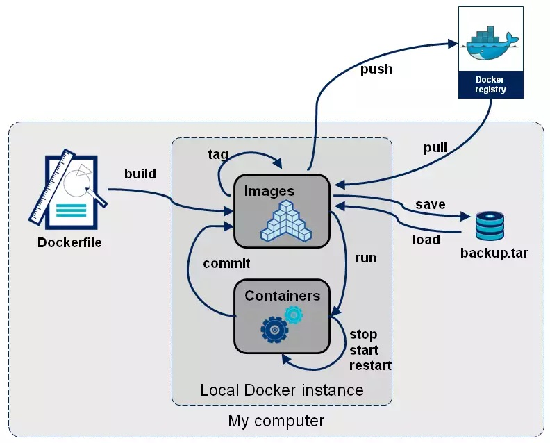

### __Docker CLI__

https://docs.docker.com/engine/reference/commandline/build/


https://docs.docker.com/engine/reference/run/


https://docs.docker.com/engine/reference/run/#network-settings

https://rominirani.com/docker-tutorial-series-a7e6ff90a023




1. docker attach

Use docker attach to attach your terminal’s standard input, output, and error (or any combination of the three) to a running container using the container’s ID or name. This allows you to view its ongoing output or to control it interactively, as though the commands were running directly in your terminal.

To stop a container, use CTRL-c. This key sequence sends SIGKILL to the container. If --sig-proxy is true (the default),CTRL-c sends a SIGINT to the container. If the container was run with -i and -t, you can detach from a container and leave it running using the CTRL-p CTRL-q key sequence.

``` shell
$ docker run -d --name topdemo ubuntu /usr/bin/top -b

$ docker attach topdemo
```


**docker exec** yeni bir tty açar. 


Bu komut ile shell kendini kapatarak exec içinde pelirtilen programa devreder.
Bir shell scripti yazıp bunnu container da çalıştırdığımızda conainer içindeki PID si 1 olan bizim shell scriptimiz ancak bu shell bash içinde bizim scriptimizi açlaıştırmak için bash açıyor biz KILL TERM komutu göndrediğimizde contair ın term olması için bu komut PID 1 olan processe gidecek ancak asıl shell script inin çalıştırıldığı PID ye ulaşmamış olacak. O yüzden asıl çalıştırdığımız komutu entrypoint yapmamız gerekit.
Bunun için gokhan hocanın bir blog yazsısı da var. 
Docker ipuçları ve cevaplar bolum 2 de https://gokhansengun.com/docker-ipuclari-soru-ve-cevaplar-bolum-2/
Bu bloga da ise ikinci yöntee var term komutunu yakalayıp child processe de gönderilebilir.


-KILL TERM –vs KILL –KILL
Ubntu term de 10 sn bekler sonra kill eder
Exited status da yazan rakamdan 128 çıkartıp KILL listesinde çıkış sebebini görebiliriz.
Kill listesi için alttaki komut 
Kill –l 
Örneğin SIGKILL gittiyse status çıkış sebebi 137 görünür. 197-128 = 9 bu durumda sistem memory eksikliğinden de çıkmış olabilir. Yada elle manule SIGKILL gönderimiş olabilir.
SIGHUB sinyali uygulamayı restart etmeden örneğin konfigürasyonu güncelledikten sonra nginx e cocfigürasyonu alması söylenebilir.

Attach vs exec (attach dan ziyade exec kullanılmalı)


2. docker build

The docker build command builds Docker images from a Dockerfile and a “context”. A build’s context is the set of files located in the specified PATH or URL. The build process can refer to any of the files in the context. For example, your build can use a COPY instruction to reference a file in the context.

The URL parameter can refer to three kinds of resources: Git repositories, pre-packaged tarball contexts and plain text files.

``` shell
docker build https://github.com/docker/rootfs.git#container:docker
```
diğer örnekler

```shell
$ docker build - < Dockerfile
With Powershell on Windows, you can run:

Get-Content Dockerfile | docker build -

```

opsiyonlar için: https://docs.docker.com/engine/reference/commandline/build/#options


3. docker commit
   
It can be useful to commit a container’s file changes or settings into a new image. This allows you to debug a container by running an interactive shell, or to export a working dataset to another server. Generally, it is better to use Dockerfiles to manage your images in a documented and maintainable way.

The --change option will apply Dockerfile instructions to the image that is created. Supported Dockerfile instructions: CMD|ENTRYPOINT|ENV|EXPOSE|LABEL|ONBUILD|USER|VOLUME|WORKDIR


``` shell

$ docker ps

CONTAINER ID        IMAGE               COMMAND             CREATED             STATUS              PORTS              NAMES
c3f279d17e0a        ubuntu:12.04        /bin/bash           7 days ago          Up 25 hours                            desperate_dubinsky
197387f1b436        ubuntu:12.04        /bin/bash           7 days ago          Up 25 hours                            focused_hamilton

$ docker commit c3f279d17e0a  svendowideit/testimage:version3

f5283438590d

$ docker images

REPOSITORY                        TAG                 ID                  CREATED             SIZE
svendowideit/testimage            version3            f5283438590d        16 seconds ago      335.7 MB

```

4. docker config

Manage Docker configs

``` shell
Command	Description
- docker config create	Create a config from a file or STDIN
- docker config inspect	Display detailed information on one or more configs
- docker config ls	List configs
- docker config rm	Remove one or more configs

```

5. docker container

https://docs.docker.com/engine/reference/commandline/container/#child-commands


ayrıca her birinin opsiyonları  da bulunmaktadır.

```
Child commands
Command                   Description
docker container  attach	Attach local standard input, output, and error streams to a running container
docker container commit   Create a new image from a container’s changes
docker container cp	      Copy files/folders between a container and the local filesystem
docker container create	  Create a new container
docker container diff	    Inspect changes to files or directories on a container’s filesystem
docker container exec	    Run a command in a running container
docker container export	  Export a container’s filesystem as a tar archive
docker container inspect	Display detailed information on one or more containers
docker container kill	    Kill one or more running containers
docker container logs	    Fetch the logs of a container
docker container ls	      List containers
docker container pause	  Pause all processes within one or more containers
docker container port	    List port mappings or a specific mapping for the container
docker container prune	  Remove all stopped containers
docker container rename	  Rename a container
docker container restart	Restart one or more containers
docker container rm	      Remove one or more containers
docker container run	    Run a command in a new container
docker container start	  Start one or more stopped containers
docker container stats	  Display a live stream of container(s) resource usage statistics
docker container stop	    Stop one or more running containers
docker container top	    Display the running processes of a container
docker container unpause	Unpause all processes within one or more containers
docker container update	  Update configuration of one or more containers
docker container wait	    Block until one or more containers stop, then print their exit codes
```
6. docker context

https://docs.docker.com/engine/context/working-with-contexts/

[Detail](0_architecture.md)

```
docker context create	  Create a context
docker context export	  Export a context to a tar or kubeconfig file
docker context import	  Import a context from a tar or zip file
docker context inspect	Display detailed information on one or more contexts
docker context ls	      List contexts
docker context rm	      Remove one or more contexts
docker context update	  Update a context
docker context use	    Set the current docker context
```


7. docker diff


List the changed files and directories in a container᾿s filesystem since the container was created. Three different types of change are tracked:

Symbol	Description
- A file or directory was added
- A file or directory was deleted
- A file or directory was changed

example

```

$ docker diff 1fdfd1f54c1b

C /dev
C /dev/console
C /dev/core
C /dev/stdout
C /dev/fd
C /dev/ptmx
C /dev/stderr
C /dev/stdin
C /run
A /run/nginx.pid
C /var/lib/nginx/tmp
A /var/lib/nginx/tmp/client_body
A /var/lib/nginx/tmp/fastcgi
A /var/lib/nginx/tmp/proxy
A /var/lib/nginx/tmp/scgi
A /var/lib/nginx/tmp/uwsgi
C /var/log/nginx
A /var/log/nginx/access.log
A /var/log/nginx/error.log

```


8. docker events

docker sisteminde meydana gelen tüm olaylar hakkında bilgi alınabilir. farklı componentler için farklı farklı eventler oluşcaktır. 


https://docs.docker.com/engine/reference/commandline/events/

Examples

``` shell

$ docker events --since 1483283804
2017-01-05T00:35:41.241772953+08:00 volume create testVol (driver=local)
2017-01-05T00:35:58.859401177+08:00 container create d9cd...4d70 (image=alpine:latest, name=test)
2017-01-05T00:36:04.703631903+08:00 network connect e2e1...29e2 (container=0fdb...ff37, name=bridge, type=bridge)
2017-01-05T00:36:04.795031609+08:00 container start 0fdb...ff37 (image=alpine:latest, name=test)
2017-01-05T00:36:09.830268747+08:00 container kill 0fdb...ff37 (image=alpine:latest, name=test, signal=15)
2017-01-05T00:36:09.840186338+08:00 container die 0fdb...ff37 (exitCode=143, image=alpine:latest, name=test)
2017-01-05T00:36:09.880113663+08:00 network disconnect e2e...29e2 (container=0fdb...ff37, name=bridge, type=bridge)
2017-01-05T00:36:09.890214053+08:00 container stop 0fdb...ff37 (image=alpine:latest, name=test)


$ docker events --filter 'event=stop'

2017-01-05T00:40:22.880175420+08:00 container stop 0fdb...ff37 (image=alpine:latest, name=test)
2017-01-05T00:41:17.888104182+08:00 container stop 2a8f...4e78 (image=alpine, name=kickass_brattain)

docker events --filter 'type=network'

2015-12-23T21:38:24.705709133Z network create 8b11...2c5b (name=test-event-network-local, type=bridge)
2015-12-23T21:38:25.119625123Z network connect 8b11...2c5b (name=test-event-network-local, container=b4be...c54e, type=bridge)

$ docker events --format '{{json .}}'

{"status":"create","id":"196016a57679bf42424484918746a9474cd905dd993c4d0f4..
{"status":"attach","id":"196016a57679bf42424484918746a9474cd905dd993c4d0f4..
{"Type":"network","Action":"connect","Actor":{"ID":"1b50a5bf755f6021dfa78e..
{"status":"start","id":"196016a57679bf42424484918746a9474cd905dd993c4d0f42..
{"status":"resize","id":"196016a57679bf42424484918746a9474cd905dd993c4d0f4..


```

9. docker export

Export a container’s filesystem as a tar archive

Examples

Each of these commands has the same result.

``` shell
$ docker export red_panda > latest.tar
$ docker export --output="latest.tar" red_panda
```

10. docker history

Show the history of an image

``` shell
$ docker history docker

IMAGE               CREATED             CREATED BY                                      SIZE                COMMENT
3e23a5875458        8 days ago          /bin/sh -c #(nop) ENV LC_ALL=C.UTF-8            0 B
8578938dd170        8 days ago          /bin/sh -c dpkg-reconfigure locales &&    loc   1.245 MB
be51b77efb42        8 days ago          /bin/sh -c apt-get update && apt-get install    338.3 MB
4b137612be55        6 weeks ago         /bin/sh -c #(nop) ADD jessie.tar.xz in /        121 MB
750d58736b4b        6 weeks ago         /bin/sh -c #(nop) MAINTAINER Tianon Gravi <ad   0 B
511136ea3c5a        9 months ago                                                        0 B                 Imported from -

```

11. docker image

manage ımages

https://docs.docker.com/engine/reference/commandline/image/#child-commands

```
Child commands
Command	Description
docker image build	  Build an image from a Dockerfile
docker image history	Show the history of an image
docker image import	  Import the contents from a tarball to create a filesystem image
docker image inspect	Display detailed information on one or more images
docker image load	    Load an image from a tar archive or STDIN
docker image ls	      List images
docker image prune	  Remove unused images
docker image pull	    Pull an image or a repository from a registry
docker image push	    Push an image or a repository to a registry
docker image rm	      Remove one or more images
docker image save	    Save one or more images to a tar archive (streamed to STDOUT by default)
docker image tag	    Create a tag TARGET_IMAGE that refers to SOURCE_IMAGE

```

12. docker kill

Kill one or more running containers

farklı kullanımları

``` shell
$ docker kill my_container
```

Send a custom signal to a container

The following example sends a SIGHUP signal to the container named my_container:

``` shell
$ docker kill --signal=SIGHUP  my_container
```
You can specify a custom signal either by name, or number. The SIG prefix is optional, so the following examples are equivalent:
``` shell
$ docker kill --signal=SIGHUP my_container
$ docker kill --signal=HUP my_container
$ docker kill --signal=1 my_container
```

**docker exec** yeni bir tty açar. 


Bu komut ile shell kendini kapatarak exec içinde pelirtilen programa devreder.
Bir shell scripti yazıp bunnu container da çalıştırdığımızda conainer içindeki PID si 1 olan bizim shell scriptimiz ancak bu shell bash içinde bizim scriptimizi açlaıştırmak için bash açıyor biz KILL TERM komutu göndrediğimizde contair ın term olması için bu komut PID 1 olan processe gidecek ancak asıl shell script inin çalıştırıldığı PID ye ulaşmamış olacak. O yüzden asıl çalıştırdığımız komutu entrypoint yapmamız gerekit.
Bunun için gokhan hocanın bir blog yazsısı da var. 
Docker ipuçları ve cevaplar bolum 2 de https://gokhansengun.com/docker-ipuclari-soru-ve-cevaplar-bolum-2/
Bu bloga da ise ikinci yöntee var term komutunu yakalayıp child processe de gönderilebilir.


-KILL TERM –vs KILL –KILL
Ubntu term de 10 sn bekler sonra kill eder
Exited status da yazan rakamdan 128 çıkartıp KILL listesinde çıkış sebebini görebiliriz.
Kill listesi için alttaki komut 
Kill –l 
Örneğin SIGKILL gittiyse status çıkış sebebi 137 görünür. 197-128 = 9 bu durumda sistem memory eksikliğinden de çıkmış olabilir. Yada elle manule SIGKILL gönderimiş olabilir.
SIGHUB sinyali uygulamayı restart etmeden örneğin konfigürasyonu güncelledikten sonra nginx e cocfigürasyonu alması söylenebilir.

Attach vs exec (attach dan ziyade exec kullanılmalı)


13. doscker export/import/load/save


- save works with Docker images. It saves everything needed to build a container from scratch. Use this command if you want to share an image with others.
- load works with Docker images. Use this command if you want to run an image exported with save. Unlike pull, which requires connecting to a Docker registry, load can import from anywhere (e.g. a file system, URLs).
- export works with Docker containers, and it exports a snapshot of the container’s file system. Use this command if you want to share or back up the result of building an image.
- import works with the file system of an exported container, and it imports it as a Docker image. Use this command if you have an exported file system you want to explore or use as a layer for a new image.

https://pspdfkit.com/blog/2019/docker-import-export-vs-load-save/

14. docker logs

Fetch the logs of a container

Options

Name, shorthand	Default	Description
```
--details		Show extra details provided to logs
--follow , -f		Follow log output
--since		Show logs since timestamp (e.g. 2013-01-02T13:23:37) or relative (e.g. 42m for 42 minutes)
--tail	all	Number of lines to show from the end of the logs
--timestamps , -t		Show timestamps
--until		API 1.35+
Show logs before a timestamp (e.g. 2013-01-02T13:23:37) or relative (e.g. 42m for 42 minutes)
```


```shell
$ docker run --name test -d busybox sh -c "while true; do $(echo date); sleep 1; done"
$ date
Tue 14 Nov 2017 16:40:00 CET
$ docker logs -f --until=2s
Tue 14 Nov 2017 16:40:00 CET
Tue 14 Nov 2017 16:40:01 CET
Tue 14 Nov 2017 16:40:02 CET
```

15. docker network

bu kısım zaetn detaylı bir şekilde ayrı bir md soyaında işleniyor.

[network](3_networ.md)

https://docs.docker.com/engine/reference/commandline/network/

https://docs.docker.com/engine/reference/run/#network-settings

16. docker plugin

Manage plugins.

Child commands

```
Command	              Description
docker plugin create	Create a plugin from a rootfs and configuration. Plugin data directory must contain config.json and rootfs directory.
docker plugin disable	Disable a plugin
docker plugin enable	Enable a plugin
docker plugin inspect	Display detailed information on one or more plugins
docker plugin install	Install a plugin
docker plugin ls	    List plugins
docker plugin push	  Push a plugin to a registry
docker plugin rm	    Remove one or more plugins
docker plugin set	    Change settings for a plugin
docker plugin upgrade	Upgrade an existing plugin

```

17. docker port

List port mappings or a specific mapping for the container


You can find out all the ports mapped by not specifying a PRIVATE_PORT, or just a specific mapping:

```shell
$ docker ps
CONTAINER ID        IMAGE               COMMAND             CREATED             STATUS              PORTS                                            NAMES
b650456536c7        busybox:latest      top                 54 minutes ago      Up 54 minutes       0.0.0.0:1234->9876/tcp, 0.0.0.0:4321->7890/tcp   test
$ docker port test
7890/tcp -> 0.0.0.0:4321
9876/tcp -> 0.0.0.0:1234
$ docker port test 7890/tcp
0.0.0.0:4321
$ docker port test 7890/udp
2014/06/24 11:53:36 Error: No public port '7890/udp' published for test
$ docker port test 7890
0.0.0.0:4321

```

18. docker ps

List containers

Options
```
Name, shorthand	Default	Description

--all , -a		Show all containers (default shows just running)
--filter , -f		Filter output based on conditions provided
--format		Pretty-print containers using a Go template
--last , -n	-1	Show n last created containers (includes all states)
--latest , -l		Show the latest created container (includes all states)
--no-trunc		Don’t truncate output
--quiet , -q		Only display numeric IDs
--size , -s		Display total file sizes
```

19. docker pull

Pull an image or a repository from a registry

```shell
docker pull [OPTIONS] NAME[:TAG|@DIGEST]
```
docker hub dışında başka bir registery den almak için

```shell
docker pull myregistry.local:5000/testing/test-image
```

20. docker rename

```shell
docker rename my_container my_new_container
```
21. docker rm

remove docker container

```
docker rm $(docker ps -a -q)
```


Options
```
Name        shorthand	Default	Description
--force ,   -f		    Force the removal of a running container (uses SIGKILL)
--link ,    -l		    Remove the specified link
--volumes , -v        Remove anonymous volumes associated with the container
```

22. docker rmi

Remove one or more images

```
docker rmi [OPTIONS] IMAGE [IMAGE...]
```

23. docker secret

Manage Docker secrets

bu bölümle alakalı daha dtaylı bir döküman hazırlandı

https://docs.docker.com/engine/reference/commandline/secret/

[Detaylı Döküman](5_dockersecret.md)

24. docker stack

aslında swarm ortamının configurasyon üzerinden yönetlimesidir.

https://medium.com/devopsturkiye/docker-container-ve-swarm-mode-f6975717647e

https://docs.docker.com/engine/reference/commandline/stack/

25. docker system

Manage Docker

Child commands
```
Command	Description
docker system df	Show docker disk usage
docker system events	Get real time events from the server
docker system info	Display system-wide information
docker system prune	Remove unused data
```

```
$ docker system df

TYPE                TOTAL               ACTIVE              SIZE                RECLAIMABLE
Images              5                   2                   16.43 MB            11.63 MB (70%)
Containers          2                   0                   212 B               212 B (100%)
Local Volumes       2                   1                   36 B                0 B (0%)

```
26. docker tag

Create a tag TARGET_IMAGE that refers to SOURCE_IMAGE


Examples

Tag an image referenced by ID

To tag a local image with ID “0e5574283393” into the “fedora” repository with “version1.0”:
```
$ docker tag 0e5574283393 fedora/httpd:version1.0
```

Tag an image referenced by Name

To tag a local image with name “httpd” into the “fedora” repository with “version1.0”:
```
$ docker tag httpd fedora/httpd:version1.0
```

Note that since the tag name is not specified, the alias is created for an existing local version httpd:latest.

Tag an image referenced by Name and Tag

To tag a local image with name “httpd” and tag “test” into the “fedora” repository with “version1.0.test”:
```
$ docker tag httpd:test fedora/httpd:version1.0.test
****
```
Tag an image for a private repository
To push an image to a private registry and not the central Docker registry you must tag it with the registry hostname and port (if needed).
```
$ docker tag 0e5574283393 myregistryhost:5000/fedora/httpd:version1.0
```
27. docker top

Display the running processes of a container

28. docker trust

docker contex in uzak sunuculara giderken/gelirken güvenli olarka trasfer edilmesini sağlar. context imzalanır ve karşı taraf açar.

29. docker update

Update configuration of one or more containers

Warning: The docker update and docker container update commands are not supported for Windows containers.

Update a container’s cpu-shares

To limit a container’s cpu-shares to 512, first identify the container name or ID. You can use docker ps to find these values. You can also use the ID returned from the docker run command. Then, do the following:

```
$ docker update --cpu-shares 512 abebf7571666
```
Update a container with cpu-shares and memory
To update multiple resource configurations for multiple containers:

```
$ docker update --cpu-shares 512 -m 300M abebf7571666 hopeful_morse
```
Update a container’s kernel memory constraints
You can update a container’s kernel memory limit using the --kernel-memory option. On kernel version older than 4.6, this option can be updated on a running container only if the container was started with --kernel-memory. If the container was started without --kernel-memory you need to stop the container before updating kernel memory.

For example, if you started a container with this command:

```
$ docker run -dit --name test --kernel-memory 50M ubuntu bash
```
30. docker wait

Block until one or more containers stop, then print their exit codes

Examples

Start a container in the background.
```
$ docker run -dit --name=my_container ubuntu bash
```
Run docker wait, which should block until the container exits.

```
$ docker wait my_container
```

In another terminal, stop the first container. The docker wait command above returns the exit code.

```
$ docker stop my_container
```

This is the same docker wait command from above, but it now exits, returning 0.

```
$ docker wait my_container
0
```


