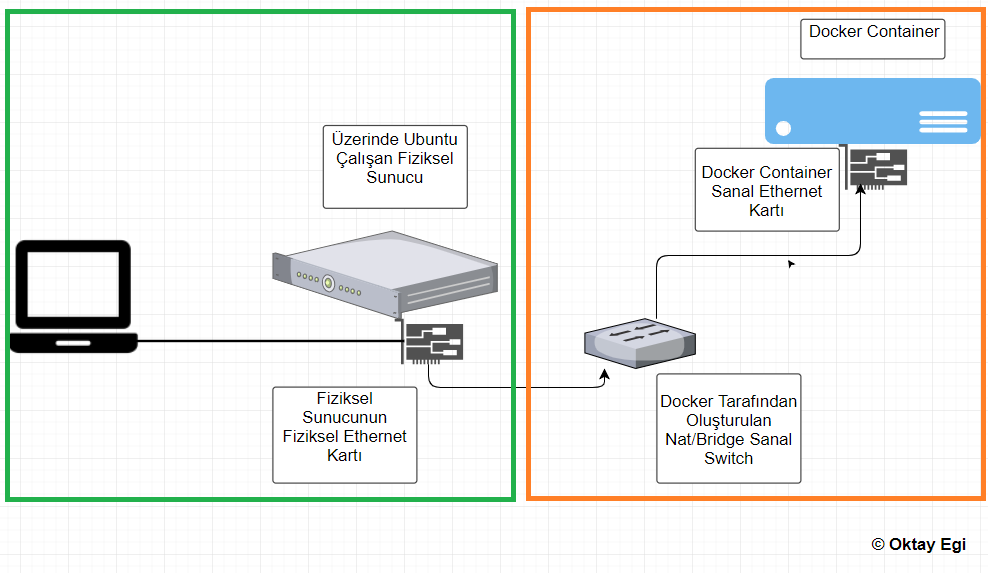
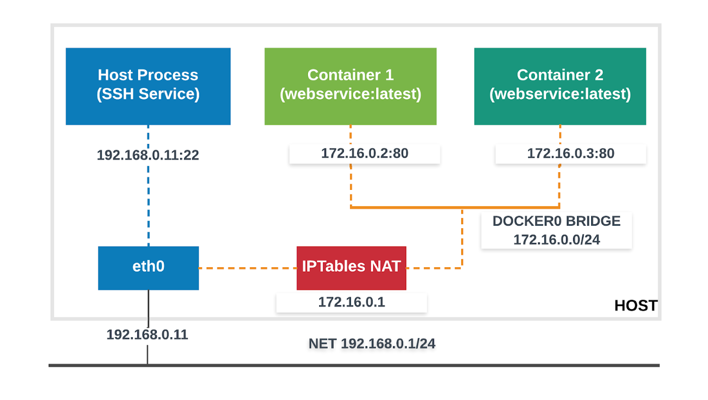
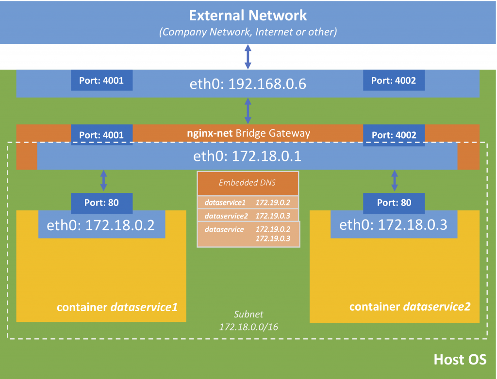
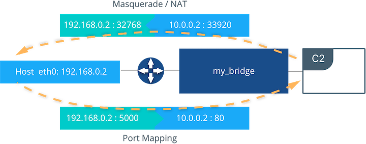

### Bridge Network Driver





bridge network aslında NAT işlemi yapmaktadır



The Docker daemon creates virtual ethernet bridge docker0, that automatically forwards packets between any other attached network interfaces. By default, all containers on a host will be connected to internal network. This mode put the container on a separated network namespace, and sharing the external IP address of the host amongst the many containers through the use of Network Address Translation.


aslında sanal bir eth tanımı yapılır ve default da aksi belirtilmedikçe bütün containerlar bridge network e dahil edilir. farklı bridge network tanımlaması yapılabilir ancka iptable ayalanmasdığı sürece bu iki network deki container lar biribiri ile haberleşemez.



örnekler için

https://dev.vividbreeze.com/docker-networking-bridge-network/


#### Bridge Network Example


öncelikle busybox image ını indiriyoruz.

```
docker pull busybox
```
daha sonra çalıştırıyoruz

```
docker run --rm -itd <imagename / id> busybox sh
```

daha sonra ikinci cusoym biridge networkumuzu create ediyoruz.
```
docker network create -d bridge --subnet 10.0.0.0/24 my_bridge
```


ve daha sonra bu network e bağlı olarak 2 container daha ayağa kaldırıyoruz

```
docker run --rm -itd --name c2 --net my_bridge busybox sh
docker run --rm -itd --name c3 --net my_bridge --ip 10.0.0.254 busybox sh
```

şu komut ile linux de oluşan bridge network leride görebiliriz. yani aslında docker buada linux ün sunduklarını kullanmış oluyor.

```
brctl show
```

aynı zamanda docker tarafında da n eolduğunu görebiliriz

```
docker network ls
```

Listing the global network namespace interfaces shows the Linux networking circuitry that's been instantiated by Docker Engine. Each veth and Linux bridge interface appears as a link between one of the Linux bridges and the container network namespaces.

```

$ ip link

1: lo: <LOOPBACK,UP,LOWER_UP> mtu 65536
2: eth0: <BROADCAST,MULTICAST,UP,LOWER_UP> mtu 9001
3: docker0: <BROADCAST,MULTICAST,UP,LOWER_UP> mtu 1500
5: vethb64e8b8@if4: <BROADCAST,MULTICAST,UP,LOWER_UP> mtu 1500
6: br-b5db4578d8c9: <BROADCAST,MULTICAST,UP,LOWER_UP> mtu 1500
8: vethc9b3282@if7: <BROADCAST,MULTICAST,UP,LOWER_UP> mtu 1500
10: vethf3ba8b5@if9: <BROADCAST,MULTICAST,UP,LOWER_UP> mtu 1500

```


#### iki bridge networku birbiriyle haberleştirmek için 

docker network connect --link container_a: container_b container_c şeklind ebağlanır.

bu nda aslında arka tarafta linux routing yapmış olur.

linux örnekleri 
```
ip route add {NETWORK/MASK} via {GATEWAYIP}
ip route add {NETWORK/MASK} dev {DEVICE}
ip route add default {NETWORK/MASK} dev {DEVICE}
ip route add default {NETWORK/MASK} via {GATEWAYIP}
```

- https://www.oreilly.com/library/view/linux-network-administrators/1565924002/ch02s04.html


yukarıda örneğini verdiğimiz docker network connect ile aslında biz ip üzerinden routşng yapmış olduk.

#### bridge network 2


In the following examples, we use a fictitious app called pets comprised of a web and db container. Feel free to try it out on your own UCP or Swarm cluster. Your app will be accessible on `<host-ip>:8000`.

```
docker network create -d bridge mybridge
docker run -d --net mybridge --name db redis 
docker run -d --net mybridge -e DB=db -p 8000:5000 --name web chrch/web

```


#### Enable forwarding from Docker containers to the outside world
By default, traffic from containers connected to the default bridge network is not forwarded to the outside world. To enable forwarding, you need to change two settings. These are not Docker commands and they affect the Docker host’s kernel.

Configure the Linux kernel to allow IP forwarding.

```
$ sysctl net.ipv4.conf.all.forwarding=1
```
Change the policy for the iptables FORWARD policy from DROP to ACCEPT.
```
$ sudo iptables -P FORWARD ACCEPT
```


#### External Access for Standalone Containers

For most types of Docker networks (bridge and overlay included) external ingress access for applications must be explicitly granted. This is done through internal port mapping. Docker publishes ports exposed on host interfaces to internal container interfaces. The following diagram depicts ingress (bottom arrow) and egress (top arrow) traffic to container C2. Outbound (egress) container traffic is allowed by default. Egress connections initiated by containers are masqueraded/SNATed to an ephemeral port (typically in the range of 32768 to 60999). Return traffic on this connection is allowed, and thus the container uses the best routable IP address of the host on the ephemeral port.

Ingress access is provided through explicit port publishing. Port publishing is done by Docker Engine and can be controlled through UCP or the Engine CLI. A specific or randomly chosen port can be configured to expose a service or container. The port can be set to listen on a specific (or all) host interfaces, and all traffic is mapped from this port to a port and interface inside the container.

```
$ docker run -d --name C2 --net my_bridge -p 5000:80 nginx
```



External access is configured using --publish / -p in the Docker CLI or UCP. After running the above command, the diagram shows that container C2 is connected to the my_bridge network and has an IP address of 10.0.0.2. The container exposes its service to the outside world on port 5000 of the host interface 192.168.0.2. All traffic going to this interface:port is port published to 10.0.0.2:80 of the container interface.


https://subscription.packtpub.com/book/networking_and_servers/9781785280955/1/ch01lvl1sec09/the-docker0-bridge

- detyalı bridge anlatımı : https://medium.com/@xiaopeng163/docker-bridge-networking-deep-dive-3e2e0549e8a0


#### şurada ilginç bir konu var 

- https://stackoverflow.com/questions/27649545/how-to-connect-multiple-dockers-to-different-bridges-in-a-single-host-machine

aynı makinda birden fazla docker instance i ve farklı bridge networkler 

How to connect multiple Dockers to different bridges in a single host machine?

ancak konuyu anlamak için tap ne demek onuda bir anlamak  lazım.


### Docker Host Network V/s Bridge Network (Practical)

https://geekylane.com/docker-host-network-v-s-bridge-network-practical/

