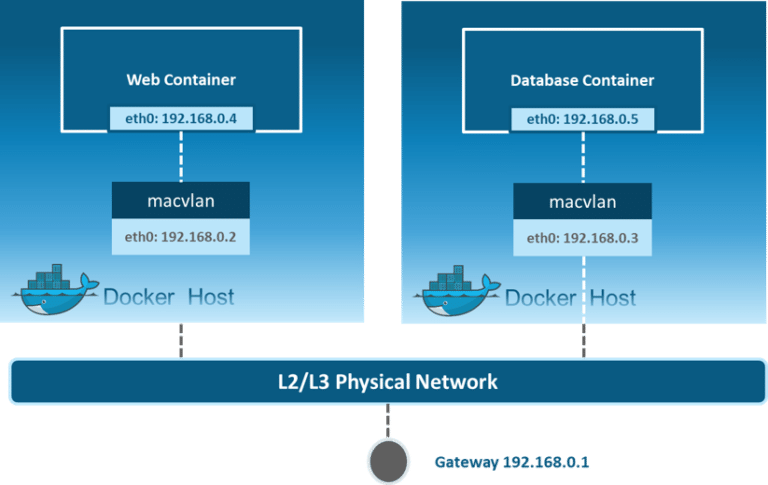

### Host Network Driver 

bu network tipinde docker container sanki hot içinde çalışan ve direk host network interface ini kullanan bir servis / uygulama gibi çalışır. yani direk eth0 ı kullanır port mapping yapmaya gerek duyulmaz bu  nedenle bridge network e göre daha hızlıdır. yan inetwork namespace leri aynı olmuş olur. izolasyon yoktur.

 

### Docker Host Network V/s Bridge Network (Practical)

https://geekylane.com/docker-host-network-v-s-bridge-network-practical/

