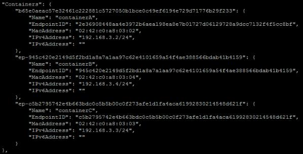

### Overlay (vxlan network)


iki farklı ohatu birbirine bağlam k için kullanılır. Aslında cluster için ortamlarında kulalnılır (swarm / kubernetes) ancak bu oramlar olamsada manuel oluşturulabilir.

şu uyarıya dikkat

__Do not attach Windows nodes to encrypted overlay networks.__

__Overlay network encryption is not supported on Windows. If a Windows node attempts to connect to an encrypted overlay network, no error is detected but the node cannot communicate.__


burada dikkat edilmesi gereken nokta şu. swarm mode da aslında direkt olar bir overlay network kulanılmaz onun yerine ingress kullanılır. ingress alt yapısında overlay network create eder. burada ingress servisler arasında load balancing de yapar.

ikinici bir konu da docker_gwbridge: buda bridge olarak ayayarlanmış bir networkun overlay network e bağlanmasını sağlar.


detaylı örneklerle anlatım: https://github.com/docker/docker.github.io/blob/master/engine/swarm/networking.md


```
$ docker network create \
  --driver overlay \
  my-network
```
detayların abakacak olursak. scope kısmında swarm yazdıpı görülür. normalde burad local, host veya global gibi scope lar görülür. option kısmına dabakacak olursak vxlan olduğu görülür. aslında docker olmayan birşeyi yapmıyor zaten linux ve network dünyasında halihazırda varolan teknikleri kullanarak standardize edilmiş bir sistem sunuyor.


```

$ docker network inspect my-network
[
    {
        "Name": "my-network",
        "Id": "fsf1dmx3i9q75an49z36jycxd",
        "Created": "0001-01-01T00:00:00Z",
        "Scope": "swarm",
        "Driver": "overlay",
        "EnableIPv6": false,
        "IPAM": {
            "Driver": "default",
            "Options": null,
            "Config": []
        },
        "Internal": false,
        "Attachable": false,
        "Ingress": false,
        "Containers": null,
        "Options": {
            "com.docker.network.driver.overlay.vxlanid_list": "4097"
        },
        "Labels": null
    }
]

```

şimdi aynı sisteme 3 redislik cluster kurulmuş olduğunu varsayalım.


```
$ docker network inspect my-network
[
    {
        "Name": "my-network",
        "Id": "fsf1dmx3i9q75an49z36jycxd",
        "Created": "2017-05-31T18:35:58.877628262Z",
        "Scope": "swarm",
        "Driver": "overlay",
        "EnableIPv6": false,
        "IPAM": {
            "Driver": "default",
            "Options": null,
            "Config": [
                {
                    "Subnet": "10.0.0.0/24",
                    "Gateway": "10.0.0.1"
                }
            ]
        },
        "Internal": false,
        "Attachable": false,
        "Ingress": false,
        "Containers": {
            "0e08442918814c2275c31321f877a47569ba3447498db10e25d234e47773756d": {
                "Name": "my-redis.1.ka6oo5cfmxbe6mq8qat2djgyj",
                "EndpointID": "950ce63a3ace13fe7ef40724afbdb297a50642b6d47f83a5ca8636d44039e1dd",
                "MacAddress": "02:42:0a:00:00:03",
                "IPv4Address": "10.0.0.3/24",
                "IPv6Address": ""
            },
            "88d55505c2a02632c1e0e42930bcde7e2fa6e3cce074507908dc4b827016b833": {
                "Name": "my-redis.2.s7vlybipal9xlmjfqnt6qwz5e",
                "EndpointID": "dd822cb68bcd4ae172e29c321ced70b731b9994eee5a4ad1d807d9ae80ecc365",
                "MacAddress": "02:42:0a:00:00:05",
                "IPv4Address": "10.0.0.5/24",
                "IPv6Address": ""
            },
            "9ed165407384f1276e5cfb0e065e7914adbf2658794fd861cfb9b991eddca754": {
                "Name": "my-redis.3.hbz3uk3hi5gb61xhxol27hl7d",
                "EndpointID": "f62c686a34c9f4d70a47b869576c37dffe5200732e1dd6609b488581634cf5d2",
                "MacAddress": "02:42:0a:00:00:04",
                "IPv4Address": "10.0.0.4/24",
                "IPv6Address": ""
            }
        },
        "Options": {
            "com.docker.network.driver.overlay.vxlanid_list": "4097"
        },
        "Labels": {},
        "Peers": [
            {
                "Name": "moby-e57c567e25e2",
                "IP": "192.168.65.2"
            }
        ]
    }
]
```

overlay network ile swarm kullanmadan da multihost docker cluster oluşturmak mümkün. 

örnekler
- https://codeblog.dotsandbrackets.com/multi-host-docker-network-without-swarm/
- https://luppeng.wordpress.com/2016/05/03/setting-up-an-overlay-network-on-docker-without-swarm/

bu ortam için keyvalue store lazım. bunun için genelde consul kullanılıyor.


swarm mode zaten swarm başlığında anlatılıyor olacak.

1. örneğe başlamdan önce docker ın network DNS adresini google olarak ayarlı bunu değiştirerek local i kullanmasını sağlıyoruz. bunun için  /etc/default/docker path ine giderek DOCKER_OPTS ayarını commendout yapıyoruz.

Host 1 de yapıyoruz.

```
# Use DOCKER_OPTS to modify the daemon startup options.
#DOCKER_OPTS= "--dns 8.8.8.8 --dns 8.8.4.4"
```
daha sonra restart yapıyoruz

```
$ sudo service docker restart
```
2. host 1' e key value store kuruyoruz. diğer host lar buna bağlanacak.

```
$ docker run -d -p 8500:8500 -h consul --name consul progrium/consul -server -bootstrap

# check ediyoruz poru

$ docker port consul

# 8500/tcp -> 0.0.0.0:8500

```

3.  docker deamon a consul ukullanmasını söylğyoruz.

2 yöntem var ya cli yada configurayon

```
$ sudo service docker stop

$ sudo /usr/bin/docker daemon -H tcp://0.0.0.0:2375 -H unix:///var/run/docker.sock --cluster-advertise {Docker Host 1 network interface}:2375 --cluster-store consul://{Docker Host 1 IP Address}:8500[/]

# örneğin
$ sudo /usr/bin/docker daemon -H tcp://0.0.0.0:2375 -H unix:///var/run/docker.sock --cluster-advertise enp0s3:2375 --cluster-store consul://172.20.10.2:8500
```
ikinci yöntem: şu path daeki dosya açılır /etc/default/docker ve alttaki satır eklenir.

```
DOCKER_OPTS="-H tcp://0.0.0.0:2375 -H unix:///var/run/docker.sock --cluster-advertise {Docker Host 1 network interface}:2375 --cluster-store consul://{Docker Host 1 IP Address}:8500[/]"

# örneğin
DOCKER_OPTS="-H tcp://0.0.0.0:2375 -H unix:///var/run/docker.sock --cluster-advertise enp0s3:2375 --cluster-store consul://172.20.10.2:8500"

```

daha sonra 

```
$ sudo service docker restart 
$ docker info
...
Cluster store: consul://172.20.10.2:8500
Cluster advertise: 172.20.10.5:2375
```

Ubuntuda (https://docs.docker.com/engine/admin/systemd/) bu işlemlerin etkisinin luştuğuna emin olmak gerekiyor. bunun için /etc/default/docker conf dosyasını docker systemd dosyasına ekleyeceğiz.


/lib/systemd/system/docker.service dosyası açılır [servive] section bulunur ve bu satırın üstüne  Environment Variable olarak /etc/default/docker path i eklenir.


dsoaya savelenir ve aşağıdaki kontroller yapılır

```
$ systemctl daemon-reload

$ sudo service docker restart
$ docker info
...
Cluster store: consul://172.20.10.2:8500
Cluster advertise: 172.20.10.5:2375

```

4. overlay network oluşturulur

bunun için host 1 dışında başka bir makinaa bağlanlır ve alttaki komut çalıştırlır. ancak burada dikkaet dilmesi gereken şey host 1 dışındaki docker da yukarıdaki gibi consul ayarlanını yapılmılş olması gerekiyor.


```
$ docker network create -d overlay --subnet=/

# örneğin
$ docker network create -d overlay --subnet=192.168.3.0/24 my-overlay

#şu komutla check edilir

$ docker network ls

```

5. add container to overlay network

```
$ docker run -itd --name containerX --net my-overlay busybox
```
host 1 dışındaki makinlardan birinde şu test yepılır

```
$ docker network inspect my-overlay
```



6. daha sonra container lar arasında ping kontrolu yapıyoruz.

```
$ docker exec containerA ping -w 5 containerC
```


- https://www.docker.com/blog/understanding-docker-networking-drivers-use-cases/

- https://stackoverflow.com/questions/27649545/how-to-connect-multiple-dockers-to-different-bridges-in-a-single-host-machine
- https://www.thegeekstuff.com/2017/06/brctl-bridge/
- https://www.docker.com/blog/understanding-docker-networking-drivers-use-cases/
- http://agciyiz.net/network-tap/
- http://www.epdata.com.tr/%C3%A7%C3%B6z%C3%BCmler/network-tab-cihaz%C4%B1


