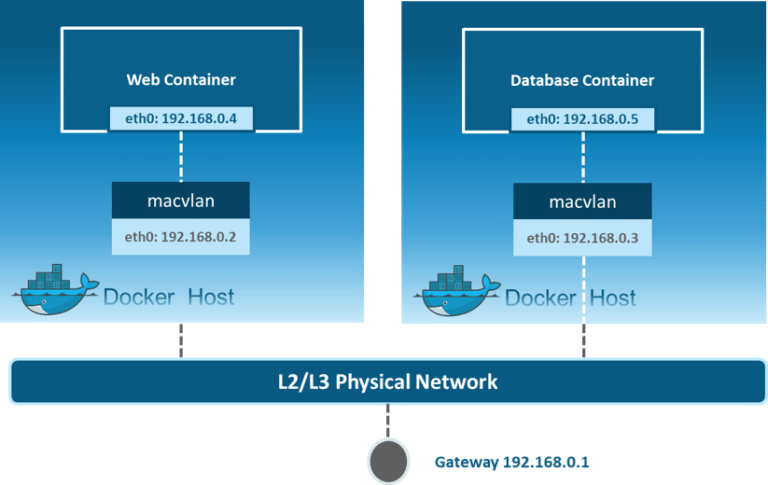

**Network konusunda en detaylı kaynak**
- https://blog.revolve.team/2017/08/20/deep-dive-3-into-docker-overlay-networks-part-3/

 
 
 ------


- https://success.mirantis.com/article/networking (kesin bakılmalı)

- https://sookocheff.com/post/kubernetes/understanding-kubernetes-networking-model/ (çok iyi bakılmalı)

- https://success.mirantis.com/article/ucp-service-discovery-swarm


 NAT (Network Address Translation), aynı ağ içerisinde bulunan birden fazla cihazın aynı public IP’yi kullanarak internete erişebilmesini sağlayan yöntemdir.

### MACVLAN Driver


buaradaki mantıkda container ın mac ini direkt olarka network e açmaktır. 

- __Bridge Example__: burada trafik direk eth0 dan  geçerek cantiner mac ine ulaşır. yani containerm mac adresi direk networküne açıktır.

1. Create a macvlan network called my-macvlan-net. Modify the subnet, gateway, and parent values to values that make sense in your environment.

```
$ docker network create -d macvlan \
  --subnet=172.16.86.0/24 \
  --gateway=172.16.86.1 \
  -o parent=eth0 \
  my-macvlan-net
  ```
You can use docker network ls and docker network inspect my-macvlan-net commands to verify that the network exists and is a macvlan network.

2. Start an alpine container and attach it to the my-macvlan-net network. The -dit flags start the container in the background but allow you to attach to it. The --rm flag means the container is removed when it is stopped.
```
$ docker run --rm -dit \
  --network my-macvlan-net \
  --name my-macvlan-alpine \
  alpine:latest \
  ash
```
3. Inspect the my-macvlan-alpine container and notice the MacAddress key within the Networks key:


```
$ docker container inspect my-macvlan-alpine

...truncated...
"Networks": {
  "my-macvlan-net": {
      "IPAMConfig": null,
      "Links": null,
      "Aliases": [
          "bec64291cd4c"
      ],
      "NetworkID": "5e3ec79625d388dbcc03dcf4a6dc4548644eb99d58864cf8eee2252dcfc0cc9f",
      "EndpointID": "8caf93c862b22f379b60515975acf96f7b54b7cf0ba0fb4a33cf18ae9e5c1d89",
      "Gateway": "172.16.86.1",
      "IPAddress": "172.16.86.2",
      "IPPrefixLen": 24,
      "IPv6Gateway": "",
      "GlobalIPv6Address": "",
      "GlobalIPv6PrefixLen": 0,
      "MacAddress": "02:42:ac:10:56:02",
      "DriverOpts": null
  }
}
...truncated

```
4. Check out how the container sees its own network interfaces by running a couple of docker exec commands.
```
$ docker exec my-macvlan-alpine ip addr show eth0

9: eth0@tunl0: <BROADCAST,MULTICAST,UP,LOWER_UP,M-DOWN> mtu 1500 qdisc noqueue state UP
link/ether 02:42:ac:10:56:02 brd ff:ff:ff:ff:ff:ff
inet 172.16.86.2/24 brd 172.16.86.255 scope global eth0
   valid_lft forever preferred_lft forever
$ docker exec my-macvlan-alpine ip route

default via 172.16.86.1 dev eth0
172.16.86.0/24 dev eth0 scope link  src 172.16.86.2

görüldüğü üzere container ında hostunda ip si 172.16.86.2


```
5. Stop the container (Docker removes it because of the --rm flag), and remove the network.
```
$ docker container stop my-macvlan-alpine

$ docker network rm my-macvlan-net
```

- __802.1q trunked bridge example__: burada trafik alt bir interface eth0.10 den geçerek mac e ulaşır. böylece host ile aynı ip den çıkılmamış olur.

1. create network

```
$ docker network create -d macvlan \
  --subnet=172.16.86.0/24 \
  --gateway=172.16.86.1 \
  -o parent=eth0.10 \
  my-8021q-macvlan-net
  ```

2. start container 

```
$ docker run --rm -dit \
  --network my-macvlan-net \
  --name my-macvlan-alpine \
  alpine:latest \
  ash

  ```
3. inspect container


```
$ docker container inspect my-macvlan-alpine

...truncated...
"Networks": {
  "my-macvlan-net": {
      "IPAMConfig": null,
      "Links": null,
      "Aliases": [
          "bec64291cd4c"
      ],
      "NetworkID": "5e3ec79625d388dbcc03dcf4a6dc4548644eb99d58864cf8eee2252dcfc0cc9f",
      "EndpointID": "8caf93c862b22f379b60515975acf96f7b54b7cf0ba0fb4a33cf18ae9e5c1d89",
      "Gateway": "172.16.86.1",
      "IPAddress": "172.16.86.2",
      "IPPrefixLen": 24,
      "IPv6Gateway": "",
      "GlobalIPv6Address": "",
      "GlobalIPv6PrefixLen": 0,
      "MacAddress": "02:42:ac:10:56:02",
      "DriverOpts": null
  }
}
...truncated

```

4. hostun ip side kontrol edilir.


```
$ docker exec my-macvlan-alpine ip addr show eth0

9: eth0@tunl0: <BROADCAST,MULTICAST,UP,LOWER_UP,M-DOWN> mtu 1500 qdisc noqueue state UP
link/ether 02:42:ac:10:56:02 brd ff:ff:ff:ff:ff:ff
inet 172.16.86.2/24 brd 172.16.86.255 scope global eth0
   valid_lft forever preferred_lft forever
```

```
$ docker exec my-macvlan-alpine ip route

default via 172.16.86.1 dev eth0
172.16.86.0/24 dev eth0 scope link  src 172.16.86.2

```
görüleceği üzere bu örnkete host ip si 172.16.86.1 iken container ip si 172.16.86.2


- https://www.docker.com/blog/understanding-docker-networking-drivers-use-cases/





