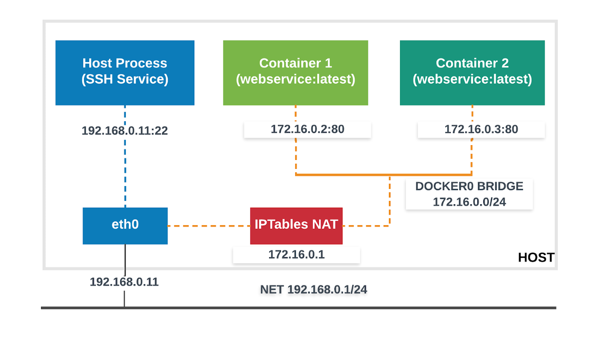
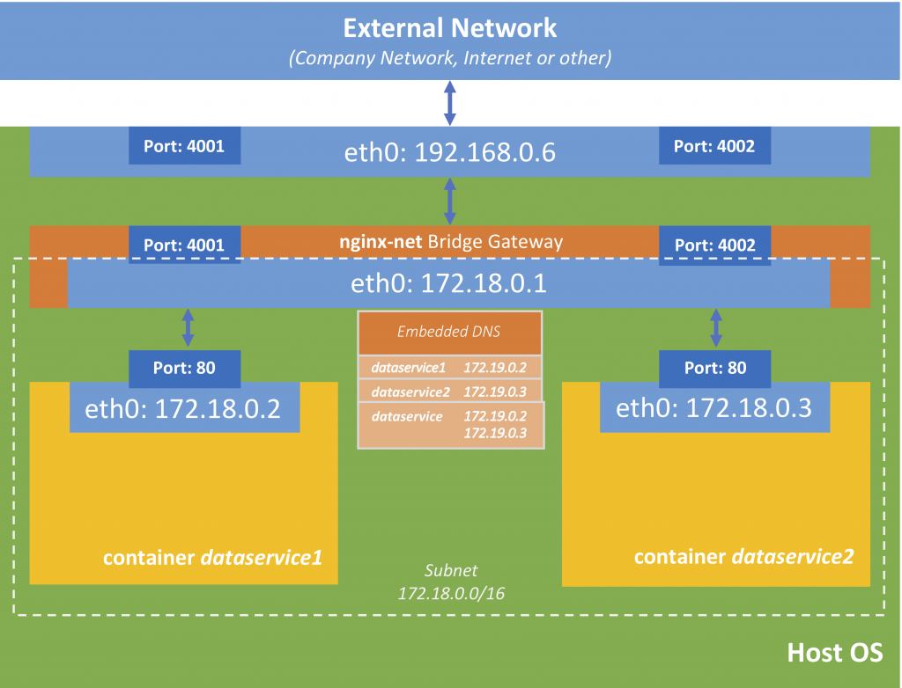
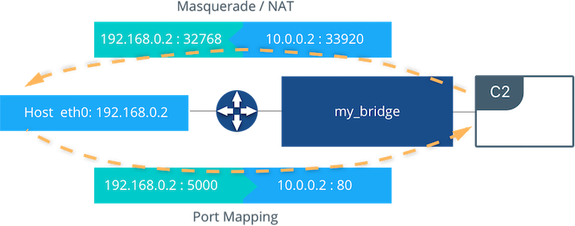

şua çıklamaya dikkat et

Overlay network limitations

You should create overlay networks with /24 blocks (the default), which limits you to 256 IP addresses, when you create networks using the default VIP-based endpoint-mode. This recommendation addresses limitations with swarm mode. If you need more than 256 IP addresses, do not increase the IP block size. You can either use dnsrr endpoint mode with an external load balancer, or use multiple smaller overlay networks. See Configure service discovery for more information about different endpoint modes.

- https://docs.docker.com/engine/reference/commandline/network_create/#overlay-network-limitations

- https://docs.docker.com/engine/reference/run/#network-settings

Dışarıdan erişim ve test için yöntemler
- ngrok
- supergrok
- SSH tünelleme

https://medium.com/devopsturkiye/docker-network-%C3%BCzerine-genel-bak%C4%B1%C5%9F-1afc830ef648

https://oktayegi.wordpress.com/2018/10/31/ubuntu-uzerinde-docker-5-network-ve-nginx-load-balancer-ornegi/

## Docker Network Drivers

https://medium.com/@dumlutimuralp/docker-networking-intro-62d4bc163843


- docker and iptables

https://docs.docker.com/network/iptables/


detaylı anlatım

https://success.docker.com/article/networking


[network presentation](files/network_presentation.pdf)

- Container Network Model (CNM)


### CNM Driver Interfaces


- Network Drivers — Docker Network Drivers provide the actual implementation that makes networks work. They are pluggable so that different drivers can be used and interchanged easily to support different use cases. Multiple network drivers can be used on a given Docker Engine or Cluster concurrently, but each Docker network is only instantiated through a single network driver. There are two broad types of CNM network drivers:
  - Native Network Drivers — Native Network Drivers are a native part of the Docker Engine and are provided by Docker. There are multiple drivers to choose from that support different capabilities like overlay networks or local bridges.
  - Remote Network Drivers — Remote Network Drivers are network drivers created by the community and other vendors. These drivers can be used to provide integration with incumbent software and hardware. Users can also create their own drivers in cases where they desire specific functionality that is not supported by an existing network driver. The following community- and vendor-created remote network drivers are compatible with CNM. Each provides unique capabilities and network services for containers.


    - contiv	An open source network plugin led by Cisco Systems to provide infrastructure and security policies for multi-tenant microservices deployments. Contiv also provides integration for non-container workloads and with physical networks, such as ACI. Contiv implements remote network and IPAM drivers.
    - weave	A network plugin that creates a virtual network that connects Docker containers across multiple hosts or clouds. Weave provides automatic discovery of applications, can operate on partially connected networks, does not require an external cluster store, and is operations friendly.
    - kuryr	A network plugin developed as part of the OpenStack Kuryr project. It implements the Docker networking (libnetwork) remote driver API by utilizing Neutron, the OpenStack networking service. Kuryr includes an IPAM driver as well.
- IPAM Drivers — Docker has a native IP Address Management Driver that provides default subnets or IP addresses for the networks and endpoints if they are not specified. IP addressing can also be manually assigned through network, container, and service create commands. Remote IPAM drivers also exist and provide integration to existing IPAM tools.

  - infoblox	An open source IPAM plugin that provides integration with existing Infoblox tools.


### Linux Network Fundamentals

There are several Linux networking building blocks which Docker uses to implement its native CNM network drivers. This list includes Linux bridges, network namespaces, veth pairs, and iptables. The combination of these tools, implemented as network drivers, provides the forwarding rules, network segmentation, and management tools for dynamic network policy.

### The Linux Bridge

A Linux bridge is a Layer 2 device that is the virtual implementation of a physical switch inside the Linux kernel. It forwards traffic based on MAC addresses which it learns dynamically by inspecting traffic. Linux bridges are used extensively in many of the Docker network drivers. A Linux bridge is not to be confused with the bridge Docker network driver which is a higher level implementation of the Linux bridge.

### Network Namespaces

A Linux network namespace is an isolated network stack in the kernel with its own interfaces, routes, and firewall rules. It is a security aspect of containers and Linux, used to isolate containers. In networking terminology they are akin to a VRF that segments the network control and data plane inside the host. Network namespaces ensure that two containers on the same host aren't able to communicate with each other or even the host itself unless configured to do so via Docker networks. Typically, CNM network drivers implement separate namespaces for each container. However, containers can share the same network namespace or even be a part of the host's network namespace. The host network namespace contains the host interfaces and host routing table.

### Virtual Ethernet Devices

A virtual ethernet device or veth is a Linux networking interface that acts as a connecting wire between two network namespaces. A veth is a full duplex link that has a single interface in each namespace. Traffic in one interface is directed out the other interface. Docker network drivers utilize veths to provide explicit connections between namespaces when Docker networks are created. When a container is attached to a Docker network, one end of the veth is placed inside the container (usually seen as the ethX interface) while the other is attached to the Docker network.

### iptables

iptables is the native packet filtering system that has been a part of the Linux kernel since version 2.4. It's a feature rich L3/L4 firewall that provides rule chains for packet marking, masquerading, and dropping. The native Docker network drivers utilize iptables extensively to segment network traffic, provide host port mapping, and to mark traffic for load balancing decisions.

## Microsoft Network Fundamentals

Following a similar philosophy to the Linux architecture, Docker on Windows leverages operating system primitives to achieve robust policy with high throughput. Docker networking is also Windows networking. However, the underlying networking features differ between the two operating systems.

In addition te the overlay driver, Docker on Windows implements four additional drivers:

- NAT (default)
- Transparent
- L2 Bridge
- L2 Tunnel

The following two tables summarize each Windows driver and the operating system features it consumes by pairing each Windows component with its functional equivalent in Linux.


#### Transparent Driver

The Transparent network driver in Windows container environments allows one to connect containers directly to the physical network. Containers will be able to pick up an IP address from an external DHCP server, or you can assign IP addresses statically.

#### L2 Bridge / L2 Tunnel Driver

L2 Bridge / L2Tunnel is a network driver associated with public and private cloud deployments. This network driver does layer-2 address translation that allows your containers to have the same subnet as the host machine. Each container under the L2 bridge network will have a unique IP address but will share the same MAC address as the container host. Only static IP assignment is supported for this type of network mode.

#### Joining Windows to the Swarm

When joining a Windows worker to the swarm for the first time, Windows will use HNS to apply a vNIC and NAT network to the Windows OS. The nat network is the default network for containers running on Windows. Any containers started on Windows without a specific network configuration will be attached to the default nat network, and automatically assigned an IP address from the nat network's internal prefix IP range: 172.x.x.x/16.


windows network daha fazlası için

https://docs.microsoft.com/en-us/virtualization/windowscontainers/container-networking/architecture


### Bridge Network Driver

bridge network aslında NAT işlemi yapmaktadır



The Docker daemon creates virtual ethernet bridge docker0, that automatically forwards packets between any other attached network interfaces. By default, all containers on a host will be connected to internal network. This mode put the container on a separated network namespace, and sharing the external IP address of the host amongst the many containers through the use of Network Address Translation.


aslında sanal bir eth tanımı yapılır ve default da aksi belirtilmedikçe bütün containerlar bridge network e dahil edilir. farklı bridge network tanımlaması yapılabilir ancka iptable ayalanmasdığı sürece bu iki network deki container lar biribiri ile haberleşemez.



örnekler için

https://dev.vividbreeze.com/docker-networking-bridge-network/


#### Bridge Network Example


öncelikle busybox image ını indiriyoruz.

```
docker pull busybox
```
daha sonra çalıştırıyoruz

```
docker run --rm -itd <imagename / id> busybox sh
```

daha sonra ikinci cusoym biridge networkumuzu create ediyoruz.
```
docker network create -d bridge --subnet 10.0.0.0/24 my_bridge
```


ve daha sonra bu network e bağlı olarak 2 container daha ayağa kaldırıyoruz

```
docker run --rm -itd --name c2 --net my_bridge busybox sh
docker run --rm -itd --name c3 --net my_bridge --ip 10.0.0.254 busybox sh
```

şu komut ile linux de oluşan bridge network leride görebiliriz. yani aslında docker buada linux ün sunduklarını kullanmış oluyor.

```
brctl show
```

aynı zamanda docker tarafında da n eolduğunu görebiliriz

```
docker network ls
```

Listing the global network namespace interfaces shows the Linux networking circuitry that's been instantiated by Docker Engine. Each veth and Linux bridge interface appears as a link between one of the Linux bridges and the container network namespaces.

```

$ ip link

1: lo: <LOOPBACK,UP,LOWER_UP> mtu 65536
2: eth0: <BROADCAST,MULTICAST,UP,LOWER_UP> mtu 9001
3: docker0: <BROADCAST,MULTICAST,UP,LOWER_UP> mtu 1500
5: vethb64e8b8@if4: <BROADCAST,MULTICAST,UP,LOWER_UP> mtu 1500
6: br-b5db4578d8c9: <BROADCAST,MULTICAST,UP,LOWER_UP> mtu 1500
8: vethc9b3282@if7: <BROADCAST,MULTICAST,UP,LOWER_UP> mtu 1500
10: vethf3ba8b5@if9: <BROADCAST,MULTICAST,UP,LOWER_UP> mtu 1500

```

#### bridge network 2


In the following examples, we use a fictitious app called pets comprised of a web and db container. Feel free to try it out on your own UCP or Swarm cluster. Your app will be accessible on `<host-ip>:8000`.

```
docker network create -d bridge mybridge
docker run -d --net mybridge --name db redis 
docker run -d --net mybridge -e DB=db -p 8000:5000 --name web chrch/web

```


#### Enable forwarding from Docker containers to the outside world
By default, traffic from containers connected to the default bridge network is not forwarded to the outside world. To enable forwarding, you need to change two settings. These are not Docker commands and they affect the Docker host’s kernel.

Configure the Linux kernel to allow IP forwarding.

```
$ sysctl net.ipv4.conf.all.forwarding=1
```
Change the policy for the iptables FORWARD policy from DROP to ACCEPT.
```
$ sudo iptables -P FORWARD ACCEPT
```


#### External Access for Standalone Containers

For most types of Docker networks (bridge and overlay included) external ingress access for applications must be explicitly granted. This is done through internal port mapping. Docker publishes ports exposed on host interfaces to internal container interfaces. The following diagram depicts ingress (bottom arrow) and egress (top arrow) traffic to container C2. Outbound (egress) container traffic is allowed by default. Egress connections initiated by containers are masqueraded/SNATed to an ephemeral port (typically in the range of 32768 to 60999). Return traffic on this connection is allowed, and thus the container uses the best routable IP address of the host on the ephemeral port.

Ingress access is provided through explicit port publishing. Port publishing is done by Docker Engine and can be controlled through UCP or the Engine CLI. A specific or randomly chosen port can be configured to expose a service or container. The port can be set to listen on a specific (or all) host interfaces, and all traffic is mapped from this port to a port and interface inside the container.

```
$ docker run -d --name C2 --net my_bridge -p 5000:80 nginx
```



External access is configured using --publish / -p in the Docker CLI or UCP. After running the above command, the diagram shows that container C2 is connected to the my_bridge network and has an IP address of 10.0.0.2. The container exposes its service to the outside world on port 5000 of the host interface 192.168.0.2. All traffic going to this interface:port is port published to 10.0.0.2:80 of the container interface.


https://subscription.packtpub.com/book/networking_and_servers/9781785280955/1/ch01lvl1sec09/the-docker0-bridge

- detyalı bridge anlatımı : https://medium.com/@xiaopeng163/docker-bridge-networking-deep-dive-3e2e0549e8a0


#### şurada ilginç bir konu var 

- https://stackoverflow.com/questions/27649545/how-to-connect-multiple-dockers-to-different-bridges-in-a-single-host-machine

aynı makinda birden fazla docker instance i ve farklı bridge networkler 

How to connect multiple Dockers to different bridges in a single host machine?

ancak konuyu anlamak için tap ne demek onuda bir anlamak  lazım.


### Host Network Driver 


### Docker Host Network V/s Bridge Network (Practical)

https://geekylane.com/docker-host-network-v-s-bridge-network-practical/


### MACVLAN Driver


- https://www.docker.com/blog/understanding-docker-networking-drivers-use-cases/


### Overlay


- https://www.docker.com/blog/understanding-docker-networking-drivers-use-cases/

- https://stackoverflow.com/questions/27649545/how-to-connect-multiple-dockers-to-different-bridges-in-a-single-host-machine
- https://www.thegeekstuff.com/2017/06/brctl-bridge/
- https://www.docker.com/blog/understanding-docker-networking-drivers-use-cases/
- http://agciyiz.net/network-tap/
- http://www.epdata.com.tr/%C3%A7%C3%B6z%C3%BCmler/network-tab-cihaz%C4%B1
