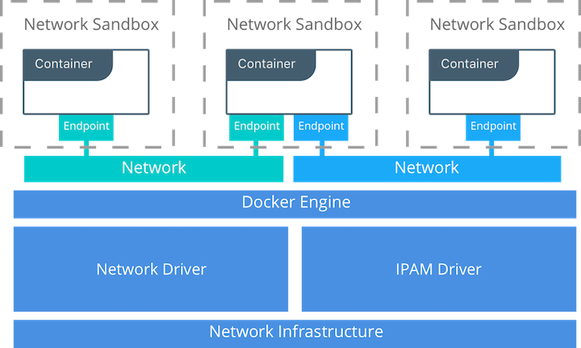

şu açıklamaya dikkat et

Overlay network limitations

You should create overlay networks with /24 blocks (the default), which limits you to 256 IP addresses, when you create networks using the default VIP-based endpoint-mode. This recommendation addresses limitations with swarm mode. If you need more than 256 IP addresses, do not increase the IP block size. You can either use dnsrr endpoint mode with an external load balancer, or use multiple smaller overlay networks. See Configure service discovery for more information about different endpoint modes.

 NAT (Network Address Translation), aynı ağ içerisinde bulunan birden fazla cihazın aynı public IP’yi kullanarak internete erişebilmesini sağlayan yöntemdir.

 
4 adet NAT türü var

https://www.youtube.com/watch?v=wg8Hosr20yw

- Source NAT : dışarıdan gelen isteklerin direkt olarkqa bir IP ye yönlendirilmesidir. yani dışarıdan gelen belli ip lerin içeride belli ip adreslerine yönşlendirilmesidir. 

Many Kubernetes network implementations use overlay networks. Typically for these deployments, when a pod initiates a connection to an IP address outside of the cluster, the node hosting the pod will **SNAT (Source Network Address Translation)** map the source address of the packet from the pod IP to the node IP

- Dynamic NAT: içeriden yapılan bir isteğin dışarıdaki noktaya giderken örneğin router ın internla ip yi dışarıya public bir ip ile açmasıdır. ancka burada şuna dikkat tek public ip yok. her .isteklde inernel ip dışarı farklı bir publik ip alıyor. buna aynı zamanda ip masquearading de deniyor. iç ip saldırılara karşı korunmuş oluyor. 
- PAT (Port Addres Transtlation): içeriden  dışarıya iç ip adresi tek bir public ip ile farklı portlarla talep yapar. router nat table kullanılır.
- Port Fortwarding: dışarıdan içeriye gelen trafik portlara göre farklı iç sunuculara yönlendirilir.
 
 

- https://docs.docker.com/engine/reference/commandline/network_create/#overlay-network-limitations

- https://docs.docker.com/engine/reference/run/#network-settings

Dışarıdan erişim ve test için yöntemler
- ngrok
- supergrok
- SSH tünelleme

**Faydalı Linker**

- https://medium.com/devopsturkiye/docker-network-%C3%BCzerine-genel-bak%C4%B1%C5%9F-1afc830ef648
- https://oktayegi.wordpress.com/2018/10/31/ubuntu-uzerinde-docker-5-network-ve-nginx-load-balancer-ornegi/
- https://www.edureka.co/blog/docker-networking/
- https://www.docker.com/blog/docker-networking-design-philosophy/
- https://www.flockport.com/guides/overlay-networks

- https://success.mirantis.com/article/networking (kesin bakılmalı)

- https://sookocheff.com/post/kubernetes/understanding-kubernetes-networking-model/ (çok iyi bakılmalı)

- https://success.mirantis.com/article/ucp-service-discovery-swarm

## Docker Network Drivers

https://medium.com/@dumlutimuralp/docker-networking-intro-62d4bc163843

- docker and iptables

https://docs.docker.com/network/iptables/

detaylı anlatım

https://success.docker.com/article/networking

[network presentation](files/network_presentation.pdf)

- Container Network Model (CNM)

### CNM Driver Interfaces

- Network Drivers — Docker Network Drivers provide the actual implementation that makes networks work. They are pluggable so that different drivers can be used and interchanged easily to support different use cases. Multiple network drivers can be used on a given Docker Engine or Cluster concurrently, but each Docker network is only instantiated through a single network driver. There are two broad types of CNM network drivers:
  - Native Network Drivers — Native Network Drivers are a native part of the Docker Engine and are provided by Docker. There are multiple drivers to choose from that support different capabilities like overlay networks or local bridges.
  - Remote Network Drivers — Remote Network Drivers are network drivers created by the community and other vendors. These drivers can be used to provide integration with incumbent software and hardware. Users can also create their own drivers in cases where they desire specific functionality that is not supported by an existing network driver. The following community- and vendor-created remote network drivers are compatible with CNM. Each provides unique capabilities and network services for containers.

    - contiv	An open source network plugin led by Cisco Systems to provide infrastructure and security policies for multi-tenant microservices deployments. Contiv also provides integration for non-container workloads and with physical networks, such as ACI. Contiv implements remote network and IPAM drivers.
    - weave	A network plugin that creates a virtual network that connects Docker containers across multiple hosts or clouds. Weave provides automatic discovery of applications, can operate on partially connected networks, does not require an external cluster store, and is operations friendly.
    - kuryr	A network plugin developed as part of the OpenStack Kuryr project. It implements the Docker networking (libnetwork) remote driver API by utilizing Neutron, the OpenStack networking service. Kuryr includes an IPAM driver as well.
- IPAM Drivers — Docker has a native IP Address Management Driver that provides default subnets or IP addresses for the networks and endpoints if they are not specified. IP addressing can also be manually assigned through network, container, and service create commands. Remote IPAM drivers also exist and provide integration to existing IPAM tools.

  - infoblox	An open source IPAM plugin that provides integration with existing Infoblox tools.

### Linux Network Fundamentals

There are several Linux networking building blocks which Docker uses to implement its native CNM network drivers. This list includes Linux bridges, network namespaces, veth pairs, and iptables. The combination of these tools, implemented as network drivers, provides the forwarding rules, network segmentation, and management tools for dynamic network policy.

### The Linux Bridge

A Linux bridge is a Layer 2 device that is the virtual implementation of a physical switch inside the Linux kernel. It forwards traffic based on MAC addresses which it learns dynamically by inspecting traffic. Linux bridges are used extensively in many of the Docker network drivers. A Linux bridge is not to be confused with the bridge Docker network driver which is a higher level implementation of the Linux bridge.

### Network Namespaces

A Linux network namespace is an isolated network stack in the kernel with its own interfaces, routes, and firewall rules. It is a security aspect of containers and Linux, used to isolate containers. In networking terminology they are akin to a VRF that segments the network control and data plane inside the host. Network namespaces ensure that two containers on the same host aren't able to communicate with each other or even the host itself unless configured to do so via Docker networks. Typically, CNM network drivers implement separate namespaces for each container. However, containers can share the same network namespace or even be a part of the host's network namespace. The host network namespace contains the host interfaces and host routing table.

### Virtual Ethernet Devices

A virtual ethernet device or veth is a Linux networking interface that acts as a connecting wire between two network namespaces. A veth is a full duplex link that has a single interface in each namespace. Traffic in one interface is directed out the other interface. Docker network drivers utilize veths to provide explicit connections between namespaces when Docker networks are created. When a container is attached to a Docker network, one end of the veth is placed inside the container (usually seen as the ethX interface) while the other is attached to the Docker network.

### iptables

iptables is the native packet filtering system that has been a part of the Linux kernel since version 2.4. It's a feature rich L3/L4 firewall that provides rule chains for packet marking, masquerading, and dropping. The native Docker network drivers utilize iptables extensively to segment network traffic, provide host port mapping, and to mark traffic for load balancing decisions.

## Microsoft Network Fundamentals

Following a similar philosophy to the Linux architecture, Docker on Windows leverages operating system primitives to achieve robust policy with high throughput. Docker networking is also Windows networking. However, the underlying networking features differ between the two operating systems.

In addition te the overlay driver, Docker on Windows implements four additional drivers:

- NAT (default)
- Transparent
- L2 Bridge
- L2 Tunnel

The following two tables summarize each Windows driver and the operating system features it consumes by pairing each Windows component with its functional equivalent in Linux.

#### Transparent Driver

The Transparent network driver in Windows container environments allows one to connect containers directly to the physical network. Containers will be able to pick up an IP address from an external DHCP server, or you can assign IP addresses statically.

#### L2 Bridge / L2 Tunnel Driver

L2 Bridge / L2Tunnel is a network driver associated with public and private cloud deployments. This network driver does layer-2 address translation that allows your containers to have the same subnet as the host machine. Each container under the L2 bridge network will have a unique IP address but will share the same MAC address as the container host. Only static IP assignment is supported for this type of network mode.

#### Joining Windows to the Swarm

When joining a Windows worker to the swarm for the first time, Windows will use HNS to apply a vNIC and NAT network to the Windows OS. The nat network is the default network for containers running on Windows. Any containers started on Windows without a specific network configuration will be attached to the default nat network, and automatically assigned an IP address from the nat network's internal prefix IP range: 172.x.x.x/16.

windows network daha fazlası için

https://docs.microsoft.com/en-us/virtualization/windowscontainers/container-networking/architecture
