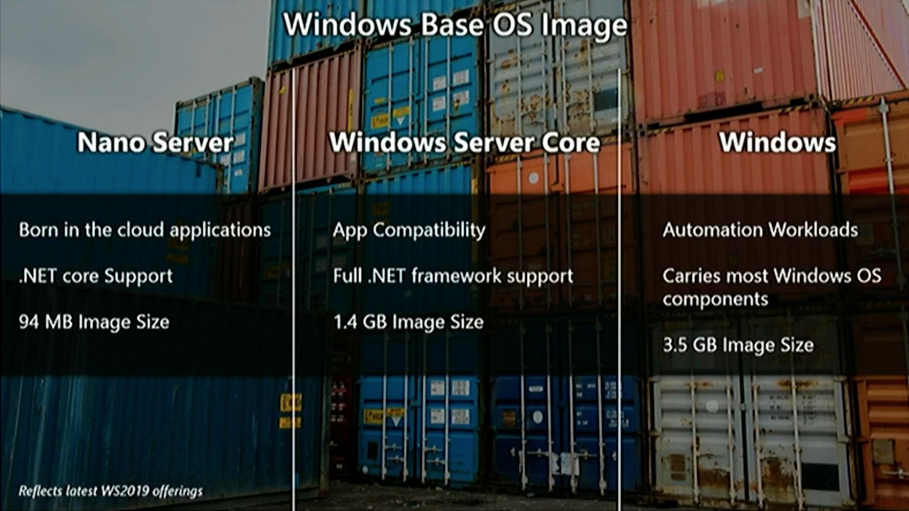

### Shared SMB volume mount

- https://docs.microsoft.com/en-us/virtualization/windowscontainers/manage-containers/persistent-storage

- https://docs.microsoft.com/en-us/virtualization/windowscontainers/manage-containers/swarm-mode

https://stefanscherer.github.io/docker-on-windows-server-2019/

https://collabnix.com/building-hybrid-docker-swarm-mode-cluster-on-google-cloud-platform/

