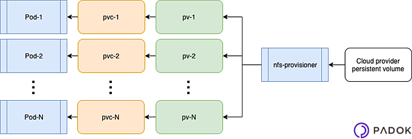

### NFS Persistent Volume in Kubernetes Cluster

https://www.youtube.com/watch?v=to14wmNmRCI


burada hikaye aslında şu şerkilde işliyor.




- **persistant volume PV**: sistemden belli bir alanın kubernetes e tanımlanması

- **Storage Classes SC**: Belirlene şekilde PV den belli bir alan alarak podlara otomatik alan tahsis eden mekanizma. bun yaparken  Peristtant Volume Claim (PVC) kullanır

- **persistant volume claim PVC**: Claims can request specific size and access modes (e.g., they can be mounted once read/write or many times read-only). PV den gerekli olan alanı belirli yetkilerle pod a verir.


- **provisioning**: 

- Static: 
A cluster administrator creates a number of PVs. They carry the details of the real storage, which is available for use by cluster users. They exist in the Kubernetes API and are available for consumption.

- Dynamic : 
When none of the static PVs the administrator created match a user’s PersistentVolumeClaim, the cluster may try to dynamically provision a volume specially for the PVC. This provisioning is based on StorageClasses: the PVC must request a storage class and the administrator must have created and configured that class for dynamic provisioning to occur. Claims that request the class "" effectively disable dynamic provisioning for themselves.


1. daha önce node lara bir NFS dik tanımlanmöış olmalı yani testi yapılmış olmalı

2. oncelikle PV tanımlaması yapıyoruz. ilgili dosya files/pv-nfs.yaml

doyada storageClass parametresini dikkat edilirse biz sadece manual diye bir isim verdik. yani kendimiz CtorageClass tanımlması yapmadık. dynammic de buraya bakıyor olacağız ama detaylı döküman için

https://kubernetes.io/docs/concepts/storage/storage-classes/


```
$ kubectl create -f files/pv-nfs.yaml
```


check etmek için

```
$ kubectl get pv

sonuç

NAME      CAPACITY   ACCESS MODES   RECLAIM POLICY   STATUS      CLAIM   STORAGECLASS   REASON   AGE
pv-nfs1   1Gi        RWO            Recycle          Available           nfs                     108s

```

3. daha sonra PVC tabımlması yapıyoruz. dosya files/pvc-nfs.yaml


```
$ kubectl create -f files/pvc-nfs.yaml
```


check etmek için alttaki komuttu kullanabiliriz. görülfüğü gibi mount olmuş görünüyor.

```
$ kubectl get pvc

sonuç

NAME          STATUS   VOLUME       CAPACITY   ACCESS MODES   STORAGECLASS   AGE
pvc-nfs-pv1   Bound    pv-nfs-pv1   1Gi        RWX            manual         5s


```


3. şimdi test emk için bu storage ı kullanacak bir uygulamayı yayına veriyoruz.


bunun için files/nfs-nginx.yaml dosyasını kullanıyor olacağız.

dosyada dikkat edilcek bölüm volume kısmı PVC alanında pvc-nfs-pv1 yazılı olduğu görülebilir. www alanı bu PVC alanına bağlanmış.

volumes alanında name de yazan www ile container altında yazan volumemounts alanındaki www kelimleri aynı olmalıdır. yani bizde adı www olan ve bizde pvc alanını gosteren kaynak container da www ile beklenen volumemount alanına bağlanacak ve container da buraya /usr/share/nginx/html klasörünü mount edecek.


```
$ kubectl create -f files/nfs-nginx.yaml
```

çalıştırdıktan 1 dk kadar sonra deploymentt ın yapılmış olduğu kontyrol edilir.

```
$ kubectl get deploy -o wide

# sonuç

NAME           READY   UP-TO-DATE   AVAILABLE   AGE     CONTAINERS    IMAGES                                 SELECTOR
nginx-deploy   1/1     1            1           2m14s   nginx         nginx                                  run=nginx

```

şimdi nfs server a gidip neler olduğuna bakabiliriz. bunun için öncelikle replikası 1 olan bu deployment ın hangi node a olduğunu öğrenmemiz gerekiyor. 

```
$ kubectl get pod

$ kubectl get pod nginx-deploy-6fdd5b84cc-wczw8


#sonuç

Name:         nginx-deploy-6fdd5b84cc-wczw8
Namespace:    default
Priority:     0
Node:         node2/10.0.1.6

```

görülfüğü üzere node2 de çalışıyor. bu node a gidip alttaki komutu çalıştırısak alttaki sonucu görebiliriz. ayrıca servis aip sinin de 10.233.96.9 olduğu görülür.

```
$ mount | grep disk

# sonuç

10.0.1.4:/media/diskshared on /var/lib/kubelet/pods/6f5f307d-d168-4750-a08a-8e0332fea732/volumes/kubernetes.io~nfs/pv-nfs-pv1 type nfs4 (rw,relatime,vers=4.2,rsize=524288,wsize=524288,namlen=255,hard,proto=tcp,timeo=600,retrans=2,sec=sys,clientaddr=10.0.1.6,local_lock=none,addr=10.0.1.4)


```

nfs serverda media/diskshared altıne bir index.html koyup bunu 10.0.16 (node2) sunucud-sunda curl http://10.233.96.9  ile çağıracak olursak sayfa içeriğini görebiliriz.


PVC de claimmiz default REtain olark ayarlandığı için bu deployment ı sisek dahi index.html kalacaktır tekrar ayağa kaldırdığımızda silinmeyen bu index.html de görünür olacaktır.


peki replikayı 3 çıkartırsak ne olur acaba ?


###  Using Persistent Volumes and Claims in Kubernetes Cluster

https://www.youtube.com/watch?v=I9GMUn15Nes

### Resources

- https://www.youtube.com/watch?v=to14wmNmRCI
- https://www.youtube.com/watch?v=I9GMUn15Nes
- https://www.youtube.com/watch?v=I9GMUn15Nes&list=PL34sAs7_26wNBRWM6BDhnonoA5FMERax0&index=20