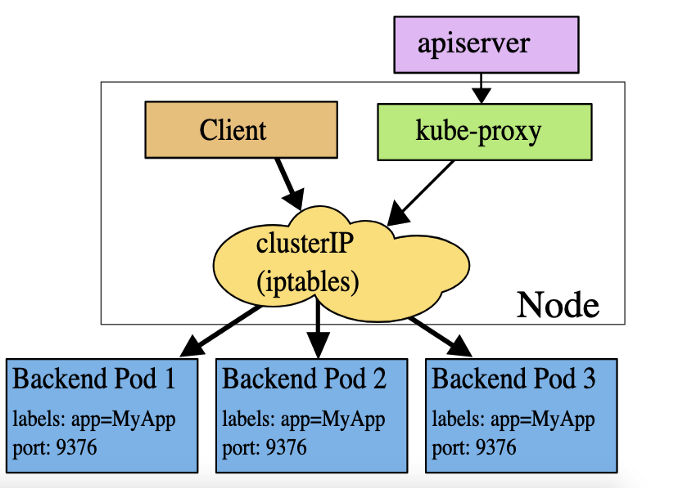

## Access Applications in a Cluster

### Accessing Cluster

1. **Rest APi zürenden erişim**

aşağıdaki komut çalıştırılarak api ile servisler arasında bir proxy kurulur. developmen, debug için uygun yöntemdir. 

```
$ kubectl proxy --port=8080
```

daha sonra diyelimki kubernetes api serververın root path ini çağıracağız. Alttak iadres çağrıldığında sonuç görülebilir.

```
curl http://localhost:8080/api/

# sonuç

{
  "kind": "APIVersions",
  "versions": [
    "v1"
  ],
  "serverAddressByClientCIDRs": [
    {
      "clientCIDR": "0.0.0.0/0",
      "serverAddress": "10.0.1.149:443"
    }
  ]
}

```


proxy olmadan bğlanmak için token a ihtiyacımız olacak.


```
APISERVER=$(kubectl config view --minify | grep server | cut -f 2- -d ":" | tr -d " ")
SECRET_NAME=$(kubectl get secrets | grep ^default | cut -f1 -d ' ')
TOKEN=$(kubectl describe secret $SECRET_NAME | grep -E '^token' | cut -f2 -d':' | tr -d " ")

curl $APISERVER/api --header "Authorization: Bearer $TOKEN" --insecure


# sonuç yukarıyla aynı olacaktır.


{
  "kind": "APIVersions",
  "versions": [
    "v1"
  ],
  "serverAddressByClientCIDRs": [
    {
      "clientCIDR": "0.0.0.0/0",
      "serverAddress": "10.0.1.149:443"
    }
  ]
}

```

apiden çağıracağımız şeylerden biri de içeride tanımlı olan service lerdir.

örneğin kubernetes dashboard u çağırmak için

http://localhost:8001/api/v1/namespaces/kubernetes-dashboard/services/https:kubernetes-dashboard:/proxy/

yani kuberntes de tanımlı service lere bu şekilde ulaşılabilir.


### Publishing Services (ServiceTypes)


Kubernetes networking addresses four concerns:

- Containers within a Pod use networking to communicate via loopback.
- Cluster networking provides communication between different Pods.
- The Service resource lets you expose an application running in Pods to be reachable from outside your cluster.
- You can also use Services to publish services only for consumption inside your cluster.


https://kubernetes.io/docs/concepts/services-networking/service/#publishing-services-service-types


http://www.mustafabektastepe.com/2020/01/18/kubernetes-nedir-nasil-calisir-nerede-kullanilir/ (türkçe kaynak)


Kubernetes ServiceTypes allow you to specify what kind of Service you want. The default is ClusterIP.

Type values and their behaviors are:

- __ClusterIP:__ Exposes the Service on a cluster-internal IP. Choosing this value makes the Service only reachable from within the cluster. This is the default ServiceType.

- __NodePort:__ Exposes the Service on each Node's IP at a static port (the NodePort). A ClusterIP Service, to which the NodePort Service routes, is automatically created. You'll be able to contact the NodePort Service, from outside the cluster, by requesting NodeIP:NodePort.

- __LoadBalancer:__ Exposes the Service externally using a cloud provider's load balancer. NodePort and ClusterIP Services, to which the external load balancer routes, are automatically created.

- **ExternalName:** Maps the Service to the contents of the externalName field (e.g. foo.bar.example.com), by returning a CNAME record

with its value. No proxying of any kind is set up.

__Note:__ You need either kube-dns version 1.7 or CoreDNS version 0.0.8 or higher to use the ExternalName type.
You can also use Ingress to expose your Service. Ingress is not a Service type, but it acts as the entry point for your cluster. It lets you consolidate your routing rules into a single resource as it can expose multiple services under the same IP address.


- MetalLB load balancer

https://www.youtube.com/watch?v=xYiYIjlAgHY


### Use a Service to Access an Application in a Cluster (NodePort)


https://kubernetes.io/docs/tasks/access-application-cluster/service-access-application-cluster/


daha once deploy ettiğimiz bir image ı aşağıdaki kod ile tipini nortport olarak expose ettiğimizi varsayalım.

```
kubectl expose deployment hello-world --type=NodePort --name=example-service
```

diyelimki bu deploymeentta replika sayısı iki. bu deployment ı describe edersek

```
kubectl describe services example-service
```

şöyle bir sonuç alırız

```
Name:                   example-service
Namespace:              default
Labels:                 run=load-balancer-example
Annotations:            <none>
Selector:               run=load-balancer-example
Type:                   NodePort
IP:                     10.32.0.16
Port:                   <unset> 8080/TCP
TargetPort:             8080/TCP
NodePort:               <unset> 31496/TCP
Endpoints:              10.200.1.4:8080,10.200.2.5:8080
Session Affinity:       None
Events:                 <none>
```

görüleceği üzere iki node da yani şu iki (10.200.1.4:8080,10.200.2.5:8080) node da yayında.

eğer bu iki node dan biirinin public ip si ile NodePort (31496) du kullanarak çağırısak sayfayı gmrebiliriz.

yani

http://node_public_ip_si:31496


### Exposing an External IP Address to Access an Application in a Cluster (LoadBalancer)

https://kubernetes.io/docs/tutorials/stateless-application/expose-external-ip-address/

### Connecting Applications with Services (ClusterIP)

https://kubernetes.io/docs/concepts/services-networking/connect-applications-service/


ilgili seploeymen adresi: https://raw.githubusercontent.com/kubernetes/website/master/content/en/examples/service/networking/run-my-nginx.yaml

bakılırsa container port 80 olarak belirtilmiş. tabi bizzat docker container içindeki port yoksa kubernetes de her pod un bir ip adresi var zaten. Bu şu anlama geliyor aynı nginx servisinden oluşan birden çok pod oluşturabiliriz.

replika sayısı 2 olan bir deployment yaptığımızı varsayalım. pod lrın ip lerine bakacak oluursak aşağıdaki sonucu göreceğiz.

```
kubectl get pods -l run=my-nginx -o yaml | grep podIP
    podIP: 10.233.90.6
    podIP: 10.233.96.8

```

bu ip leri herhangi bir node da çalıştıracak olursak sayfayı görebiliriz.

bu şu anlama geliyor eğer bu pod ip lerini bir şekilde dışarıdan bu node lara soracak olursak sayfayı görebiliriz.


peki tam bu noktada node lardan birinde route table a bakacak olursak ne görürüz

```
$ sudo route -n

# veya

$ ip r

 # şu sonuçla karşılaşırız

Destination     Gateway         Genmask         Flags Metric Ref    Use Iface
0.0.0.0         10.0.1.1        0.0.0.0         UG    100    0        0 eth0
10.0.1.0        0.0.0.0         255.255.255.0   U     0      0        0 eth0
10.233.90.0     10.0.1.5        255.255.255.0   UG    0      0        0 tunl0
10.233.92.0     10.0.1.7        255.255.255.0   UG    0      0        0 tunl0
10.233.96.0     0.0.0.0         255.255.255.0   U     0      0        0 *
10.233.96.1     0.0.0.0         255.255.255.255 UH    0      0        0 cali202dec2f757
10.233.96.2     0.0.0.0         255.255.255.255 UH    0      0        0 calib3c96e9a5c5
10.233.96.3     0.0.0.0         255.255.255.255 UH    0      0        0 cali7c971c4ed12
10.233.96.4     0.0.0.0         255.255.255.255 UH    0      0        0 cali1f991f573cb
10.233.96.5     0.0.0.0         255.255.255.255 UH    0      0        0 cali64e64f4bd2b
10.233.96.6     0.0.0.0         255.255.255.255 UH    0      0        0 cali12e7d09a6dc
10.233.96.7     0.0.0.0         255.255.255.255 UH    0      0        0 cali616b311a227
10.233.96.8     0.0.0.0         255.255.255.255 UH    0      0        0 calia203c519832
168.63.129.16   10.0.1.1        255.255.255.255 UGH   100    0        0 eth0
169.254.169.254 10.0.1.1        255.255.255.255 UGH   100    0        0 eth0
172.17.0.0      0.0.0.0         255.255.0.0     U     0      0        0 docker0


```


görülceği üzere alttaki 1 satır bizim pod larımızdan birinin ipsini göstermektedir. Diğer ip de başka bir node da. calico ilgili podlarla alakalı kayılar atmış görünüyor. bu sistem BGP olarak geçmektedir. ilgili tüm ip ler sanal eth yarıdmıyla route table a aeklenir ve bütün node lara kopylanır. anlaşılması ve kontrolü VXLAN a göre daha kolaydır. detaylar için [şu sayfaya](https://docs.projectcalico.org/networking/configuring) ve [bu sayfaya](https://rancher.com/blog/2019/2019-03-21-comparing-kubernetes-cni-providers-flannel-calico-canal-and-weave/) ve [wikiye](https://en.wikipedia.org/wiki/Border_Gateway_Protocol)bakabilirsiniz. 

```
10.233.96.8     0.0.0.0         255.255.255.255 UH    0      0        0 calia203c519832

```

calico her bir ip için ilgili node üzerinde bir sanal eth oluşturmaktadir. alttaki komutlarla test edilebilir.

```
$ ifconfig
$ ip link
$ netstat -i
```

listedeki calico eth lerindne birinin detaylarına şu komutlarla bakılabilir

```
sudo ethtool calia203c519832

```

buraya kadar bir nginx container ı deploy edip podIP si ile sayfayı görüntüledik.

Şimdi bir servis olarak expose edelim. 

```
# bu imperative yol
$ kubectl expose deployment/my-nginx

# eğer alttaki yml doyasını apply edersek (declerative) yol olmuş olur.

apiVersion: v1
kind: Service
metadata:
  name: my-nginx
  labels:
    run: my-nginx
spec:
  ports:
  - port: 80
    protocol: TCP
  selector:
    run: my-nginx

```


bu komutu çalştırdığımızda artık service haline getirmiş olduk. yani artık bütün podlar için tekbir ip adresimiz olacak bu da clusterIP olmuş oluyor. Dikkat edilirse burada artık port belirtebiliyoruz. belirtmezsek (ki impretaive de belirtmedik) 80 portu kullanılır.

alttaki komutla kontrol edecek olursak

```
$ kubectl get svc my-nginx

NAME       TYPE        CLUSTER-IP      EXTERNAL-IP   PORT(S)   AGE
my-nginx   ClusterIP   10.233.21.110   <none>        80/TCP    33s
```


10.233.21.110 ip sini herhangi bir node da çağıracak olursak sonucu görebiliriz.

Eğer servisi describe edecek olursak.

```
$ kubectl describe svc my-nginx

Name:              my-nginx
Namespace:         default
Labels:            <none>
Annotations:       <none>
Selector:          run=my-nginx
Type:              ClusterIP
IP:                10.233.21.110
Port:              <unset>  80/TCP
TargetPort:        80/TCP
Endpoints:         10.233.90.6:80,10.233.96.8:80
Session Affinity:  None
Events:            <none>


```

route tablosundan baktığımızda bu ipnin (10.233.21.110) görünmediğini farkederiz. çünki bu adresi kullanarak pod lara yönlendirme işini kubeproxy yapmaktadır.

- https://kubernetes.io/docs/concepts/services-networking/service/#virtual-ips-and-service-proxies




peki oluşturulan my-ngnix servisinin acaba bir dns kaydı varmı? yada my-nginx domainini kontrol ettiğimizde karşılığında ip adresi varmı?

bunu öğrenmenin birr yolu podlardaki containerlardan birine girip nslookup my-nging diye çağırmak. 

yada pod içine bir contaner (sidecar,embassador, etc) yükleyip onun üzeriden sorgu yapmak. bunun için üretilmiş olan çok iyi bir contaşner mevcut.

alttaki komtla kurlumun yapıp komut satırını çagırabiliriz.

```
$ kubectl run curl --image=radial/busyboxplus:curl -i --tty

#ekrana bu image ı komut satırında açmış olacak
#daha sonra "nslookup my-nginx" komutunu yazıp test ediyoruz

Server:    169.254.25.10
Address 1: 169.254.25.10

Name:      my-nginx
Address 1: 10.233.21.110 my-nginx.default.svc.cluster.local


```

görüleceği üzere 169.254.25.10 ipsi ansible ile kurlum yaparken k8s-cluster.yml dosyasında belirttiğimiz dns ipsi.

my-nginx.default.svc.cluster.local adreside servisimizin tam adresi.

bu adresi yine bağlı bulunduğumuz busyboxplus containerında curl ile çağıracak olursak web sitesi sonucunu görmüş oluruz.

bu domaini eğer node larda host dosyasında yazıp 10.233.21.110 ipsine yönşendşrecek olursak node içinde adresi çağırdığımızda web sitesini görebilirliz.

bu şekilde eğer dış bir load balancer ile dışarıdan gelen domain node larda hosot doyasında yazılı domain ilgili ip ye yönlendirilerek çalıştırılabilir. 

yada metallb gibi bir sisittem kurularak bu dns kaydı oluşturma işi otomatikleştirilmiş olur.


### Create an External Load Balancer

cluster ip ile oluşturulmuş servislere node lar üzerinde hsots kaydına domainler yazılarak external load balancer (veya proxy) ile çağrılarak sistem çalıştırılabilir.

üstteki clusterip senaryosu incelenebilir.


https://kubernetes.io/docs/tasks/access-application-cluster/

https://kubernetes.io/docs/tasks/access-application-cluster/create-external-load-balancer/#:~:text=When%20the%20Service%20type%20is,entries%20for%20the%20Kubernetes%20pods.


### ingress

https://kubernetes.io/docs/concepts/services-networking/ingress/


### Resources
- https://kubernetes.io/docs/concepts/services-networking/ingress/
- 