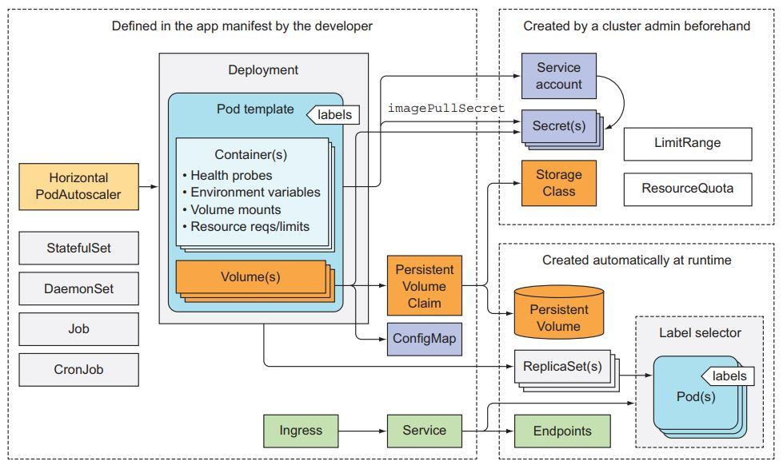

### Managing Resources for Containers
https://kubernetes.io/docs/concepts/configuration/manage-resources-containers/





__Request and Limit__

If the node where a Pod is running has enough of a resource available, it’s possible (and allowed) for a container to use more resource than its request for that resource specifies. However, a container is not allowed to use more than its resource limit.

For example, if you set a memory request of 256 MiB for a container, and that container is in a Pod scheduled to a Node with 8GiB of memory and no other Pods, then the container can try to use more RAM.

örnek

```yml
apiVersion: v1
kind: Pod
metadata:
  name: frontend
spec:
  containers:
  - name: db
    image: mysql
    env:
    - name: MYSQL_ROOT_PASSWORD
      value: "password"
    resources:
      requests:
        memory: "64Mi"
        cpu: "250m"
      limits:
        memory: "128Mi"
        cpu: "500m"
  - name: wp
    image: wordpress
    resources:
      requests:
        memory: "64Mi"
        cpu: "250m"
      limits:
        memory: "128Mi"
        cpu: "500m"
```

ephemeral storage örneği

```yml
apiVersion: v1
kind: Pod
metadata:
  name: frontend
spec:
  containers:
  - name: db
    image: mysql
    env:
    - name: MYSQL_ROOT_PASSWORD
      value: "password"
    resources:
      requests:
        ephemeral-storage: "2Gi"
      limits:
        ephemeral-storage: "4Gi"
  - name: wp
    image: wordpress
    resources:
      requests:
        ephemeral-storage: "2Gi"
      limits:
        ephemeral-storage: "4Gi"
```


### Pod Overhead
https://kubernetes.io/docs/concepts/configuration/pod-overhead/


### Pod Priority and Preemption

Pods can have priority. Priority indicates the importance of a Pod relative to other Pods. If a Pod cannot be scheduled, the scheduler tries to preempt (evict) lower priority Pods to make scheduling of the pending Pod possible.

bakılabilir 

https://kubernetes.io/docs/concepts/configuration/pod-priority-preemption/