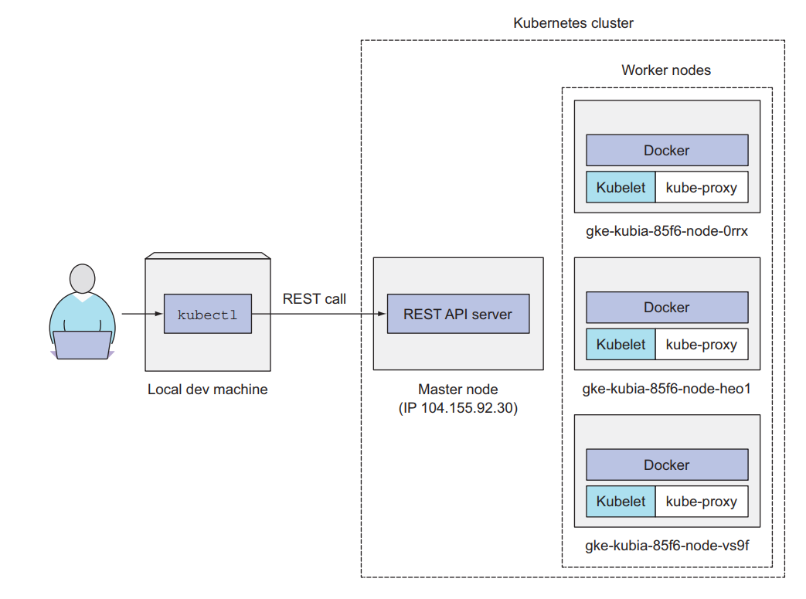

#### Components

[Bakınız Güzel anlatım](https://www.digitalocean.com/community/tutorials/an-introduction-to-kubernetes)

Resim incelendiğinde 2 parçanın olduğu görülecektir

1. Kubernetes Control Plane
2. Kubernetes Nodes

bu iki bölümün komponentlerini incelemek lazım

1. __Kubernetes Control Plane Components__
   1. __kube-apiserver:__ kubernetes control plane' nin frontend kısmıdır. scale out yapılabilir.
   2. __etcd:__ HA distributed key value store db. detayları için [link](https://etcd.io/docs/).
   3. __kube-scheduler:__ 4 tip controller mavcut.
      - Node controller: Responsible for noticing and responding when nodes go down.
      - Replication controller: Responsible for maintaining the correct number of pods for every replication controller object in the system.
      - Endpoints controller: Populates the Endpoints object (that is, joins Services & Pods).
      - Service Account & Token controllers: Create default accounts and API access tokens for new namespaces.
    4. __cloud-controller-manager:__ scaleout yapılabilir. cloud özel kontrol logic i kubernetes e getirir/embet edilir. eğer onpremise de çalışıyorsak bu controller ın bir önemi yok.
       - Node controller: For checking the cloud provider to determine if a node has been deleted in the cloud after it stops responding
       - Route controller: For setting up routes in the underlying cloud infrastructure
       - Service controller: For creating, updating and deleting cloud provider load balancers
2. __Node Componenets__
   bütün node larda çalışan komponetler
   1. __kubelet:__ containerların pod ları içinde çalıştığından emin olur.kbernets tarafında create edilmemiş hiçbir container ı yönetmez. PodSpec e uygun olarak contianerları çalıştığından emin olur.

kubelet ler kubeadm tarafından kurulmaz manuel olarka kurulması gerekir. butun pod lara kurulur.

   2. __kube proxy__: kuberntes network servislerine uygun olarak pod ların kuberntes içindeki network haberleşmelerini sağlar.

örneğin pod lar oluşturuldukları node larda bir  ip adresi alır. bunların önüne bir service koyduğuuzda service sanal bir componenttir, ram da çalışır. pod larla aynı netwprkde değildir ve pod ların tek bir uygulama gibi dışa açılmasını sağlar. peki bunu nasıl yapar? kube-proxy ile. kube-proxy her bir node da kuruludur.

   3. __Container runtime__: The container runtime is the software that is responsible for running containers.

    Kubernetes supports several container runtimes: Docker, containerd, CRI-O, and any implementation of the Kubernetes CRI (Container Runtime Interface).

    biz Docker ı kullanıyor olacağız.

#### Kubernetes API

aslında elimizdeeki cubectl cli tamamen API ile haberşen bir uygulama. tüm sistem API ile yönetilmektedir. OpenAPI ve swagger defitantionları vardır [detay](https://kubernetes.io/docs/concepts/overview/kubernetes-api/#openapi-and-swagger-definitions). 

 

