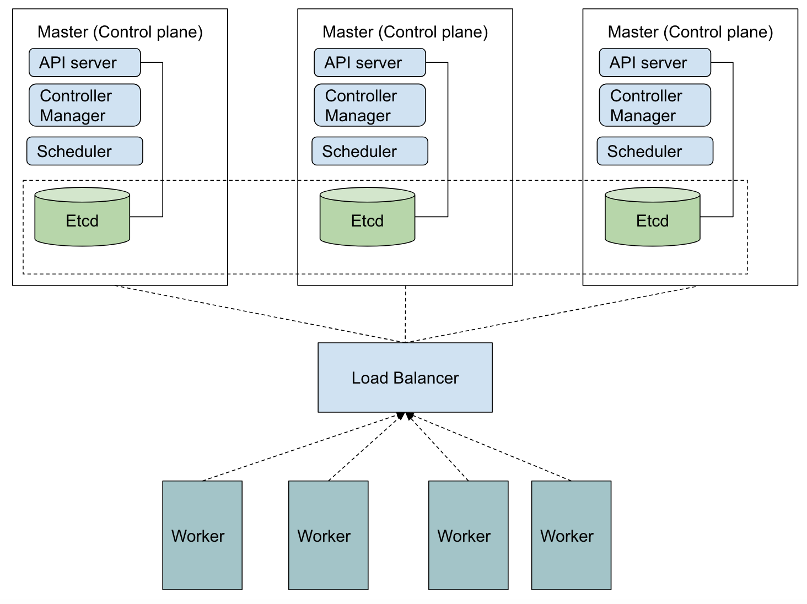

### Nodes


bütün container lar pod içinde bulunur ve bütün od larda node larda yer alır. node dediğimiz nesne ya fiziksel yada sanal bir işletim sistemidir ve control plae üzerinde yöntilirler.

node ları kubernetes cluster a register etmenin iki yolu mevcut

- The kubelet on a node self-registers to the control plane (tavsiye edilen ve bir çok distro da varsayılan olark gelen teknik), --register-node tru olarak ayarlandığında kubelet configurasyonundaki değerleri okuyarak cluster abağlanır.

When the Node authorization mode and NodeRestriction admission plugin are enabled, kubelets are only authorized to create/modify their own Node resource.

- You, or another human user, manually add a Node object. Bu durumda manule olar cubectl kullanlarak register yapılır.

__Conditions_

node ların çalılşır haldeki durumları

|Node Condition|Description|
|---|---|
|Ready|	True if the node is healthy and ready to accept pods, False if the node is not healthy and is not accepting pods, and Unknown if the node controller has not heard from the node in the last node-monitor-grace-period (default is 40 seconds)|
|DiskPressure|	True if pressure exists on the disk size–that is, if the disk capacity is low; otherwise False|
|MemoryPressure|	True if pressure exists on the node memory–that is, if the node memory is low; otherwise False|
|PIDPressure|	True if pressure exists on the processes—that is, if there are too many processes on the node; otherwise False|
|NetworkUnavailable|	True if the network for the node is not correctly configured, otherwise False|

API json olarka bu bilgiyi sunar

```
"conditions": [
  {
    "type": "Ready",
    "status": "True",
    "reason": "KubeletReady",
    "message": "kubelet is posting ready status",
    "lastHeartbeatTime": "2019-06-05T18:38:35Z",
    "lastTransitionTime": "2019-06-05T11:41:27Z"
  }
]
```
node controller node ları ayakta olup olmadığından sorumludur.



Node ları kontrol için --node-monitor-period saniye olark ayarlanır ve bu değere göre heardbeats kontrolu yapılır. her node kendi durumunu 40 saniye ile 5 dakika aralığında (monitor-period) node un status u hakkında bilgi gönderir node controller a.


__Reliability__

Default da kubernetes cluster ı zone lara böler. nedeni ise iş yükünü sağlıksız olan zone larlardan sağlıklı zone lara kaydırarak sistemi ayakta tutabilmesidir. 

Herhangi bir zone da bir node stasu hakkında false bilgisi iletirse contoller a, node controller o zondaki --unhealthy-zone-threshold değerini check eder (default %55) eğer değer default dan küçükse node tahliyesini yavaşlatır. Ancak eğer cluster küçükse (bunun için --large-cluster-size-threshold değerine bakar default 50) eğer değer default dan küçükse tahliyeyi durdurur, eğer değer daha büyükse tahliye oranını  --secondary-node-eviction-rate değerine düşürür (varsayılan 0.01). 


### Controller

Controller lar sistemin şuanki halini (current state) istenen (desired state) duruma en yakın hale getirmeye çalışır.

1. __Control via API server__

örneğin job controller kubernetes kurulumuyla hazır geliyor. job lar pod larda çalışan bir kubernetes kaynağıdır. job controller yeni bir job gördüğünde API server a yeni pod oluşturulmasını yada silinmesini söyler. pod veya container larda direkt olarak çalışmaz.

ilgili job tamamlandığında job ın status unü finihed olark işaretler böylece current state i desiredstate mümkün olduğunda yakın tutmaya çalışır.

bütün bu işler cluster ın kendi içinde olup biter. ancak cluster dışından yapıla müdahelelerde mümküdir bunun için direct control kullanılır.


2. __Direct Control__ 

örenğin cluster a daha fazla node gerektiği düşünüldüğünde controller direk olarak desired state erişerek değişiklik yapar.


### Cloud Controller Manager


plugin mekanizmasını kullanarak cloud provider lar kendi platformlarını kubernetes e entegre ederler.

böylece cloud controller manager node controller, route controller ve service controller fonksiyonelliğini sağlamış olur.

