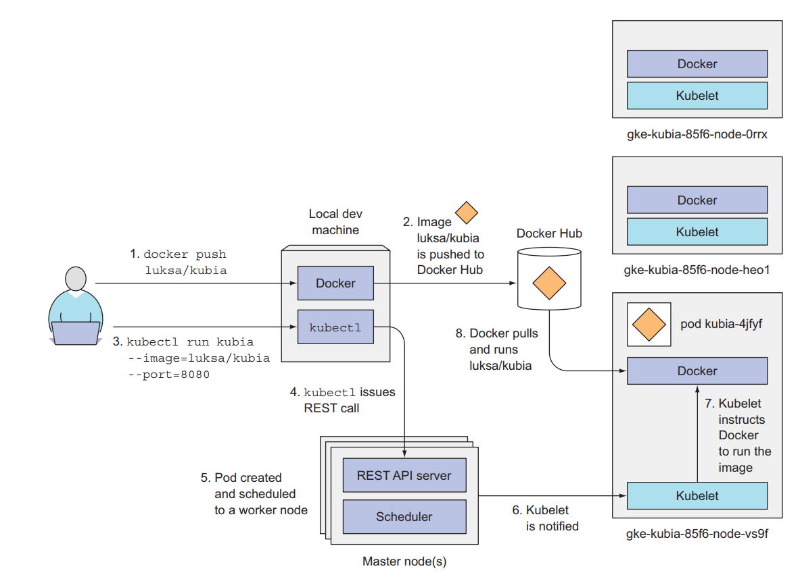

- podlar kubernetes teki en küçük birimdir. 
- bir pod da teknik olarak birden fazla cotainer olabilir (docker/container network), ancak tavsiye edilen tek container olmasıdır.
- herbir pod kenine özel ip adresine sahiptir.

pod contollers pod ların ayakta olmasında sorumludur. bu nedenle herhangi bir od stop olduğunda onu tekrar ayağa kaldırmaa çalşır.





pod lar pod tempalte ler il eoluşturulur

örneğin

```yml
apiVersion: batch/v1
kind: Job
metadata:
  name: hello
spec:
  template:
    # This is the pod template
    spec:
      containers:
      - name: hello
        image: busybox
        command: ['sh', '-c', 'echo "Hello, Kubernetes!" && sleep 3600']
      restartPolicy: OnFailure
    # The pod template ends here
```

bu template de değişiklik yapıldığında sistem pod üzeridne dğişiklik yapmak bunun yerine yeni bir pod oluşturarak eskisini silip yenisini deploy eder.


### Pod Lifecycle

__pod phases__


PodStatus içindeki phase field ının değerleri

|Value|Description|
|---|---|
|Pending|	The Pod has been accepted by the Kubernetes system, but one or more of the Container images has not been created. This includes time before being scheduled as well as time spent downloading images over the network, which could take a while.|
|Running|	The Pod has been bound to a node, and all of the Containers have been created. At least one Container is still running, or is in the process of starting or restarting.|
|Succeeded|	All Containers in the Pod have terminated in success, and will not be restarted.|
|Failed|	All Containers in the Pod have terminated, and at least one Container has terminated in failure. That is, the Container either exited with non-zero status or was terminated by the system.|
|Unknown|	For some reason the state of the Pod could not be obtained, typically due to an error in communicating with the host of the Pod.|

__Pod Condition__

PodStatus içindeki PodContitions field ının değerleri.

probe container healtcheck demektir.

- The lastProbeTime field provides a timestamp for when the Pod condition was last probed.

- The lastTransitionTime field provides a timestamp for when the Pod last transitioned from one status to another.

- The message field is a human-readable message indicating details about the transition.

- The reason field is a unique, one-word, CamelCase reason for the condition’s last transition.

- The status field is a string, with possible values “True”, “False”, and “Unknown”.

- The type field is a string with the following possible values:

  - PodScheduled: the Pod has been scheduled to a node;
  - Ready: the Pod is able to serve requests and should be added to the load balancing pools of all matching Services;
  - Initialized: all init containers have started successfully;
  - ContainersReady: all containers in the Pod are ready.

__Container Probes__

container ları durumları hakkında kubelet peryodik olarak bilgi toplar. bunu yaparken de 3 farklı handler ı kullanır.

- ExecAction: Executes a specified command inside the Container. The diagnostic is considered successful if the command exits with a status code of 0.
- TCPSocketAction: Performs a TCP check against the Container’s IP address on a specified port. The diagnostic is considered successful if the port is open.
- HTTPGetAction: Performs an HTTP Get request against the Container’s IP address on a specified port and path. The diagnostic is considered successful if the response has a status code greater than or equal to 200 and less than 400.

ve bu üç handler üç farklı durum değeri alır.

- Success: The Container passed the diagnostic.
- Failure: The Container failed the diagnostic.
- Unknown: The diagnostic failed, so no action should be taken.

ayrıca kubelet ıopsiyonel olarak şu probe leride yapabilir çalışan container üzerinde.

- livenessProbe: container ı çalışıp çalışmadığını check eder eğer fail dönerse container ı kill eder ve restart policy ye göre tekrar çalıştırı state i success olana kadar. eğer ugulamamız kendi kendine fail oluyorsa bu kullanılmalı.
- readinessProbe: servisin reqauest alamya hazır olup olamdığını check eder. eğer sisitem hazır değilse hazır oluncaya kadar pod un ip adresini siler.
- startupProbe: uygulamanın container içinde çalıştığında  emin olur. eğer bu fail olursacontainer silinerek tekrar oluşturulur. eğer uygulamamız initialDelaySeconds + failureThreshold × periodSeconds(30s)değerinde daha uzun sürede ayağa kalkıyor sa bunu kulanmalıyız.

examples

liveness probe example

```
apiVersion: v1
kind: Pod
metadata:
  labels:
    test: liveness
  name: liveness-http
spec:
  containers:
  - args:
    - /server
    image: k8s.gcr.io/liveness
    livenessProbe:
      httpGet:
        # when "host" is not defined, "PodIP" will be used
        # host: my-host
        # when "scheme" is not defined, "HTTP" scheme will be used. Only "HTTP" and "HTTPS" are allowed
        # scheme: HTTPS
        path: /healthz
        port: 8080
        httpHeaders:
        - name: X-Custom-Header
          value: Awesome
      initialDelaySeconds: 15
      timeoutSeconds: 1
    name: liveness
```

Example states

1. Pod is running and has one Container. Container exits with failure.
   - Log failure event.
   - If restartPolicy is:
     - Always: Restart Container; Pod phase stays Running.
     - OnFailure: Restart Container; Pod phase stays Running.
     - Never: Pod phase becomes Failed.
  2. Pod is running, and a disk dies.
   - Kill all Containers.
   - Log appropriate event.
   - Pod phase becomes Failed.
   - If running under a controller, Pod is recreated elsewhere.
3. Pod is running and has one Container. Container runs out of memory.
   - Container terminates in failure.
   - Log OOM event.
   - If restartPolicy is:
     - Always: Restart Container; Pod phase stays Running.
     - OnFailure: Restart Container; Pod phase stays Running.
     - Never: Log failure event; Pod phase becomes Failed.

### Init Continers

bu containerlar normal conrtainer lardan farklı olarak asıl uygulama contianer ları çalışmada önce çalışması gereken container larıdr. bu container alrda daha çok ilk çalışma scripltari, bazı araçlar olabilir.

bir pod da birden fazla container olması durumunda kullanılırlar.

bu containler diğer normal containerlar gibidir sadece alttaki farklar hariç
- herzaman comletion olmak için çalşırlar
- bütün init containerlar sırayla successful olmalıdır. bir önceki fail olduysa hepsi fail olmuş demektir.

eğer bir init container fail olursa bütün pod tekrar oluşturulur.

init container lar lifecycle, livenessProbe, readinessProbe, or startupProbe ları deteklemez. çünkü pod zaten readsy olmadan çalışıp bitmeliler.

örnekler


aşağıdaki örnekte iki adet init container var ilki myserice i bekliyor ikincisi de mydb diye bir servisi bekliyor. bu iki inir container de başladığında pod app container ı çalıştırmaya başlaycak.

```yml
apiVersion: v1
kind: Pod
metadata:
  name: myapp-pod
  labels:
    app: myapp
spec:
  containers:
  - name: myapp-container
    image: busybox:1.28
    command: ['sh', '-c', 'echo The app is running! && sleep 3600']
  initContainers:
  - name: init-myservice
    image: busybox:1.28
    command: ['sh', '-c', "until nslookup myservice.$(cat /var/run/secrets/kubernetes.io/serviceaccount/namespace).svc.cluster.local; do echo waiting for myservice; sleep 2; done"]
  - name: init-mydb
    image: busybox:1.28
    command: ['sh', '-c', "until nslookup mydb.$(cat /var/run/secrets/kubernetes.io/serviceaccount/namespace).svc.cluster.local; do echo waiting for mydb; sleep 2; done"]
```
 tam bu esnada pod iki servisi bekliyor olacak

 ```yml

 ---
apiVersion: v1
kind: Service
metadata:
  name: myservice
spec:
  ports:
  - protocol: TCP
    port: 80
    targetPort: 9376
---
apiVersion: v1
kind: Service
metadata:
  name: mydb
spec:
  ports:
  - protocol: TCP
    port: 80
    targetPort: 9377
```

### Pod Preset

bir pod a create olma aşamasında bilgi inject etmek için kullanılır. örneğin secret, volume veya env iject etmek için.

bunun için kubernetes da podpreset active edilmelidir.

--runtme-config kullanılarak API çağrılabilir.
şunların çalıştığında emin olmalıyız.

- You have enabled the api type settings.k8s.io/v1alpha1/podpreset
- You have enabled the admission controller PodPreset
- You have defined your pod presets

örnek

pod spec
```yml
apiVersion: v1
kind: Pod
metadata:
  name: website
  labels:
    app: website
    role: frontend
spec:
  containers:
    - name: website
      image: ecorp/website
      ports:
        - containerPort: 80
```
pod preset spec

```yml
kind: PodPreset
apiVersion: settings.k8s.io/v1alpha1
metadata:
  name: allow-database
  namespace: myns
spec:
  selector:
    matchLabels:
      role: frontend
  env:
    - name: DB_PORT
      value: "6379"
  volumeMounts:
    - mountPath: /cache
      name: cache-volume
  volumes:
    - name: cache-volume
      emptyDir: {}
```

Pod spec after admission controller


```yml
apiVersion: v1
kind: Pod
metadata:
  name: website
  labels:
    app: website
    role: frontend
  annotations:
    podpreset.admission.kubernetes.io/allow-database: "resource version"
spec:
  containers:
    - name: website
      image: ecorp/website
      volumeMounts:
        - mountPath: /cache
          name: cache-volume
      ports:
        - containerPort: 80
      env:
        - name: DB_PORT
          value: "6379"
  volumes:
    - name: cache-volume
      emptyDir: {}
```

daha detaylı örnekler için
https://unofficial-kubernetes.readthedocs.io/en/latest/tasks/run-application/podpreset/

### Pod Topology Spread Constraints

bir hata meydana geldiğinide pod ların clusterda nasıl dağıtlacağını belirlemek mümkün. bu bize HA sağlamış olacak.

bunun için EvenPodsSpread in enable edilmesi gerekmektedir.

toplogy spread constraints node labellara bağlı olarka çalışır. 

örnek 

```
apiVersion: v1
kind: Pod
metadata:
  name: mypod
spec:
  topologySpreadConstraints:
    - maxSkew: <integer>
      topologyKey: <string>
      whenUnsatisfiable: <string>
      labelSelector: <object>
```
- maxSkew: podlarin eşit olmayan şekilde dağılma derecesini belirler.
- topologyKey: node label in anahtarıdır. eğer iki node aynı anahtarla etiketlenmişse scheduler iki node aynı topolojideymiş gibi davranır.iki noda dengeli bir şekilde pod ları bölmeye çalışır.
- whenUnsatisfiable:
- labelSelector: eşleşen pod ları bulmak için kullanılır. böylece topologyalanındaki bölme sayısı belirlenebilir.

detaylar için

https://kubernetes.io/docs/concepts/workloads/pods/pod-topology-spread-constraints/


### Disruptions

detayarına bakılmalı 

https://kubernetes.io/docs/concepts/workloads/pods/disruptions/

istemsiz gerçekleşen bozulmaları minimize etmek için gerekli.

### Ephemeral (fani demek) Containers

bu aslında docker/container network ün kubernetes şekli. bu konuda en iyi image lardan biri Nicolaka/nwtshoot.

burada amaç geçici bir container ı pod içine koyarak proble çözmek. aslına bu contianer direk olaark uygulamnın bir parçası olmamış oluyor.

oluşturmak için örnek

```
{
    "apiVersion": "v1",
    "kind": "EphemeralContainers",
    "metadata": {
            "name": "example-pod"
    },
    "ephemeralContainers": [{
        "command": [
            "sh"
        ],
        "image": "busybox",
        "imagePullPolicy": "IfNotPresent",
        "name": "debugger",
        "stdin": true,
        "tty": true,
        "terminationMessagePolicy": "File"
    }]
}
```

oluşturmak için daha sonra bu komut çalıştırılır

```
kubectl replace --raw /api/v1/namespaces/default/pods/example-pod/ephemeralcontainers  -f ec.json
```

