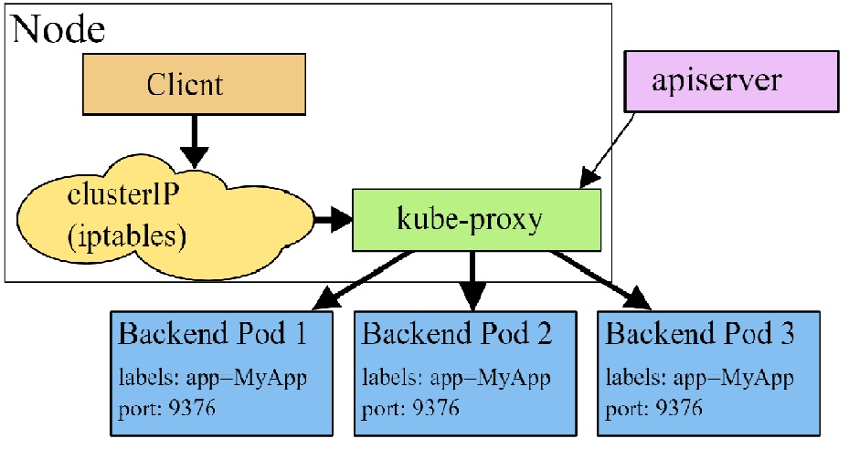
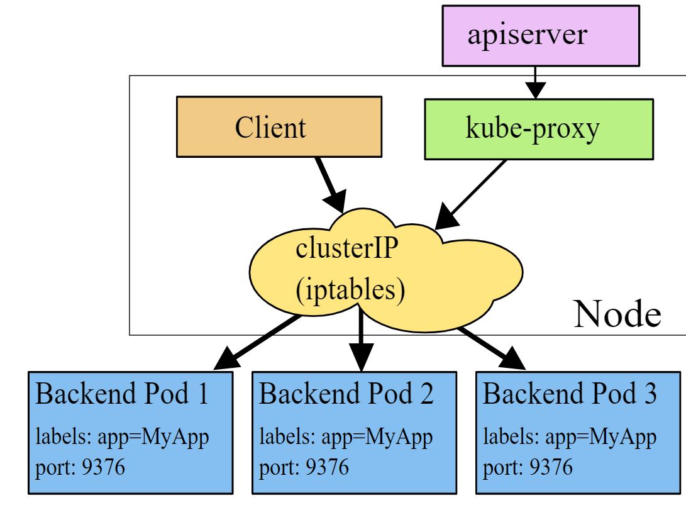
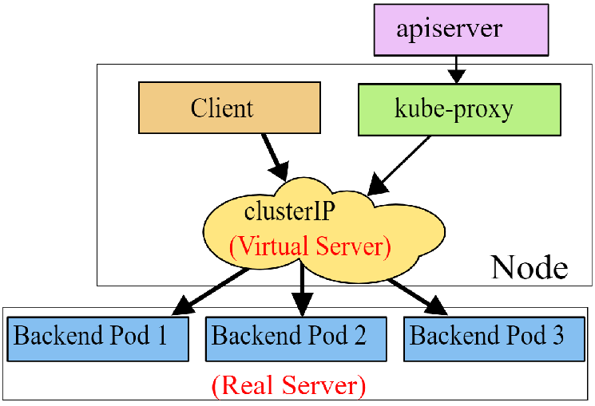

https://kubernetes.io/docs/concepts/services-networking/service/

Kubernetes her bir pod a ip adersi verir ve aynı işi yapan bir grup pod a tek bir DNS name verir. böylece load balance yapmamız sağlanmış olur.


### Services


#### Defining a Service

alttaki kod my-service adında bir servis crate ediyor ve label ı MyApp olan tüm pod ları dışarıya 80 portundan açıyor içeride ise 9376 portundan okuyor.

service ip lerine cluster ip si de denir.


```yml
apiVersion: v1
kind: Service
metadata:
  name: my-service
spec:
  selector:
    app: MyApp
  ports:
    - protocol: TCP
      port: 80
      targetPort: 9376
```

bazen pod selactor olamdan da serviec create edileblir daha sonra bu servis manuel olarak bağlanabilir.

```yml
apiVersion: v1
kind: Service
metadata:
  name: my-service
spec:
  ports:
    - protocol: TCP
      port: 80
      targetPort: 9376
```

end point ile bağlanabilir

```yml
apiVersion: v1
kind: Endpoints
metadata:
  name: my-service
subsets:
  - addresses:
      - ip: 192.0.2.42
    ports:
      - port: 9376
```


#### Virtual IP implementation
The previous information should be sufficient for many people who just want to use Services. However, there is a lot going on behind the scenes that may be worth understanding.

1. Avoiding collisions
One of the primary philosophies of Kubernetes is that you should not be exposed to situations that could cause your actions to fail through no fault of your own. For the design of the Service resource, this means not making you choose your own port number if that choice might collide with someone else’s choice. That is an isolation failure.
In order to allow you to choose a port number for your Services, we must ensure that no two Services can collide. Kubernetes does that by allocating each Service its own IP address.
To ensure each Service receives a unique IP, an internal allocator atomically updates a global allocation map in etcd prior to creating each Service. The map object must exist in the registry for Services to get IP address assignments, otherwise creations will fail with a message indicating an IP address could not be allocated.
In the control plane, a background controller is responsible for creating that map (needed to support migrating from older versions of Kubernetes that used in-memory locking). Kubernetes also uses controllers to check for invalid assignments (eg due to administrator intervention) and for cleaning up allocated IP addresses that are no longer used by any Services.

2. Service IP addresses
Unlike Pod IP addresses, which actually route to a fixed destination, Service IPs are not actually answered by a single host. Instead, kube-proxy uses iptables (packet processing logic in Linux) to define virtual IP addresses which are transparently redirected as needed. When clients connect to the VIP, their traffic is automatically transported to an appropriate endpoint. The environment variables and DNS for Services are actually populated in terms of the Service’s virtual IP address (and port).
kube-proxy supports three proxy modes—userspace, iptables and IPVS—which each operate slightly differently.
   - Userspace
As an example, consider the image processing application described above. When the backend Service is created, the Kubernetes master assigns a virtual IP address, for example 10.0.0.1. Assuming the Service port is 1234, the Service is observed by all of the kube-proxy instances in the cluster. When a proxy sees a new Service, it opens a new random port, establishes an iptables redirect from the virtual IP address to this new port, and starts accepting connections on it.
When a client connects to the Service’s virtual IP address, the iptables rule kicks in, and redirects the packets to the proxy’s own port. The “Service proxy” chooses a backend, and starts proxying traffic from the client to the backend.
This means that Service owners can choose any port they want without risk of collision. Clients can simply connect to an IP and port, without being aware of which Pods they are actually accessing.
   - iptables
Again, consider the image processing application described above. When the backend Service is created, the Kubernetes control plane assigns a virtual IP address, for example 10.0.0.1. Assuming the Service port is 1234, the Service is observed by all of the kube-proxy instances in the cluster. When a proxy sees a new Service, it installs a series of iptables rules which redirect from the virtual IP address to per-Service rules. The per-Service rules link to per-Endpoint rules which redirect traffic (using destination NAT) to the backends.
When a client connects to the Service’s virtual IP address the iptables rule kicks in. A backend is chosen (either based on session affinity or randomly) and packets are redirected to the backend. Unlike the userspace proxy, packets are never copied to userspace, the kube-proxy does not have to be running for the virtual IP address to work, and Nodes see traffic arriving from the unaltered client IP address.
This same basic flow executes when traffic comes in through a node-port or through a load-balancer, though in those cases the client IP does get altered.

   - IPVS
iptables operations slow down dramatically in large scale cluster e.g 10,000 Services. IPVS is designed for load balancing and based on in-kernel hash tables. So you can achieve performance consistency in large number of Services from IPVS-based kube-proxy. Meanwhile, IPVS-based kube-proxy has more sophisticated load balancing algorithms (least conns, locality, weighted, persistence).


#### Virtual IPs and Service Proxies

Every node in a Kubernetes cluster runs a kube-proxy. kube-proxy is responsible for implementing a form of virtual IP for Services of type other than ExternalName.

There are a few reasons for using proxying for Services:

- There is a long history of DNS implementations not respecting record TTLs, and caching the results of name lookups after they should have expired.
- Some apps do DNS lookups only once and cache the results indefinitely.
- Even if apps and libraries did proper re-resolution, the low or zero TTLs on the DNS records could impose a high load on DNS that then becomes difficult to manage.


1. __User space proxy mode__
  
By default, kube-proxy in userspace mode chooses a backend via a round-robin algorithm.

bu versiyonda kube_proxy master node u watch eder. böylece eklene veya silinen servisleri ve end pointleri ayaralayabilir.

böylecce ip taples a kurallar girer hangi port hangi portla hangi ip hangi ip ile haberleşecek vs.



1. __iptables proxy mode__

By default, kube-proxy in iptables mode chooses a backend at random.

burada kube-proxy control plane izler böylece eklene veya silinen servisleri ve end pointleri ayaralayabilir.

an cak bu sistem daa yavaştır çünki trafiği handle etmek userspace ve kernelspace swith yapmadan Linux netfilter ı kullanır.

You can use Pod readiness probes to verify that backend Pods are working OK, so that kube-proxy in iptables mode only sees backends that test out as healthy. Doing this means you avoid having traffic sent via kube-proxy to a Pod that’s known to have failed.



1. __IPVS proxy mode__
__Note:__ To run kube-proxy in IPVS mode, you must make IPVS available on the node before starting kube-proxy. When kube-proxy starts in IPVS proxy mode, it verifies whether IPVS kernel modules are available. If the IPVS kernel modules are not detected, then kube-proxy falls back to running in iptables proxy mode.
In ipvs mode, kube-proxy watches Kubernetes Services and Endpoints, calls netlink interface to create IPVS rules accordingly and synchronizes IPVS rules with Kubernetes Services and Endpoints periodically. This control loop ensures that IPVS status matches the desired state. When accessing a Service, IPVS directs traffic to one of the backend Pods.
The IPVS proxy mode is based on netfilter hook function that is similar to iptables mode, but uses a hash table as the underlying data structure and works in the kernel space. That means kube-proxy in IPVS mode redirects traffic with lower latency than kube-proxy in iptables mode, with much better performance when synchronising proxy rules. Compared to the other proxy modes, IPVS mode also supports a higher throughput of network traffic.
IPVS provides more options for balancing traffic to backend Pods; these are:

   - rr: round-robin
   - lc: least connection (smallest number of open connections)
   - dh: destination hashing
   - sh: source hashing
   - sed: shortest expected delay
   - nq: never queue

In these proxy models, the traffic bound for the Service’s IP:Port is proxied to an appropriate backend without the clients knowing anything about Kubernetes or Services or Pods.
If you want to make sure that connections from a particular client are passed to the same Pod each time, you can select the session affinity based on the client’s IP addresses by setting service.spec.sessionAffinity to “ClientIP” (the default is “None”). You can also set the maximum session sticky time by setting service.spec.sessionAffinityConfig.clientIP.timeoutSeconds appropriately. (the default value is 10800, which works out to be 3 hours).

#### Multi-Port Services

örnek 

```
apiVersion: v1
kind: Service
metadata:
  name: my-service
spec:
  selector:
    app: MyApp
  ports:
    - name: http
      protocol: TCP
      port: 80
      targetPort: 9376
    - name: https
      protocol: TCP
      port: 443
      targetPort: 9377
```

#### Choosing your own IP address

You can specify your own cluster IP address as part of a Service creation request. To do this, set the .spec.clusterIP field. For example, if you already have an existing DNS entry that you wish to reuse, or legacy systems that are configured for a specific IP address and difficult to re-configure.

The IP address that you choose must be a valid IPv4 or IPv6 address from within the service-cluster-ip-range CIDR range that is configured for the API server. If you try to create a Service with an invalid clusterIP address value, the API server will return a 422 HTTP status code to indicate that there’s a problem.

#### Discovering services

__Note:__ When you have a Pod that needs to access a Service, and you are using the environment variable method to publish the port and cluster IP to the client Pods, you must create the Service before the client Pods come into existence. Otherwise, those client Pods won’t have their environment variables populated. If you only use DNS to discover the cluster IP for a Service, you don’t need to worry about this ordering issue.

Kubernetes supports 2 primary modes of finding a Service
1. __environment variables and DNS.__
Environment variables
When a Pod is run on a Node, the kubelet adds a set of environment variables for each active Service. It supports both Docker links compatible variables (see makeLinkVariables) and simpler {SVCNAME}_SERVICE_HOST and {SVCNAME}_SERVICE_PORT variables, where the Service name is upper-cased and dashes are converted to underscores.

For example, the Service "redis-master" which exposes TCP port 6379 and has been allocated cluster IP address 10.0.0.11, produces the following environment variables:

```
REDIS_MASTER_SERVICE_HOST=10.0.0.11
REDIS_MASTER_SERVICE_PORT=6379
REDIS_MASTER_PORT=tcp://10.0.0.11:6379
REDIS_MASTER_PORT_6379_TCP=tcp://10.0.0.11:6379
REDIS_MASTER_PORT_6379_TCP_PROTO=tcp
REDIS_MASTER_PORT_6379_TCP_PORT=6379
REDIS_MASTER_PORT_6379_TCP_ADDR=10.0.0.11
```
2. __DNS__
You can (and almost always should) set up a DNS service for your Kubernetes cluster using an add-on.

https://kubernetes.io/docs/concepts/cluster-administration/addons/

A cluster-aware DNS server, such as CoreDNS, watches the Kubernetes API for new Services and creates a set of DNS records for each one. If DNS has been enabled throughout your cluster then all Pods should automatically be able to resolve Services by their DNS name.

For example, if you have a Service called "my-service" in a Kubernetes Namespace "my-ns", the control plane and the DNS Service acting together create a DNS record for "my-service.my-ns". Pods in the "my-ns" Namespace should be able to find it by simply doing a name lookup for my-service ("my-service.my-ns" would also work).

Pods in other Namespaces must qualify the name as my-service.my-ns. These names will resolve to the cluster IP assigned for the Service.

Kubernetes also supports DNS SRV (Service) records for named ports. If the "my-service.my-ns" Service has a port named "http" with the protocol set to TCP, you can do a DNS SRV query for _http._tcp.my-service.my-ns to discover the port number for "http", as well as the IP address.

The Kubernetes DNS server is the only way to access ExternalName Services. You can find more information about ExternalName resolution in DNS Pods and Services.


#### Headless Services
Sometimes you don’t need load-balancing and a single Service IP. In this case, you can create what are termed “headless” Services, by explicitly specifying "None" for the cluster IP (.spec.clusterIP).

You can use a headless Service to interface with other service discovery mechanisms, without being tied to Kubernetes’ implementation.

For headless Services, a cluster IP is not allocated, kube-proxy does not handle these Services, and there is no load balancing or proxying done by the platform for them. How DNS is automatically configured depends on whether the Service has selectors defined:

- With selectors

For headless Services that define selectors, the endpoints controller creates Endpoints records in the API, and modifies the DNS configuration to return records (addresses) that point directly to the Pods backing the Service.

- Without selectors

For headless Services that do not define selectors, the endpoints controller does not create Endpoints records. However, the DNS system looks for and configures either:

- CNAME records for ExternalName-type Services.
- A records for any Endpoints that share a name with the Service, for all other types.

#### Publishing Services (ServiceTypes)

For some parts of your application (for example, frontends) you may want to expose a Service onto an external IP address, that’s outside of your cluster.

Kubernetes ServiceTypes allow you to specify what kind of Service you want. The default is ClusterIP.

Type values and their behaviors are:

- __ClusterIP:__ Exposes the Service on a cluster-internal IP. Choosing this value makes the Service only reachable from within the cluster. This is the default ServiceType.

- __NodePort:__ Exposes the Service on each Node’s IP at a static port (the NodePort). A ClusterIP Service, to which the NodePort Service routes, is automatically created. You’ll be able to contact the NodePort Service, from outside the cluster, by requesting NodeIP:NodePort.


```yml
apiVersion: v1
kind: Service
metadata:
  name: my-service
spec:
  type: NodePort
  selector:
    app: MyApp
  ports:
      # By default and for convenience, the `targetPort` is set to the same value as the `port` field.
    - port: 80
      targetPort: 80
      # Optional field
      # By default and for convenience, the Kubernetes control plane will allocate a port from a range (default: 30000-32767)
      nodePort: 30007
```


- __LoadBalancer:__ Exposes the Service externally using a cloud provider’s load balancer. NodePort and ClusterIP Services, to which the external load balancer routes, are automatically created.

Note: On Azure, if you want to use a user-specified public type loadBalancerIP, you first need to create a static type public IP address resource. This public IP address resource should be in the same resource group of the other automatically created resources of the cluster. For example, MC_myResourceGroup_myAKSCluster_eastus.

 Specify the assigned IP address as loadBalancerIP. Ensure that you have updated the securityGroupName in the cloud provider configuration file. For information about troubleshooting CreatingLoadBalancerFailed permission issues see, [Use a static IP address with the Azure Kubernetes Service (AKS) load balancer](https://docs.microsoft.com/en-us/azure/aks/static-ip) or [CreatingLoadBalancerFailed on AKS cluster with advanced networking](https://github.com/Azure/AKS/issues/357).


cloud service sağlayıcıların internal load balancer kullanımları için 

https://kubernetes.io/docs/concepts/services-networking/service/#internal-load-balancer


```yml
apiVersion: v1
kind: Service
metadata:
  name: my-service
spec:
  selector:
    app: MyApp
  ports:
    - protocol: TCP
      port: 80
      targetPort: 9376
  clusterIP: 10.0.171.239
  type: LoadBalancer
status:
  loadBalancer:
    ingress:
    - ip: 192.0.2.127
```
Traffic from the external load balancer is directed at the backend Pods. The cloud provider decides how it is load balanced.

- __ExternalName:__ Maps the Service to the contents of the externalName field (e.g. foo.bar.example.com), by returning a CNAME record

with its value. No proxying of any kind is set up.

__Warning:__ You may have trouble using ExternalName for some common protocols, including HTTP and HTTPS. If you use ExternalName then the hostname used by clients inside your cluster is different from the name that the ExternalName references.

For protocols that use hostnames this difference may lead to errors or unexpected responses. HTTP requests will have a Host: header that the origin server does not recognize; TLS servers will not be able to provide a certificate matching the hostname that the client connected to.


__Note:__ You need either kube-dns version 1.7 or CoreDNS version 0.0.8 or higher to use the ExternalName type.
You can also use Ingress to expose your Service. Ingress is not a Service type, but it acts as the entry point for your cluster. It lets you consolidate your routing rules into a single resource as it can expose multiple services under the same IP address.

Services of type ExternalName map a Service to a DNS name, not to a typical selector such as my-service or cassandra. You specify these Services with the spec.externalName parameter.

This Service definition, for example, maps the my-service Service in the prod namespace to my.database.example.com:

```
apiVersion: v1
kind: Service
metadata:
  name: my-service
  namespace: prod
spec:
  type: ExternalName
  externalName: my.database.example.com

```


- __External IPs__ If there are external IPs that route to one or more cluster nodes, Kubernetes Services can be exposed on those externalIPs. Traffic that ingresses into the cluster with the external IP (as destination IP), on the Service port, will be routed to one of the Service endpoints. externalIPs are not managed by Kubernetes and are the responsibility of the cluster administrator.

In the Service spec, externalIPs can be specified along with any of the ServiceTypes. In the example below, “my-service” can be accessed by clients on “80.11.12.10:80” (externalIP:port)

```
apiVersion: v1
kind: Service
metadata:
  name: my-service
spec:
  selector:
    app: MyApp
  ports:
    - name: http
      protocol: TCP
      port: 80
      targetPort: 9376
  externalIPs:
    - 80.11.12.10
```


https://medium.com/google-cloud/kubernetes-from-load-balancer-to-pod-3f2399637b0c

https://www.projectcalico.org/comparing-kube-proxy-modes-iptables-or-ipvs/


### Service Topology

Service Topology enables a service to route traffic based upon the Node topology of the cluster.

The Service Topology feature resolves this by allowing the Service creator to define a policy for routing traffic based upon the Node labels for the originating and destination Nodes.

If topologyKeys is not specified or empty, no topology constraints will be applied.

Consider a cluster with Nodes that are labeled with their hostname, zone name, and region name. Then you can set the topologyKeys values of a service to direct traffic as follows.

- Only to endpoints on the same node, failing if no endpoint exists on the node: ["kubernetes.io/hostname"].
- Preferentially to endpoints on the same node, falling back to endpoints in the same zone, followed by the same region, and failing otherwise: ["kubernetes.io/hostname", "topology.kubernetes.io/zone", "topology.kubernetes.io/region"]. This may be useful, for example, in cases where data locality is critical.
- Preferentially to the same zone, but fallback on any available endpoint if none are available within this zone: ["topology.kubernetes.io/zone", "*"].

Examples

- Only Node Local Endpoints

```yml
apiVersion: v1
kind: Service
metadata:
  name: my-service
spec:
  selector:
    app: my-app
  ports:
    - protocol: TCP
      port: 80
      targetPort: 9376
  topologyKeys:
    - "kubernetes.io/hostname"
```

- Prefer Node Local Endpoints

```yml
apiVersion: v1
kind: Service
metadata:
  name: my-service
spec:
  selector:
    app: my-app
  ports:
    - protocol: TCP
      port: 80
      targetPort: 9376
  topologyKeys:
    - "kubernetes.io/hostname"
    - "*"
```

- Only Zonal or Regional Endpoints

```yml
apiVersion: v1
kind: Service
metadata:
  name: my-service
spec:
  selector:
    app: my-app
  ports:
    - protocol: TCP
      port: 80
      targetPort: 9376
  topologyKeys:
    - "topology.kubernetes.io/zone"
    - "topology.kubernetes.io/region"

```

- Prefer Node Local, Zonal, then Regional Endpoints

```yml
apiVersion: v1
kind: Service
metadata:
  name: my-service
spec:
  selector:
    app: my-app
  ports:
    - protocol: TCP
      port: 80
      targetPort: 9376
  topologyKeys:
    - "kubernetes.io/hostname"
    - "topology.kubernetes.io/zone"
    - "topology.kubernetes.io/region"
    - "*"
```

### EndpointSlices

okunabilir

https://kubernetes.io/docs/concepts/services-networking/endpoint-slices/


