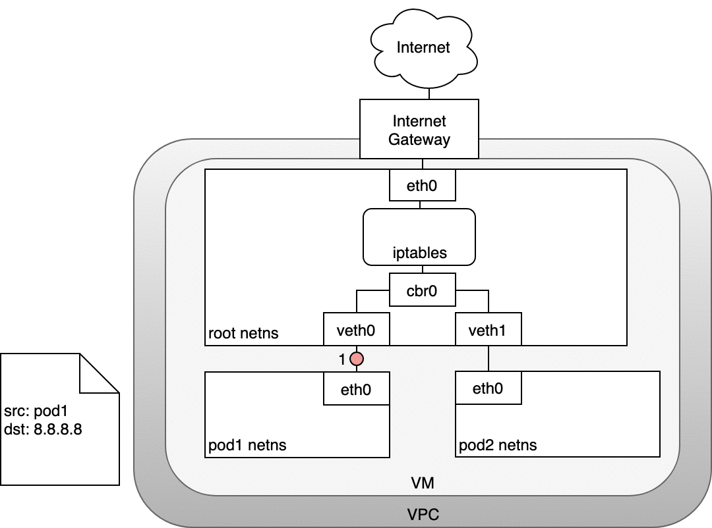
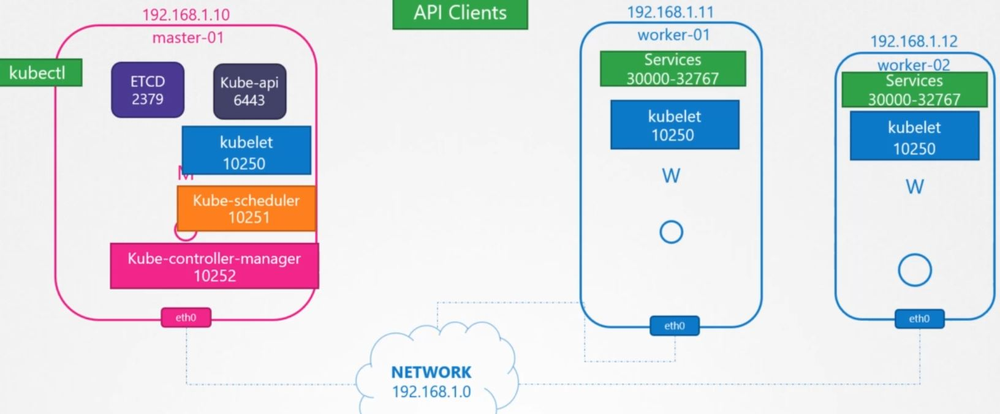

**şu linklere mutlaka bakılmalı**

- https://success.mirantis.com/article/networking (kesin bakılmalı)

- https://sookocheff.com/post/kubernetes/understanding-kubernetes-networking-model/ (çok iyi bakılmalı)

- https://success.mirantis.com/article/ucp-service-discovery-swarm


- https://github.com/muratcabuk/DockerTutorial/tree/master/Kubernetes/AnsibleInstallation/KubesprayInstallation/istio


- https://oteemo.com/2019/09/19/kubernetes-networking-and-services-101/

- https://oteemo.com/2020/01/16/ingress-102-kubernetes-ingress-implementation-options/

- https://sookocheff.com/post/kubernetes/understanding-kubernetes-networking-model/

### Life of a packet: Pod-to-Pod, across Nodes


### Life of a packet: Pod to Service


### Life of a packet: LoadBalancer to Service


### Life of a packet: Node to Internet




### Intro

IPAM = Ip Access Management


https://medium.com/@zhaohuabing/which-one-is-the-right-choice-for-the-ingress-gateway-of-your-service-mesh-21a280d4a29c

https://medium.com/flant-com/comparing-ingress-controllers-for-kubernetes-9b397483b46b


https://docs.google.com/spreadsheets/d/1DnsHtdHbxjvHmxvlu7VhzWcWgLAn_Mc5L1WlhLDA__k/edit#gid=0


ISTIO en altta


- Kube Proxy
- Ingress
- Service Mesh
- Gateway
- Load Balancing


### Kube-Proxy


#### Routing 

iki farklı fiziksel makinanın birbiriyle haberleşmesinin nasıl olduğunu inceleytcek olursak.

A (eth0 ip 192.168.1.10) ve B (eth0 ip 192.168.1.11) olsun. bu iki makin aörneğin bir switch (192.168.1.0 gateway) yardımıyla birbiriyle haberlşebilir.

ikinci bir network düşünelim buradaki makinların C (eth0 ip 192.168.2.10)  ve D (eth0 ip 192.168.1.11). aralarnda da bir switch olsun (192.168.2.0 gateway) .

Bu durumda B makinasının C ile konuşması gerekirse? 

iki switch birbirine örneğin bir router ile bağlanırsa ve bir ucuna örneğin 192.168.1.1 ve diğer ucuna 192.168.2.1 verirsek ve daha sonra 

B makinasına 192.168.2.0 bloğuna anasıl gideğini ve C makinasınada 92.168.1.0 bloğuna nasıl gideğini aşlağıdaki komutlarla belirtisek bu blok birbiyle haberleşebilir hale gelmiş olacak.

B Makinası

```
$ ip route add 192.168.2.0/24 via 192.168.1.1 

# daha sonra route komutu verisek ekeldiğimiz routing i görebiliriz.

```

C Makinası
```
$ ip route add 192.168.1.0/24 via 192.168.2.1 
```


Peki bütün interneti nasıl keleyebiliriz. bu durumda örneğin bizim routing imiz başka bir koldan interenete açılmış olsun ve bizde B makinasını internete açmak isiyor olursak default route olarak yani, bilinmeyen bütün ip ler için default route kullanılmış olur.

B Makinası için
```
$ ip route add default via 192.168.2.1
```

Alkttaki gibi bir durum olduğunu düşünelim. bu durumda A ve B makinasoına gateway (route) eklemeiş olacağız ancak bunun haricinde B makinasına iki interface (eth) arasında  forward işlemnini otomatik yapması için alttaki aayarı yapmamız gerekiyor.

B Makinasında 
```
$ cat /proc/sys/net/ipv4/ip_forward

# sonmuç sıfırsa bunu 1 yapmamız lazım
0

echo 1 > /proc/sys/net/ipv4/ip_forward
# somuç
1
```

diğer bazı faydalı komuıtlar

```

$ ip link

# bütün interface leri listeler

$ id addr add 192.168.1.10/24 dev eth0 

# interfac e ip blogu ekler

$ ip route

# ip route table ı listeler

$ ip route add 192.168.1.0/24 via 192.168.2.1

# route ekler

```

#### DNS

bütün makinlarıan /etc/hosts doyasını editlemektense bir DNS sunucusu kurulur ve /etc/resolv.conf dosyasına nanmespace adredsi girilir.


peki bizim dns sunucumuzun bilmediği bir adres gelirse ne olcak? bunun için resolv doısyasına ikinci bir nameserver eklenir.

```
cat >> /etc/resolv.config

nameserver 192.168.1.100
nameserver 8.8.8.8
```


dig veya nslookup komutlarıyla da hangi DNS sunuclarında geçtiği öğrenilebilir bir iteğin.

#### Network Namespaces

Network Namespace eklemek için

```
$ ip netns add red
$ ip netns add blue

$ ip netns

# spnuç
red
blue

```

açılan herhangi bir namespace içindeki interface leri görmek için

```
$ ip -n red link
```

yada arp table (mac adresleri ile çalışır) için 

```
$ ip -n red arp
```

route table için

```
$ ip -n red route
```

aynı makina üzerinde oluşturulan bu iki namespace altındaki interface i biribiyle haberleştşrmek için öncelikle iki namespace için  virtual cable (peer) oluşturulur.


```
$ ip link add veth-red type veth peer name veth-blue
```

daha sonra bu virtual ethernet leri namespace lere assign ediyoruz.

```
$ ip link set veth-red netns red

$ ip link set veth-blue netns blue
```

daha sonra ip adreslerini virtual ethernet lere atayabiliriz.

```
$ ip -n red addr add 192.168.15.1 dev veth-red

$ ip -n red addr add 192.168.15.2 dev veth-blue
```

daha sonra virtual ethernet i up yapıyoruz

```
$ ip -n red link set veth-red up

$ ip -n blue link set veth-blue up
```


ping atmak için
```
$ ip netns exec ret ping 192.168.15.2
```


peki namespace ler attmaya başlarsa onlarca namespace i birbirine bağlamak için çok fazla komut yazmak lazım. Burada da aynı DNS server gibi bir çözüme ihtiyacımız olacak.

burada da virtual network kuracağız bunu n içine virtual switche ihtiyacımız olacak. Linux de bunun için Linux Bridge ve ya  Ovs Open vSwitch var. Linux Bridge direkt olrak kernek ile geliyor kullanımı basit bir switch. Ovs ise daha kompleks işler için kullanılabilir.

sisteme eklemek için 

```
ip link add v-net-0 type bridge
```
bu komutla birlikte aslında yeni bir interface tanımlamış oluyoruz. ip link komutuyla bakacak olursak görebiliriz.

şuan interface doen durumda, up yamka için 


```
$ ip link set dev v-net-0 up (virtual private network oluşturduk)
```
 
daha önce red ve blue diye 2 tane namespace oluşturmuştuk ve bunlar birbirine direk bağlıydı ancak şimdi bun aihtiyacımız kalmadı silebiliriz.

```
$ ip -n red link del veth-red
```

şimdi yeni bir peer (sanall kalblo) ekliyoruz namespace ile bridge arasına

red ve blue için

```
$ ip link add veth-red type veth peer name veth-red-br

$ ip link add veth-blue type veth peer name veth-blue-br
```

şimdi oluşturduğumuz virtual private network  e bağlanıyoruz

```
$ ip link set veth-red netns red

$ ip link set veth-blue netns blue

$ ip link set veth-red-br master v-net-0

$ ip link set veth-blue-br master v-net-0
```


Daha sonra namespace lerin virtual eth lerine ip ataması yapıp up durumuna getiriyoruz.

```
$ ip -n red addr add 192.168.15.1 dev veth-red

$ ip -n blue addr add 192.168.15.2 dev veth-blue

$ ip -n red link set veth-red up
```
Bu durumda iken 192.168.15.1 ipsine ping atsak paketler ulaşmayacaktır.  Çünki fiziksel makinamız şuan bu vi rtual networkten ve dolayısıyla namespace lerdende habersiz durumda. Şuan virtual network için oluşturduğumuz virtual ethernete i,n bir ip si yok dolayısıyla bu by networkdeki namespace lere ulaşma şansımız yok. 

Bu  nedenle bu v-net-0 virtual eth e bir aip ataması yapıyoruz.

```
$ ip addr add 192.168.15.5/24 dev v-net-0
```


Şuan burada oluşturduğumuz network private ve dışarıdan bir istek yapamaz veya dış networkler bu networten bir işstek yapamazlar.


Konuyu anlmak için içerideki bu vnet imizi host dışında ayrı bir network gibi düşünecek olursak


Mesela 192.168.1.3. e ping atmak istediğimizde ulaşamadığımızı görebiliriz.

Bu rada bir router / gateway e ihiyacımız var bunun amacı v-net-0 ile host daki eth0 interface ini birbirine bağlamak.

```
$ ip netns exec blue ip route add 192.168.1.0/24 via 192.168.15.5
```


Ancak bu da yetmeyecek çünki host içindeki bir vnet den dışarı çıkmak isitiyoruz bunun için bize NAT lazım. 

"IP Masquerade, also called IPMASQ or MASQ, allows one or more computers in a network without assigned IP addresses to communicate with the Internet using Linux server's assigned IP address."

```
$ iptables -t nat -A POSTROUTING -s 192.168.15.0/24  -j MASQUERADE 
```
böylec e bu paketi dışarıda alan birisi bu paketin blue namespace den değil de Host dan gelmiş gibi görüyor olacak.

şuan ping çalışıyor olacak

```
ip netns exec blue ping 192.168.1.3
```

fakat LAN (192.168.1.0) ın internete aıldığını düşünelim ve amacımız blue namespace i internete açmak bu durumdada internete çıkamıyor olacağız. çünki belirlene ip adresleri dışında sistem nereye gideğini bimiyor. bunun için default gateway tanımlamsını da yapmalıyız.


```
$ ip netns exec blue ip route add default via 192.168.15.5
```

artık intenete açılabilir

```
$ ip netns exec blue ping 8.8.8.8
```
bide tamn tersini düşünelim yani dışarıdan işçerideki blue namespace e gelinmesini istiyoruz diyelim. bu durumda aslında blue namespace altında bir web sayfamızı dışarı açmak isteğimiz idüşünelim. O zaman port yönlendirmesi yapıyoruz.

```
$ iptables -t nat -A PREROUTING --dport 80 --to-destination 192.168.15.2:80 -j DNAT
```
Aslında Docker da tam bu şekilde çalışmaktadır.


#### CNI (Container Networking Interface)

aslında bizim yukarıda bahsettiğimiz ve hada fazlasının olduğu bu konsept kubernetes, mesos, docker ve benzerlerinde aynı şekilde çalışıyor. Biz de ileride kendi sistemimizi/uygulamamızı yazıyor olsak ve network işlmleride olsa bu uygulamanın, belli bir düzede belirli kurallar ve konseptlere uyugn network süreçlerinin işlmesini isteriz. bu konsepte uygun kod yazmak ve hata çözümlemek ayrıca diğer yazılımcıalrında destek verebilmelerini sağlamak isteriz. işte tam bu problemi çözmek için CNI oluşturulmuştur.

CNI bazı kurallarla içerir
- container runtime network namespace oluşturmalıdır
- container eklendiğinde, container runtime network plugini çağırabilmelidir 
- container silindiğinde, container runtime network plugini çağırabilmelidir 
- network configurasyonu için JSON format kullanır


runtime ise örneğin aşağıdaki sağlamalıdır
- CLI add,del,check argumanlarını desteklemelidir
- container id, nmetwork ns vb parametreleri desteklemeli
- ip adresi pod lara assign edilebilmeli
- vb

herhangi bir runtime farklı pluginleri desteklemelidir. örneğin
- bridge
- vlan
- ipvlan
- macvlan
- windows

ayrıca bazı IPAM pluginlerini desteklerler örneğin
- host-local
- dhcp

ayrıca 3. parti organizasyonların yazdığı pluginler de mevcuttur.

- weave
- flannel
- cilium
- vmware
- nsx
- calico
- infoblox

Docker CNI kullanmaz onun kendi standardı vardır CNM (Docker Network Model).

Ancak burda Docker CNI kullanamz diye birşey yok. Docker network ayarını none olarak ayarladıktan sonra  manuel olarak Docker a network atamsı yapılır. kubernetes de bu işi bu şekilde yapar zaten.

```
$ docker run --network=none nginx
$ bridge add 45erwet44vv /var/run/netns/45erwet44vv
```

#### Kubernetes Cluster Networking

kubernetes cluster ıdan her bir makina fiziksel bir interface e bağlı olmalı ve bu clusterdaki bütün makinlar privatre bir network üzerindn ehaberşlşebilmeldir. Ayrıca sprcifik bazı portlar da kubernetes komponentlerinin çalışabilmesi için açık olmalıdır.



### Pod Netwoking

- bütün podların kendi ip adresleri olmalı
- aynı node daki bütün podlar biribi,ryle haberleşebilşmelidir
- NAT olmaksızın bütün node lardaki podlar birbiriyle haberleşebilmelidir.

 bütün bu problemleri çözmek için birçok plugin mevcut aslında (weave, calico vb). Ancak daha önmce gördüğümüz komutlarla bu problemi çözmeye çalışamak konuları daha da pekiştirmemizi sağlayacaktır.

bütün bu komutları bir scrpt doyası haline getidiğimizi varsayalım. Bu durumda yeni bir pod create olduğunda bu scriptin çalışmasını sağlayacak araç CNI'dır. 

kubelet mesela tam bu işi yapmkatadır. bu nedenle kubelet sersinin service doyasında şu üç satır görülür

```
--network-plugin=cni \
--cni-bin-dir=/opt/cni/bin \
--cni-conf-dir=/etc/cni/net.d 

```

örneğin weave kenmdini bütün node lara kurar,  ayrıca bütün nodelarda pod lariçin bir bridge (10.244.2./24) üzerinden haberleşir. ilgili paket A node undan  B nodundaki 2 nolu pod a gidecek diyelim. Her node üzerinde kurulu weave plugini pod un hangi node da olduğunu bildiği için paketi ilgili node yöneldirir ve oradaki weave plugini paketi açarak ilgili pode gönderir. bu pketleme işlemlerinde vxlan (overlay network) kullanılır genelde.

#### Service Networking

uygulama yayınlarken herhazman servisi kullanmak lazım. böyleece service discovery mekanizması çalışmış olacak. aytıca load balancing, güvenlik, dns  vb mekanizmalar devreye girmiş olacak service sayesinde.


- sadece cluster içinde erişlebilir bir service oluşturacaksak bu tip servislere __ClusterIp__ denilir.  

- eğer servisi cluster dışına açıyorsak buna __NodePod__ denilir. Belli bir por üerinde bütün node lardan dışarıda expose edilir service

- Üçüncü bir seçenekte global cloud'larda kullanılabilen __loadBalancer__ seçeneği kullanılabilir.    

service ler aslında gerçek objeler değildir sadace vittual nesnelerdir. bir service create edildiğinde kube-procy devreye girerek bütün noıde lara forward kuralı girer. 

service ip sine gelen istek direk pod ip sine forward edilir.

kube-proxy bu kuralları yazarken 3 farklı teknikten birini kullnır (userspace, iptables, ipvs). default olarak iptables gelir.

gerçektende eğer bir service oluşturduktan sonra herhangi bir node üzerinde alttaki komutla oluşturduğumuz servise bakacak olursak kaydı görebiliriz.

```
$ iptables -L -t net | grep "service dınızı yazınız"
```
ayrıca kube-proxy loglarını /var/log/kube-proxy.log adresine kaydeder buradan da check edilebilir.

### DNS (Core DNS)

podlar için bir isim kullanılarka bir dns kaydı açılmaz bunun yerine pod un ip adresi kullanılır.

aslındacore dns de bir pod dur ve üzerinde dns kayılarını tutar. diper bütün pod larda ise /etc/resolv.config doyasında bu dns pod unun adı bulunur.

üsttede belirtiğimiz gibi core dns bunu sadecce service için yapar. podlar için ise pod un  ip adresindeki noktalar çizgi (dash) ile değiştirilerek kaydedilir. 

kubernetes 1.12 den sonra kube-dns yerine coreDNS si tavsiye etmektedir. ReplicaSet olrak 2 tane kurulur. 

coreDNS configürasyon dosyasını kullanarak çalışır. /etc/coredns/Corefile dosyasınında ilgili konfigürasyonlar yer alır. bu dosyya baktığımızda başka plugin lerinde kullanıldığı görülecektir (errors, health, proxy, cache, realod).Bu plugin lerden biride kubernetes ile çalışması sağlayan kubernetes plugin nidir. Kubernetes pluginine prametre olarka giden top level domainde görülebilir o da cluster.local domainidir.


örnek config dosyası

```
.:53 {
        errors
        health {
            lameduck 5s
        }
        ready
        kubernetes cluster.local in-addr.arpa ip6.arpa {
            pods insecure
            fallthrough in-addr.arpa ip6.arpa
            ttl 30
        }
        prometheus :9153
        forward . /etc/resolv.conf
        cache 30
        loop
        reload
        loadbalance
    }

```

Peki bütün podlar dns server adresini nereden bilecek? coredns kurulurken ayrıca kube-dns diye bir servis kuruyor açılan bütün pod larda bu servisin ip si DNS (nameservice) olarka /etc/resolv.config dosyasına kaydedilir.

peki dns kaydının pod lara atanmasından kim sorumludur? kubelet. kubelet için /var/lib/kubelet/config.yaml doyasına bakacak olursak clusterDNS ip adresi ve root domain (cluster.local) ayarı görülebilir.

bu durumda herhangi bir servisi aşağıdaki adreslerden biriyle çağırabiliriz. 

```
$ curl http://db-service
$ curl http://db-service.default
$ curl http://db-service.default.svc
$ curl http://db-service.default.svc.cluster.local
```

peki full qualified name üzerinden sorgu nasıl yapılır? dns üzerinde örneğin db-service.default.svc.cluster.local için nslookup sorgusu nasıl yapılır.

bunun için /etc/resolv.config içine search satırı eklenir.

```
search default.svc.cluster.local svc.db-service.default.svc.cluster.local
```
bu sayede sadece db-service servisini nslookup (yada host) komutuyla "host db-service" sorgulayabiliriz.

ancak pod ları bu şekidle sorgulayamıyoruz onları eninde sonun uzun adresle sorgulamalıyız. örneğin pod ip adresi 10.244.2.11 olsun bu durumda sorgu şöyle olmalı

```
`$ host 10-244-2-11.defaultçpod.cluster.local
```


#### Ingress

Ingress için birçok seçenek var.

- nginx (kubernetes tarafından desteklenen)
- haproxy
- traefik

Ingress için bir çözüm kurduğumuzda ingress controller kurmuş oluyoruz. Daha sonra yazdığımız kurallar ingress resources olmuş oluyor.

https://medium.com/better-programming/how-to-expose-your-services-with-kubernetes-ingress-7f34eb6c9b5a


### Kubernetes Networking

https://sookocheff.com/post/kubernetes/understanding-kubernetes-networking-model/ (kesin bakılmalı)

https://neuvector.com/network-security/advanced-kubernetes-networking/


https://willwarren.com/2019/05/running-kubernetes-on-ubuntu-18-04-virtualbox/


### Ingress

https://kubernetes.io/docs/concepts/services-networking/ingress/


Kubernetes flat network kullanıyor.

#### Farklarını inceleyek olursak

- __Flat Network__

bütün host ve pod ların aynı subnet de olabildikleri (Layer 2) network türüdür.

Katman 2 ve katman 3 ağları hakkında hızlı bir not. Aynı alt ağdaki ana bilgisayarlar katman 2 ağındadır. Alt ağları birbirine bağladığınızda, alt ağlar katman 3 ağındadır. Katman 2 ağlarında adresleme mac adresleri aracılığıyla gerçekleşir. Katman 3 ağlarda adresleme IP adresleri aracılığıyla gerçekleşir.

Aynı alt ağdaki kısa ana bilgisayarlar katman 2 üzerinden iletişim kurar ve farklı alt ağlardaki ana bilgisayarlar IP adresleri üzerinden katman 3 üzerinden iletişim kurar.

- __Overlay Netwok__

Overlay networkler, mevcut ağların (underlays) üzerine ağ oluşturmanıza olanak tanır. Katman 2 veya katman 3 katmanları oluşturmayı seçebilirsiniz.

Peki nasıl seçmelisin? Çoğu durumda, katman 3 ağ kurulumu ve kullanımı en ölçeklenebilir ve en kolay ağdır. Kesinlikle gerekli olmadıkça, katman 2 kaplama alt ağları ana bilgisayarlar arasında gerilmemelidir.

Container lar, tek bir ana bilgisayardaki özel bir ağdır, katman 2 alt ağındadır. Örneğin 10.0.3.0/24 tipik bir özel NAT ağıdır ve ağdaki kapsayıcılar IP'leri alt ağ aralığında alırlar, yani 10.0.3.10, 10.0.3.11 vb. X "

- __Vxlan__

Vxlan, Linux çekirdeğinde yerleşiktir ve katman 3 ağı üzerinden katman 2 ağı oluşturmanıza olanak tanır. Container ana bilgisayarlarını Vxlan ile bağladıktan sonra, Vxlan köprüsüne bağlı container lar veya VM'ler ana bilgisayarlar arasında aynı katman 2 alt ağında olacaktır.


An API object that manages external access to the services in a cluster, typically HTTP.

Ingress may provide load balancing, SSL termination and name-based virtual hosting.

- __Terminology__

For clarity, this guide defines the following terms:

  - Node: A worker machine in Kubernetes, part of a cluster.
  - Cluster: A set of Nodes that run containerized applications managed by Kubernetes. For this example, and in most common Kubernetes deployments, nodes in the cluster are not part of the public internet.
  - Edge router: A router that enforces the firewall policy for your cluster. This could be a gateway managed by a cloud provider or a physical piece of hardware.
  - Cluster network: A set of links, logical or physical, that facilitate communication within a cluster according to the Kubernetes networking model.
  - Service: A Kubernetes Service that identifies a set of Pods using label selectors. Unless mentioned otherwise, Services are assumed to have virtual IPs only routable within the cluster network.


- __What is Ingress?__
Ingress exposes HTTP and HTTPS routes from outside the cluster to services within the cluster. Traffic routing is controlled by rules defined on the Ingress resource.

```
    internet
        |
   [ Ingress ]
   --|-----|--
   [ Services ]
```

An Ingress may be configured to give Services externally-reachable URLs, load balance traffic, terminate SSL / TLS, and offer name based virtual hosting. An Ingress controller is responsible for fulfilling the Ingress, usually with a load balancer, though it may also configure your edge router or additional frontends to help handle the traffic.

An Ingress does not expose arbitrary ports or protocols. Exposing services other than HTTP and HTTPS to the internet typically uses a service of type Service.Type=NodePort or Service.Type=LoadBalancer.


- __Ingress Class__

Ingresses can be implemented by different controllers, often with different configuration. Each Ingress should specify a class, a reference to an IngressClass resource that contains additional configuration including the name of the controller that should implement the class.

```yml
apiVersion: networking.k8s.io/v1beta1

kind: IngressClass
metadata:
  name: external-lb
spec:
  controller: example.com/ingress-controller
  parameters:
    apiGroup: k8s.example.com/v1alpha
    kind: IngressParameters
    name: external-lb
```

IngressClass resources contain an optional parameters field. This can be used to reference additional configuration for this class


- __Types of Ingress__

  - Single Service Ingress

You can expose a Service in multiple ways that don’t directly involve the Ingress resource:

    - Use Service.Type=LoadBalancer
    - Use Service.Type=NodePort

```yml
apiVersion: networking.k8s.io/v1beta1
kind: Ingress
metadata:
  name: test-ingress
spec:
  backend:
    serviceName: testsvc
    servicePort: 80
```

If you create it using kubectl apply -f you should be able to view the state of the Ingress you just added:

kubectl get ingress test-ingress


https://medium.com/better-programming/how-to-expose-your-services-with-kubernetes-ingress-7f34eb6c9b5a


  - Simple fanout

A fanout configuration routes traffic from a single IP address to more than one Service, based on the HTTP URI being requested. An Ingress allows you to keep the number of load balancers down to a minimum. For example, a setup like:

```
foo.bar.com -> 178.91.123.132 -> / foo    service1:4200
                                 / bar    service2:8080
```

would require an Ingress such as:

```yml
apiVersion: networking.k8s.io/v1beta1
kind: Ingress
metadata:
  name: simple-fanout-example
  annotations:
    nginx.ingress.kubernetes.io/rewrite-target: /
spec:
  rules:
  - host: foo.bar.com
    http:
      paths:
      - path: /foo
        backend:
          serviceName: service1
          servicePort: 4200
      - path: /bar
        backend:
          serviceName: service2
          servicePort: 8080
```

When you create the Ingress with kubectl apply -f:

```
kubectl describe ingress simple-fanout-example
```


```
Name:             simple-fanout-example
Namespace:        default
Address:          178.91.123.132
Default backend:  default-http-backend:80 (10.8.2.3:8080)
Rules:
  Host         Path  Backends
  ----         ----  --------
  foo.bar.com
               /foo   service1:4200 (10.8.0.90:4200)
               /bar   service2:8080 (10.8.0.91:8080)
Annotations:
  nginx.ingress.kubernetes.io/rewrite-target:  /
Events:
  Type     Reason  Age                From                     Message
  ----     ------  ----               ----                     -------
  Normal   ADD     22s                loadbalancer-controller  default/test

```

  - __Name based virtual hosting__


Name-based virtual hosts support routing HTTP traffic to multiple host names at the same IP address.

```
foo.bar.com --|                 |-> foo.bar.com service1:80
              | 178.91.123.132  |
bar.foo.com --|                 |-> bar.foo.com service2:80

```


The following Ingress tells the backing load balancer to route requests based on the Host header.

```yml
apiVersion: networking.k8s.io/v1beta1
kind: Ingress
metadata:
  name: name-virtual-host-ingress
spec:
  rules:
  - host: foo.bar.com
    http:
      paths:
      - backend:
          serviceName: service1
          servicePort: 80
  - host: bar.foo.com
    http:
      paths:
      - backend:
          serviceName: service2
          servicePort: 80
```
If you create an Ingress resource without any hosts defined in the rules, then any web traffic to the IP address of your Ingress controller can be matched without a name based virtual host being required.


For example, the following Ingress resource will route traffic requested for first.bar.com to service1, second.foo.com to service2, and any traffic to the IP address without a hostname defined in request (that is, without a request header being presented) to service3.
```yml
apiVersion: networking.k8s.io/v1beta1
kind: Ingress
metadata:
  name: name-virtual-host-ingress
spec:
  rules:
  - host: first.bar.com
    http:
      paths:
      - backend:
          serviceName: service1
          servicePort: 80
  - host: second.foo.com
    http:
      paths:
      - backend:
          serviceName: service2
          servicePort: 80
  - http:
      paths:
      - backend:
          serviceName: service3
          servicePort: 80
```


  - __TLS__

kesin oku

https://kubernetes.io/docs/concepts/services-networking/ingress/#tls

  - __Loadbalancing__


bakılabilir

https://kubernetes.io/docs/concepts/services-networking/ingress/#loadbalancing


- __Updating an Ingress__

kubectl edit ingress test
This pops up an editor with the existing configuration in YAML format. Modify it to include the new Host:

```yml
spec:
  rules:
  - host: foo.bar.com
    http:
      paths:
      - backend:
          serviceName: service1
          servicePort: 80
        path: /foo
  - host: bar.baz.com
    http:
      paths:
      - backend:
          serviceName: service2
          servicePort: 80
        path: /foo
..

```

After you save your changes, kubectl updates the resource in the API server, which tells the Ingress controller to reconfigure the load balancer.


### Ingress Controller

https://kubernetes.io/docs/concepts/services-networking/ingress-controllers/


In order for the Ingress resource to work, the cluster must have an ingress controller running.

Unlike other types of controllers which run as part of the kube-controller-manager binary, Ingress controllers are not started automatically with a cluster. Use this page to choose the ingress controller implementation that best fits your cluster.

Kubernetes as a project currently supports and maintains GCE and nginx controllers.

https://kubernetes.io/docs/concepts/services-networking/ingress-controllers/#additional-controllers

linkte haproxy, nginx, f5, citrix, gloo, Kong, Tyk vb birçok ingress ürünü var.

### Network Policies

https://kubernetes.io/docs/concepts/services-networking/network-policies/

örnek

```yml
apiVersion: networking.k8s.io/v1
kind: NetworkPolicy
metadata:
  name: test-network-policy
  namespace: default
spec:
  podSelector:
    matchLabels:
      role: db
  policyTypes:
  - Ingress
  - Egress
  ingress:
  - from:
    - ipBlock:
        cidr: 172.17.0.0/16
        except:
        - 172.17.1.0/24
    - namespaceSelector:
        matchLabels:
          project: myproject
    - podSelector:
        matchLabels:
          role: frontend
    ports:
    - protocol: TCP
      port: 6379
  egress:
  - to:
    - ipBlock:
        cidr: 10.0.0.0/24
    ports:
    - protocol: TCP
      port: 5978

```

### Adding entries to Pod /etc/hosts with HostAliases

şu şekilde hosts görülebilir

```
kubectl exec nginx -- cat /etc/hosts

# Kubernetes-managed hosts file.
127.0.0.1	localhost
::1	localhost ip6-localhost ip6-loopback
fe00::0	ip6-localnet
fe00::0	ip6-mcastprefix
fe00::1	ip6-allnodes
fe00::2	ip6-allrouters
10.200.0.4	nginx
```

- __Adding Additional Entries with HostAliases__

```yml
apiVersion: v1
kind: Pod
metadata:
  name: hostaliases-pod
spec:
  restartPolicy: Never
  hostAliases:
  - ip: "127.0.0.1"
    hostnames:
    - "foo.local"
    - "bar.local"
  - ip: "10.1.2.3"
    hostnames:
    - "foo.remote"
    - "bar.remote"
  containers:
  - name: cat-hosts
    image: busybox
    command:
    - cat
    args:
    - "/etc/hosts"
```

__Why Does Kubelet Manage the Hosts File?__

Kubelet manages the hosts file for each container of the Pod to prevent Docker from modifying the file after the containers have already been started.

Because of the managed-nature of the file, any user-written content will be overwritten whenever the hosts file is remounted by Kubelet in the event of a container restart or a Pod reschedule. Thus, it is not suggested to modify the contents of the file.


### ISTIO

https://azure.kocsistem.com.tr/tr/blog/istio-kurulum-ve-trafik-yonetimi


https://medium.com/google-cloud/back-to-microservices-with-istio-p1-827c872daa53

https://medium.com/google-cloud/back-to-microservices-with-istio-part-2-authentication-authorization-b079f77358ac


