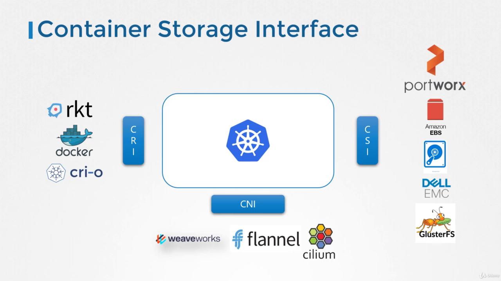
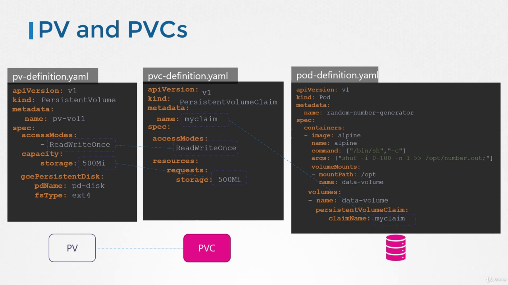
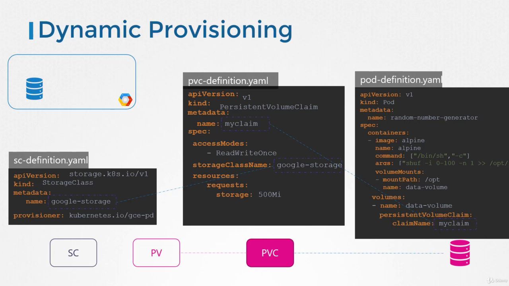
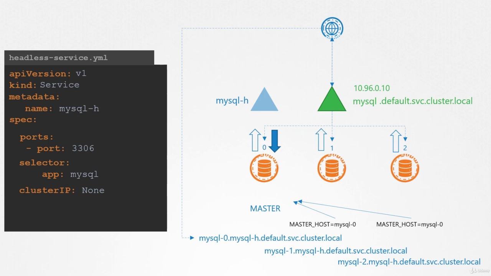
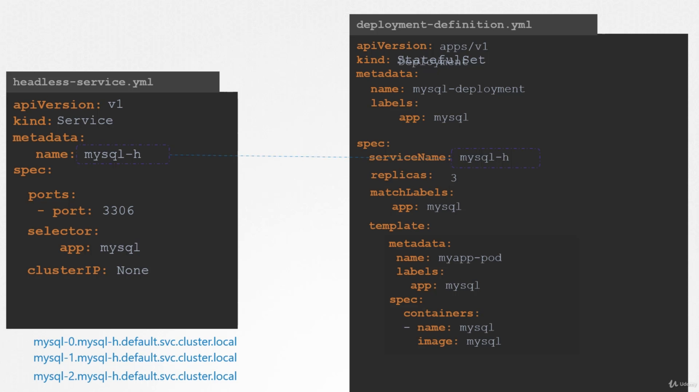
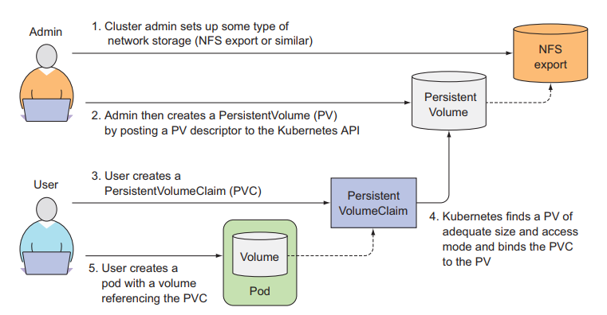
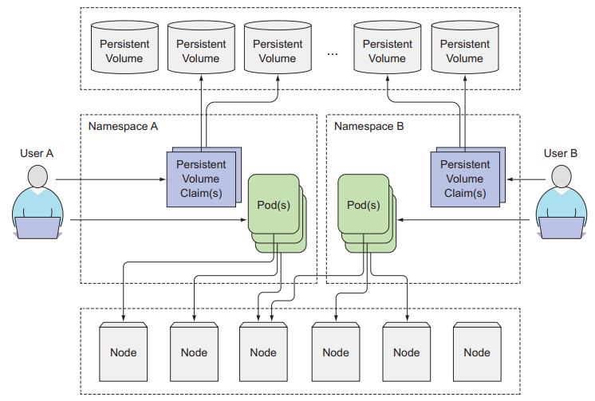

### Intro 


- https://vitobotta.com/2019/08/06/kubernetes-storage-openebs-rook-longhorn-storageos-robin-portworx/
- https://computingforgeeks.com/storage-solutions-for-kubernetes-and-docker/
- https://www.expedient.com/knowledgebase/blog/2019-08-13-persistent-volume-options-for-kubernetes-storage/
- https://docs.openebs.io/docs/next/rwm.html
- https://blog.mayadata.io/openebs/how-to-run-nfs-on-top-of-openebs-jiva
- https://blog.mayadata.io/openebs/how-to-run-nfs-on-top-of-openebs-jiva
- https://medium.com/@utkarshmani1997/how-to-run-nfs-on-top-of-openebs-jiva-ca4158e82127


#### Storage Drivers

Storage Driversa image ve container üzerindeki verilerin yönetilmesindnme sorumludur.

Burada Docker storage ve volume konusunu iyi anlamak gerekiyor. bunun için [şu linke](../Docker/2_volume.md) bakabilirsiniz. Bu sayfada diğer kaynaklara da linkler bulabilirsiniz.

Docker da bütün bu volume, layered storage, contaner layer vb kavramlardan docker storage driver sorumludur. Bunlardan bazıları

- AUFS ( advanced multi-layered unification filesystem)
- ZFS
- BTRFS
- Device Mapper
- Overlay

bunlardan hangilerinin kullanılacağı biraz işletim sistemi le ilgilidir. Örneğin Ubuntu da AUFS kullanılır.

[Diğerleri için tıklayınız](https://docs.docker.com/storage/storagedriver/select-storage-driver/#docker-engine---community)


|Linux distribution| 	Recommended storage drivers| 	Alternative drivers|
|------------------|-----------------------------|---------------------|
|Docker Engine - Community on Ubuntu| 	overlay2 or aufs (for Ubuntu 14.04 running on kernel 3.13)| 	overlay, devicemapper, zfs, vfs|
|Docker Engine - Community on Debian| 	overlay2 (Debian Stretch), aufs or devicemapper (older versions)| 	overlay, vfs|
Docker Engine - Community on CentOS| 	overlay2| 	overlay, devicemapper, zfs, vfs|
Docker Engine - Community on Fedora| 	overlay2| 	overlay, devicemapper, zfs, vfs|

desteklenen backing filesystem'ler

|Storage driver| 	Supported backing filesystems|
|--------------|-------------------------------|
|overlay2, overlay| 	xfs with ftype=1, ext4|
|aufs 	|xfs, ext4|
|devicemapper 	|direct-lvm|
|btrfs 	|btrfs|
|zfs 	|zfs|
|vfs 	|any filesystem|


#### Volume Drivers

burada da üçüncü parti bir çok plugin mevcut. 

- Local
- Azure File Storage
- Convoy
- DigitalOcean Block Storage
- Flocker
- gce-docker
- GlusterFS
- NetApp
- RexRay
- VMware vSphere Storage


örnek kullanımı

```
$ docker run -it --name postgres --volumne-driver rexray/ebs --mount src=ebs-vol,target=/var/lib/postgres postgres
```
bunun içinde kubernetes CSI kullanır. aynı şekilde network ve container için farklı interface ler kullanılır.




bu arada bunların hiç biri kuberntes standardı değil. yani farklı orkestrasyon araçları içinde kullanılabilir. RPC ile haberşleme olur. CSI temel bazı kuralları içinde barındırır ve bunları orkestrasyonların kullanımına açar. Örneğin kuberntes CSI ile haberleşerek sadece bir volume istediğini belirtir CSI implemente ekmiş olan plugin de bunu gerçekleştirir.


#### PV/C (Persistant Volume - Persistant Volume Claim)

normalde bir volume mountedildiğinde pod ujn çalıştığı noıde üzerindeki klasör pod a bağlanır. eğer pod diğer node lara da scale edildiyse haliyle bütün noıde larda aynı klasör mount edilmiş olur bu da istenmeyen bir durumdur. Çünki runtime da oluşturulan veriler bu durumda her node da farklı olacaktır. 

bu nedenle kubernetes farklı storage sistemlerini destekler

- NFS
- GlusterFS
- Flocker
- Ceph
- Scaleio
- vb

Bu sayede cluster-wide bir storage çözümünü elde etmiş oluruz. 

Öncelikle persistent volume create edilir daha sonra bu volum içinden belli bir alan claim edilerek podlarda kullanılır.




burada google cloud kullanılmış stoırage olarak. bu sistemde en büyük problem bu PV oluşturmadan önce google storage'da storage oluşturulmalıdır. bu na static provisioning denir. 

eğer uygulama ihtiyaç duyduğunda storage otomatik olarka oluşturulursa buna da dynamic porvisioning denir. Bunu sağlayan da Storage Class' dır.




bunu sağlayan birçok plugin var 

- AzureFile
- NFS
- GlusterFS
- NFS
- Local
- ScaleIO
- FC
- ISCSI
- Flocker
- CephFS
- vb

bunların her birinin farklı parametreleri olacaktır. Replkicastion, disk type vb.


#### Headless Service



Burada mantık ClusterIP opsiyonunu kaldırmaktır. böylece örneğin statful setlerin master ve worker nodelarına ayrı ayrı dns adresleri ile ulaşm şansı elde etmiş oluruz.

ancak master ve worker poslara resimdeki gibi dns kaydı açılabilmesi için pod spec inde subdomaşn kısmına headless servisin adını yani örneğe göre (mysql-h) ve hostname e de mysql-pod adını yazıyoruz.


stateful set oluşturuken de service name a headless service in adını template kısmında da örneğe göre mysql yazarsak sistem otomatik olarak statefulset deki makinlara sırayla rakam vererek podları oluşturup dns kaydı açacaktır.




#### Official Kaynaklar 

https://rancher.com/blog/2018/2018-09-20-unexpected-kubernetes-part-1/
https://kubernetes.io/docs/concepts/storage/persistent-volumes/#lifecycle-of-a-volume-and-claim

bu kavramları iyi öğren

PV, PVC, Storage Class, and Provisioner

Pod -> PVC -> PV -> Host machine

Persistent Volume Pod un talebi doğrultusunda oluşturulup pod a bağlanması Persistant Volume Clame olmuş oluyor.




__A PersistentVolume (PV)__ 

is a piece of storage in the cluster that has been provisioned by an administrator or dynamically provisioned using Storage Classes. It is a resource in the cluster just like a node is a cluster resource. PVs are volume plugins like Volumes, but have a lifecycle independent of any individual Pod that uses the PV. This API object captures the details of the implementation of the storage, be that NFS, iSCSI, or a cloud-provider-specific storage system.

__A PersistentVolumeClaim (PVC)__

is a request for storage by a user. It is similar to a Pod. Pods consume node resources and PVCs consume PV resources. Pods can request specific levels of resources (CPU and Memory). Claims can request specific size and access modes (e.g., they can be mounted once read/write or many times read-only).



görüldüğü üzere persitant volume lar namespace e bağlı değildir. ancak PVC dahildir.

__The keywords you need to pay attention to here are by an administrator and by a user.__

__Provisioning__

There are two ways PVs may be provisioned: statically or dynamically.

- Static
A cluster administrator creates a number of PVs. They carry the details of the real storage, which is available for use by cluster users. They exist in the Kubernetes API and are available for consumption.

- Dynamic
When none of the static PVs the administrator created match a user’s PersistentVolumeClaim, the cluster may try to dynamically provision a volume specially for the PVC. This provisioning is based on StorageClasses: the PVC must request a storage class and the administrator must have created and configured that class for dynamic provisioning to occur. Claims that request the class "" effectively disable dynamic provisioning for themselves.


#### Volumes

bakılabilir

https://kubernetes.io/docs/concepts/storage/volumes/


####  Persistent Volumes

persistent volume lar plugin yarıdımıyla implement edilirler.

cloud ve onpremise bir çok sistem bulunmakta.

örnek 

```

apiVersion: v1
kind: PersistentVolume
metadata:
  name: pv0003
spec:
  capacity:
    storage: 5Gi
  volumeMode: Filesystem
  accessModes:
    - ReadWriteOnce
  persistentVolumeReclaimPolicy: Recycle
  storageClassName: slow
  mountOptions:
    - hard
    - nfsvers=4.1
  nfs:
    path: /tmp
    server: 172.17.0.2

```

- __Acces Mode__

  - ReadWriteOnce – the volume can be mounted as read-write by a single node
  - ReadOnlyMany – the volume can be mounted read-only by many nodes
  - ReadWriteMany – the volume can be mounted as read-write by many nodes

- __Phase__
A volume will be in one of the following phases:

  - Available – a free resource that is not yet bound to a claim
  - Bound – the volume is bound to a claim
  - Released – the claim has been deleted, but the resource is not yet reclaimed by the cluster
  - Failed – the volume has failed its automatic reclamation


- __PersistentVolumeClaims__
Each PVC contains a spec and status, which is the specification and status of the claim. The name of a PersistentVolumeClaim object must be a valid DNS subdomain name.

```
apiVersion: v1
kind: PersistentVolumeClaim
metadata:
  name: myclaim
spec:
  accessModes:
    - ReadWriteOnce
  volumeMode: Filesystem
  resources:
    requests:
      storage: 8Gi
  storageClassName: slow
  selector:
    matchLabels:
      release: "stable"
    matchExpressions:
      - {key: environment, operator: In, values: [dev]}
```

- __Claims As Volumes__
Pods access storage by using the claim as a volume. Claims must exist in the same namespace as the Pod using the claim. The cluster finds the claim in the Pod’s namespace and uses it to get the PersistentVolume backing the claim. The volume is then mounted to the host and into the Pod.

```
apiVersion: v1
kind: Pod
metadata:
  name: mypod
spec:
  containers:
    - name: myfrontend
      image: nginx
      volumeMounts:
      - mountPath: "/var/www/html"
        name: mypd
  volumes:
    - name: mypd
      persistentVolumeClaim:
        claimName: myclaim
```

#### Volume Snapshot 

bakılabilir

https://kubernetes.io/docs/concepts/storage/volume-snapshots/

#### CSI Volume Cloning

bakılabilir

https://kubernetes.io/docs/concepts/storage/volume-pvc-datasource/

#### Storage Classes

A StorageClass provides a way for administrators to describe the “classes” of storage they offer. Different classes might map to quality-of-service levels, or to backup policies, or to arbitrary policies determined by the cluster administrators. Kubernetes itself is unopinionated about what classes represent. This concept is sometimes called “profiles” in other storage systems.

örnek
```yml
apiVersion: storage.k8s.io/v1
kind: StorageClass
metadata:
  name: standard
provisioner: kubernetes.io/aws-ebs
parameters:
  type: gp2
reclaimPolicy: Retain
allowVolumeExpansion: true
mountOptions:
  - debug
volumeBindingMode: Immediate
```
bütün detaylar için sayfasyı ziyaret ediniz.

https://kubernetes.io/docs/concepts/storage/storage-classes/

#### Dynamic Volume Provisioning

Dynamic volume provisioning allows storage volumes to be created on-demand. Without dynamic provisioning, cluster administrators have to manually make calls to their cloud or storage provider to create new storage volumes, and then create PersistentVolume objects to represent them in Kubernetes. The dynamic provisioning feature eliminates the need for cluster administrators to pre-provision storage. Instead, it automatically provisions storage when it is requested by users.

örnek 


tanımlama
```yml
apiVersion: storage.k8s.io/v1
kind: StorageClass
metadata:
  name: fast
provisioner: kubernetes.io/gce-pd
parameters:
  type: pd-ssd
```

kullanım

```yml
apiVersion: v1
kind: PersistentVolumeClaim
metadata:
  name: claim1
spec:
  accessModes:
    - ReadWriteOnce
  storageClassName: fast
  resources:
    requests:
      storage: 30Gi
```

