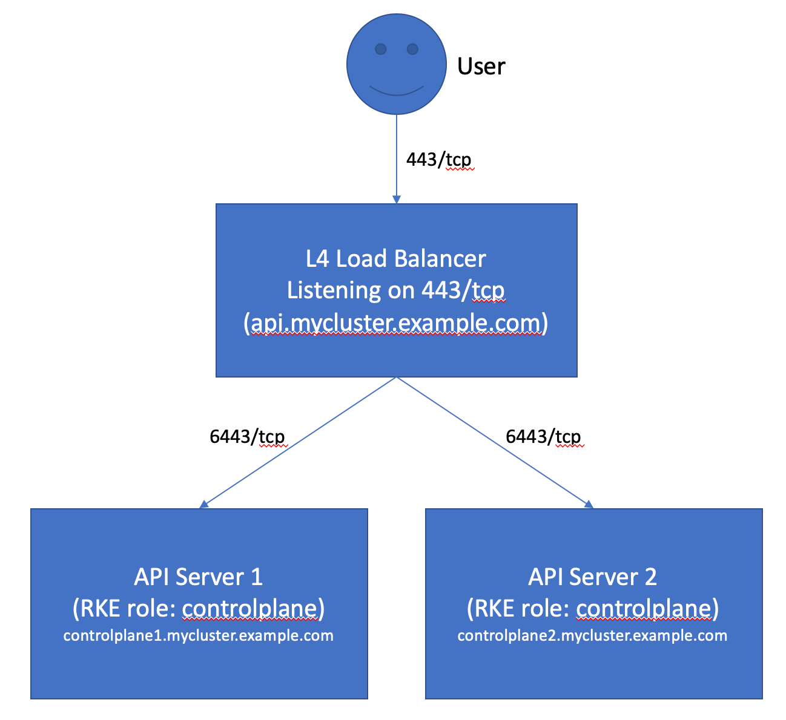
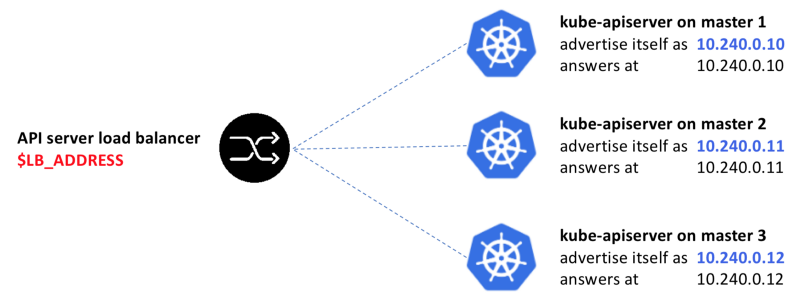
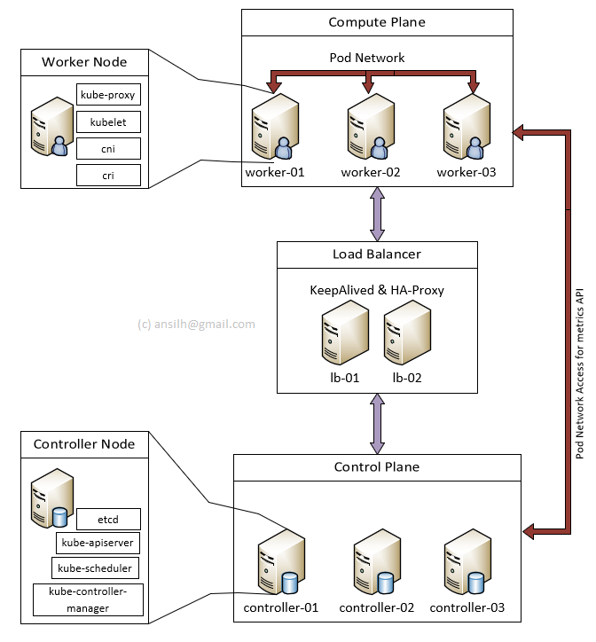

### Ön Hazırlık

#### Kurulum Yapılacak Versiyonlar

- Ubuntu: 18.04
- Kubernetes: 1.18
- Docker: 19.03.11
- etcd: 3.4.9
- CNI: v0.8.6
- DNS: coredns 1.6.9 (diğer seçenek sky dns)
- Network: Calico
- TSL: CFSSL

Ayrıca diğer seçeneklerle ilgili linkler makaleler içinde verilmektedir.

#### Kurulum Yapılacak Ortam

Digitalocean dan makinaları ayarlıyoruz.

- __Nginx Load Balancer ve Cluster ın kullanbilmesi için NFS disk paylaşımı için=__ 1 adet size=s-2vcpu-2gb
- __Master-Conroller-etcd node ları içn 3 lü cluster=__ 3 adet size=s-2vcpu-2gb
- __Worker nodelar için=__ 3 adet size=s-2vcpu-2gb

amacımız şunun gibi bir yapı kurmak

Ancak burada master node lara dışarıdan erişimi de load balancer üzerinden yapmak istiyoruz. örneğin kubectl api server a erişirken de bir proxy üzerinden geçsin bu nedenle nginxlb makinasıı kuruyoruz.

Aslında bu iş için kuberntes e özel bir load balancer aracı da var ona da bakınız.  

- [MetalLB](https://metallb.universe.tf/) 
- [daha karmaşık ve büyük sistemler için bakınız](https://rancher.com/learning-paths/building-a-highly-available-kubernetes-cluster/)

Ancak şunu unutmamak lazım bu iki çözümün amacı iç servis i dışarı açmak.bizim istediğimiz ise bizzat master-node ları HA olark dışarı açmak. Normalde bu kurulum için cloud ortamlarında kubernetes'in master-nodelar daki api service i dışarı açmak için load balancer araçları var. 

Hatta en çok takip edilen hard-way kurulumunda Kelsey Hightower serfika üretiminde google cloud üzerinde bir public ip oluşturarak kubernetres api server ın sertifikası için kullanıyor.

[ilgili link](https://github.com/kelseyhightower/kubernetes-the-hard-way/blob/master/docs/04-certificate-authority.md#the-kubernetes-api-server-certificate)

Fakat biz kendi Load Balancer ımızı kendimiz kurguluyor olacağız.

- https://icicimov.github.io/blog/kubernetes/Kubernetes-cluster-step-by-step-Part5/ (detaylı anlatmış gayet iyi bir makale)

- https://blog.heptio.com/kubernetes-ha-under-x-ray-5d05f552c9f

- https://docs.kublr.com/articles/onprem-multimaster/#on-premise-install-haproxy-as-a-load-balancer-and-configure-it-to-work-with-kubernetes-api-server

Bir yol her api server ı kedine statik bir ip bağlamaki Kelsey Hightower kendi kurlumunda bunu yapmış. 

[ilgili link](https://github.com/kelseyhightower/kubernetes-the-hard-way/blob/master/docs/04-certificate-authority.md#the-kubernetes-api-server-certificate)

Ancak biz direkt olarak bu master sunucularına erişmesini istemiyoruz admin kullanıcısının (kubectl örneğin). onun yerine örnek grafiklerde görüldüğü üzere nginxlb ile port yönlendirmsi yapıyor olacağız.

Bu arada api service de contolle manager üzeriden [örnek](https://github.com/kelseyhightower/kubernetes-the-hard-way/blob/master/docs/08-bootstrapping-kubernetes-controllers.md#configure-the-kubernetes-controller-manager) --leader-elect=true ile 3 taneden biri gittiğinde diğer ikisi kendilernden birini master olarkaseçiyor olacak. bizde belirli aralıklarla helatchek yaprak ilgili node lara isteği gönderiyor olacağız. 

Droplet leri create ederken ssh key i e oluşturp veriyoruz (public key) de veriyoruz ki makinalar arası ve client dan makinalar key kurulumu ile uğraşmyalım.

Normal şartlarda makinalar oluştuktan sonra username pass ile bağlanıp her birine ssh için key oluşturup vermemiz gerekiyor.

Bütün makianalara ssh ile bağlanabilmemiz lazım. ayrıca bütün makinlarda biribirine ssh ile bağlanabimeli. //TODO: burası teyid edilerek ileride düzeltme veya doğrulama yaılması gerekebilir.

Makinlar için eğer VPC (Virtual Private Cloud)
 seçmediysek (ki bizseçmedik). Linux network ayaralarından sanal bir network kartı (eth1) tanımlayarak private bir network tanımlayacağız.

Bunu yapmaktaki amacımız bu kurulumu bare-metal veya virtual machine üzerine yaparken bu ayarları yapma ihtiyacımız olabileceğinden,  o kısımlara da değinebilmek.

Ayrıca nginx load balancer makinasına 100 gb lık birde volume mount ettik. Bu diski yukarıda da bahsettğimiz gibi bütün cluster a disk olarka paylaştırmak.

Bütün makinlara bağlandıktan sonra ilk yapacağımız bu diski NFS olarak makinlara bağlamak olacak.

Şuan 7 adet makinamız oldu

- nginxlb: 2 core, 2 gb, 100 gb disk
- master1: 2 core, 2 gb
- master2: 2 core, 2 gb
- master3: 2 core, 2 gb
- worker1: 2 core, 2 gb
- worker2: 2 core, 2 gb
- worker3: 2 core, 2 gb
- load balancer (nginxlb) için statik public ip tanımlaına da ihtiyacmız olacak. adres bağlayıp dışarı açamk istiyorsak yada belli bir ip bloğuna iyi olur.

Her birinde shh tanımlı ve client dan her birine bağlabiliyoruz. 

Benim clinet'ım bir Windows 10 makinası, bu durumda master node'larla dolayısıyle Kube AP servisiyle haberleşmek için kubectl i makinama kurmam gerekecek. 

Ayrıca aynı anda bütün makinalarda aynı kurulumu yapabilmek için Window da 2 Araç mevcut.

Linux için de tmux u tavsiye ederim.

1. cmder e şu adresten ulaşabilirsiniz. 

https://cmder.net/

Bu araçda bir panel açtıktan sonra sağ alttaki artı işaretine tıklayarak ekranı bölerek açacağınız her panelin kendi üzerinde comut yazarsanız sadece onda çalılır. il panelde yazacağınız komutlar ise açılan ve o ekranda split edilrek kullanılan tüm panellerde aynı anda çalışır.

Kubernetes için 6 makinamız olduğuna göre belli bir yre kadar bütün makinlarda kurulum yapabilmek için 6 adet belli bir noktadan sonra 3 grup master 3 grup worker lar için yine 6 adet ancak farklı tablarda açıyor olcağız. 

2. yada remotedesktopmanager ın community edition ını indirip  açılan tablarda sağ tıklayıp broadcast i açanbilirisiniz.

benim tercihim remotedesktopmanager olacak. aşağıdaki adresten indirebilirsiniz.

https://remotedesktopmanager.com/home/downloadfree

Bütün makinlarda /etc/hosts alttaki satırları ekleyiniz. her makinada kendisini gösteren isim için 127.0.0.1 yazınız

- 10.240.0.8 nginxlb 
- 165.227.247.99 nginxlb publicip
- 10.240.0.2 master1
- 10.240.0.3 master2
- 10.240.0.4 master3
- 10.240.0.5 worker1
- 10.240.0.6 worker2
- 10.240.0.7 worker3
- 10.240.0.1 de gateway için kullanılıyor olacak haliyle

HA Load Balancer için [şu makale](https://medium.com/@sliit.sk95/managing-failovers-with-keepalived-haproxy-c8de98d0c96e) de okunabilir.

Son tahlilde alttaki şekildeki gibi bir sistem kuramk istiyoruz. tek fark loadbalncer ımız nginx olcak ve tek sunucu olarak kullancağız. bu şekilde haproxy kullanılmış ve HA için de keepalived kullanılmış

### Kaynaklar

- https://github.com/Praqma/LearnKubernetes/blob/master/kamran/Kubernetes-The-Hard-Way-on-BareMetal.md
- https://github.com/oahcran/kubernetes-the-hard-way-bare-metal
- https://medium.com/polarsquad/how-to-bootstrap-kubernetes-the-hard-way-ca7ca46381f5
- https://github.com/mmumshad/kubernetes-the-hard-way
- https://github.com/yinchuan/kubernetes-the-hard-way-virtualbox
- https://github.com/kelseyhightower/kubernetes-the-hard-way
- https://github.com/ansilh/kubernetes-the-hardway-virtualbox
- https://ansilh.com/
- https://github.com/kelseyhightower/kubernetes-the-hard-way/tree/ee5790bc155d3645e7599e1f436a5ee5aceb1f48 (KElsey Docker Version)
- https://blog.inkubate.io/deploy-kubernetes-1-9-from-scratch-on-vmware-vsphere/

Seri Kaynak

- https://veerendra2.github.io/kubernetes-the-hard-way-1/
- https://veerendra2.github.io/kubernetes-the-hard-way-2/
- https://veerendra2.github.io/kubernetes-the-hard-way-3/

Windows - Kubernetes

- https://github.com/donbecker/donb.kubernetes-the-hard-way
