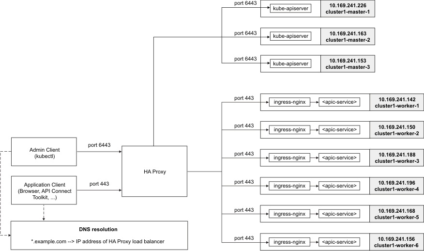
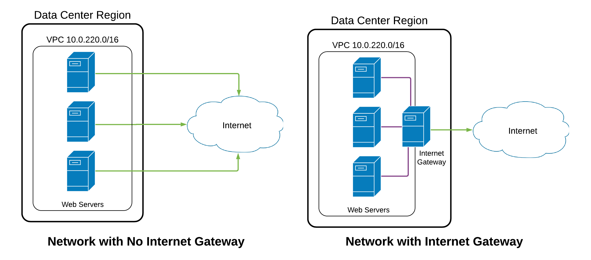

#### 1. Network Ayarlarının Yapılması



https://www.ibm.com/support/knowledgecenter/SSBS6K_3.1.2/installing/set_loadbalancer.html

https://docs.openshift.com/container-platform/3.4/install_config/install/advanced_install.html#multiple-masters


__3 Adet network oluşturuyor oluyoruz__ 

1. Bu yaptığımız ayarlar clusterdaki makinaların bizzat kendi aralarında haberleşmesi için gerekli network ayarlarını ifade ediyor.

Aşağıda yapacağımız ayarlarda 10.240.0.0/24 bloğunu ayarlarmış oluyoruz.

2. Bunun pod ların kendi aralarından haberleşmesi için bir network bloğu lazım (POD CIDR - Classless Inter-Domain Routing).

Bunun için bu bölümde herhangi bir ayar yapmayacağız ancak ileride lazım olacağı için burada bloğu kaynaklarda böyle belirtildiği için bizde 10.200.0.0/16 olarak belirledik.


3. Diğer bir Network de clusterdaki service de oluşturulacak.

Burası içinde yine şuan birşey yapmıyoruz ancak ileride lazım olacağı için burada belirliyoruz. Genelde kaynaklarda bu blok kullanıldığı için 10.32.0.0/24 belirliyoruz.


Bunun için /etc/network/interfaces dosyasına ek yapılcabilceği gibi aynı zamanda Ubuntu 18.04 ile gelen Netplan'da kullanılabilir.

[detaylı netplan örnekleri için tıklayınız](https://netplan.io/examples)


[netplan ile kubernetes](https://willwarren.com/2019/05/running-kubernetes-on-ubuntu-18-04-virtualbox/)


genel de 10.240.0.0/24 bloğu kullanıldığı için bize onu kullanacağız.

öncelikle bütün node larda aşağıdaki komutu çalıştırarak mac adreslerini alıyoruz

```
$lshw -class network

. . .
*-network:1
    description: Ethernet controller
    . . .
    *-virtio1 DISABLED
        description: Ethernet interface
        physical id: 0
        bus info: virtio@1
        logical name: ens4
        serial: ex:am:pl:e3:65:13
. . .

```
serial kısmında yazan mac adresi.

mac adreslerini not ettikten sonra alttaki komutla 50-cloud-init.yml dopsyasını editliyoruz.

nginx: mac adresi ce:6d:22:e9:95:89
- nginx: 10.240.0.8/24
- master1: 10.240.0.2/24
- master2: 10.240.0.3/24
- master3: 10.240.0.4/24
- worker1: 10.240.0.5/24
- worker2: 10.240.0.6/24
- worker3: 10.240.0.7/24

10.240.0.1 de gateway için kullanılıyor olacak haliyle


```
nano /etc/netplan/50-cloud-init.yaml
```
yeni eth1 kartımızı tanımlıyoruz

```

        eth1:
            addresses:
            - 10.240.0.8/24
            match:
                macaddress: 02:90:49:ae:25:f7
            nameservers:
                addresses:
                - 67.207.67.3
                - 67.207.67.2
                search: []
            set-name: eth1

```


Ancak ben bu kurulumu yaprken digitalocean da ne yaprsak yapalım yeni eth1 sanal interface i sistemler tanımadı oyüzden yine digitalocean ın sayfasndan private network oluşturmak durumunda kaldım.


aynı aralıkta bir ip blogu tanımladım (10.240.0.0/24)

Ancak son tahlilde yasml doyasının için kontrol ettiğimizde yukarıdaki gibi girildii görülcektir.


kurulumlaradn sonra sadece nginx dışarı bakacak şekilde network ayarlamsı yapcağız


https://www.digitalocean.com/docs/networking/vpc/resources/droplet-as-gateway/


#### 2. nginxlb Makinmasındaki 100 gb lık Diskin NFS Olarak Tüm Makinalara Tanıtılması.


daha önce mount edilmiş 100 gb lık diskimizi diğer 6 makinaya NFS olarak mount edeceğiz.

öncelikle kaynaklarımını update ediyoruz

```
sudo apt-get update
```

daha sonra nfs server ı kuruyoruz

```
sudo apt-get install nfs-kernel-server
```
daha sonra bütün clinet larda şu kmutları çalıştırarak nfs common ı kuruyoruz

```
sudo apt-get update
sudo apt-get install nfs-common
```

tekrar nginx makinamıza yani nfs servier a geri dönüyoruz.

daha sonra paylaşım yapacağımız klasörü oluşturuyoruz.

nginxlb makşinasındaki 100 gb lık dikimize bir klasör oluşturp onu paylaştıracağız

```
$ cd /mnt/nginxlbvolume
$ mkdir kubeshared

```
daha sonra client ların herhangi bir kısıtlama ve izne bağlı kalmadan erişebilmeleri için alttaki komutu yazıyoruz

```
$ sudo chown -R nobody:nogroup /mnt/nginxlbvolume/kubeshared
```


nfs paylaşımları /etc/exports dosyasına yapılır

```
$ sudo nano /etc/exports

dosya alttaki satırları ekliyoruz

/mnt/nginxlbvolume/kubeshared 10.240.0.0/24(rw,sync,no_subtree_check)
# buraya dikkat ilgili subnet deki tüm node lara yetki verdik
```

daha sonra altakşi komutlarla paylaşımı açıyoruz

```
$ sudo exportfs -a
$ sudo systemctl restart nfs-kernel-server
```


daha sonra client larda şu işlemleri yapıyoruz.

```
$ showmount -e 10.240.0.8 // nginxlb makinamızın ip adresi

üstteki komutu clinet larda çalıştırdığımızda alttaki gibi bir sonuç dönecektir.


Export list for 10.240.0.8:
/mnt/nginxlbvolume/kubeshared 10.240.0.0/24

```
büstteki sonucu tüm clientlarımızda gördüysek. her restart da ilgili NFS nin otomatik mountolmasını sağlamak amacıyla alttaki komutları tüm clientlarda çalıştıyıoruz

ilk önce mount edeceğimiz klasörü create etmemiz gerekiyor. karışıklık olmaamsı için nginxlb de açtığımız aynı path i burada da oluşturuyoruz.

```
mkdir /mnt/nginxlbvolume
mkdir /mnt/nginxlbvolume/kubeshared
```

daha sonra fsrab doyasına ilgili mount işlmeini yazıyoruz.

```
$ sudo nano /etc/fstab

# aşağıdaki satırları ekliyoruz ve save liyoruz

10.240.0.8:/mnt/nginxlbvolume/kubeshared /mnt/nginxlbvolume/kubeshared nfs auto,noatime,nolock,bg,nfsvers=4,intr,tcp,actimeo=1800 0 0
```

makinları restart etmeden check etmeke için 

```
$ sudo mount -a
```

daha sonra biraz test yapılabilir bütün node lardan create edilen dosyaların okunabiliyor olması lazım.
