#### Worker Nodes

Konuya başlamadan önce şunu belitmek isityorum. Bu makale baya bi uzun olacak çünkü (bence) Kubernetes'in en karmaşık konularıdna biri network. Bu nedenle Kubernetes'in bazı pluginleri direk Linux'un kendi bileşenleri  kullandığı için çok detaya girmeden bu bileşenlere deyinmek zorunda kaldım.

Ayrıca konuyu dağıtmamak için makaleyi ikiye bölmek istemedim.

İlk olarak worker makinlarımızda swap özelliğini off yapmamız lazım. Hatta 1.8 den itibaren bildiğim kadarıyla swap açıkken sunucuyu restart ettiğimizde Kubernetes çalışmıyor. 

Bunu sebeplerini şu şekilde sıramak

- Öncelikle kubernetes swap bölümünü yönetmek için dizayn edilmedi. (tabii ki dizyn edilecek şekilde de kurgulanabilirdi ki bunu savunanlarında aşağıda linkini verdiğim bir github issue'var) 
- Kubernetes podları öngörülemez bağımlıklıklardan arındırılmalıdır. Yani swap alanının uygulamalar tarafaında nasıl handle edileceği yada performansının ne olacağı tahmin edilebilir değildir ve bu da docker felesefesine aykırıdır. Yani biz uygulamamızı paketlerken temel bazı garantilerden dolayı docker'ı kullanıyoruz ve swap alanı belirsisizlerinden dolayı bu durumu bozmaktadır.Kubernetes Podlar için 3 tip garanti sunmaktadır, bunlar  [Guaranteed, Burstable, and BestEffort](https://kubernetes.io/docs/tasks/configure-pod-container/quality-service-pod/#create-a-pod-that-gets-assigned-a-qos-class-of-guaranteed).
- Ayrıca Docker mantık olarak küçük ama çok istek alan uygulamaların yönetimi üzerine kurgulanmıştır denilebilir. Yani tek başına bir podda çalışıp çok ram ve işlemci gerektiren uyulamalardan ziyade onlarca hatta belki binlerce az işlemlemci ve ram gerektiren podda çalışabilcek uygulama altyapıları Docker (dolayısyla Kubernetes) için daha mantıklıdır. işin doğası tabiiki yoğun cache (doğrudan ram değil) gerektiren uygulamar olcaktır ancak bunun için de redis, apache ignite vb in memmory store' lar kullanmak mantıklı olacaktır. 


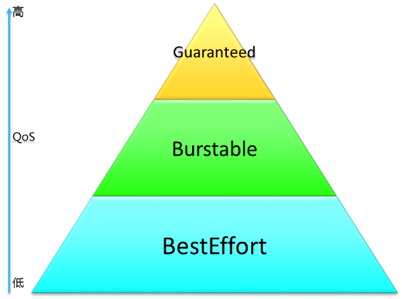

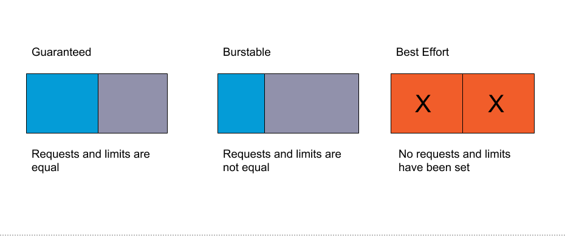

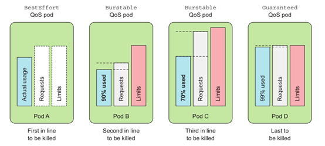

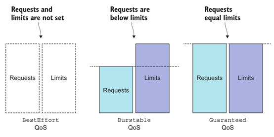


Bazı kullanıcılar swap mode'un açık olmasını savunmaktdırlar. En aazında bazı uyulamalar için ihtiyaç olduğunu idda edenler var.
2017 de Ekimde açılmılş olan bu issue üzerinden halen tartışmalar devam etmektedir. 

- https://github.com/kubernetes/kubernetes/issues/53533

swap alanının açık olup olmadığını görmek için

```
$ sudo swapon --show
```
Eğer ekran empty (boş) geliyora swap kapalı (disabled) demektir.

Eğer açık ise aşağıdaki gibi sonuç çıkacaktır.

```
NAME      TYPE      SIZE USED PRIO
/dev/dm-1 partition 980M   0B   -2
```

Swap alanının ayarlanabileceği diğer bir yerde fstab dosyasıdır. Bu dosya içinde de swapla ilgili birşey varsa # ile kapatmalıyız.

```
sudo vi /etc/fstab #<-- Comment out the line for swap and save it
```

devam etmeden özce az sonra kurumunu yapcağımız 3 araç için bazı bilgiler vermek istiyorum.


[conntrack-tool](https://conntrack-tools.netfilter.org/manual.html)

[Makale - Connection Tracking System](http://people.netfilter.org/pablo/docs/login.pdf)

[socat komutu hakkında](http://www.dest-unreach.org/socat/doc/README)

- __socat__ iki bağımsız kanal arasındaki veri transferi için bir relay (röle) dir, trnsferi gerçekleştirir. Bu iki kanal dosya, device (serial line, pesudo terminal), socket (UDP, TCP, IPv4, IPv6), program, file desriptor (stdin) ve benzerleri olabilir. Ençok ullanıldığı alanlardan biri de port forwarding dir.

- __conntrack__ ise "connection tracking system" için bir interface dir. yani system üzerinde çalışmamızı sağlar. peki Connection tracking sistem nedir? 

- Sistem üzerinden yapılan bazı connectionların state leri olabilir. Bu statelerin takip edilmesi ve diğer araçlar tarafından bu statelere göre işlem yapılmasını mümkün kılan siteme __connection tacking system__ denir. Bahsi geçen state'ler,

  - NEW — paket yeni bir bağlantı isyiordur, örneğin http.
  - ESTABLISHED — paket halihazırda bir cbağlantının üyesidir.
  - RELATED — paket bir bağlantının üyesi olmasına rağmen farıklı bir bağlantı daha isiyordur. öeneğin FTP 21 portundan bağlıdır ancak 20 nolu portdan transfer yapabilir..
  - INVALID — paket tracking table'daki herhangi bir bağlantıya üye değildir.

[conntract sebepli Kubernetes network problemleri](https://deploy.live/blog/kubernetes-networking-problems-due-to-the-conntrack/)


Bu arara hatırlatmakda fayda olduğunu düşünüyorum. Bu araçlar Kuberntes binaryleri değil. Linux kernel seviyesinde işlem yapmak için gerekli Yani Kubernetes'in ileride kuracağımız binary'leri bu araçlar sayesinde gerekli olan network ayarlarını yapabilmektedir.

__Peki Kuberntes bu araçlara neden ihtiyaç duyar?__

Çünkü yüzlerce hatta binlerce pod arasındaki işletişim ve bu iletişimin statelerinin yönetilmesi çok önemli bir konudur. Bu nedenle aşağıda kurumları yapılcak olan araçlara  ihtiyaç bulunmaktadır.

paket kurumları sayesinde "kubectl port-forward" komutu kullanılabilir hale gelir.

3 worker da da alttaki kokurumı yapınız
```
$ apt -y install socat conntrack ipset
```

Devam etmeden önce "Container Network Interface" kavramından biraz bahsetmek istiyorum. Docker'dan farklı olarak Kubernetes kurulumunda hazır network çözümü sunmaz. Bunun için plugin'ler den birini tercih etmemzi gerekiyor.

Bu pluginler farklı network katmanlarını kullanarak podları bir biryle haberleştirmektedirler. Uzun uzadıya network anlatacak değiliz cancak konun anlaşılabilmesi için bazı terimleri hatırlamakta fayda var. Ayrıca Kubernetes ağ yönetimi için de bilmek gerekiyor. OSI katmnlarını inceleyecek olursak,

- __Layer 2 (Data Link):__ Fiziksel katmana (Layer 1) erişmek ile ilgili kuralları belirler. B ukatman verileri belirli parçalara bölerek fiziksel katmana iletir. Bu böümlere frame adı verilir.
- __Layer 3 (Network Layer):__ Bu katmanda veriler paket olarak taşınır. Farklı ağlara iletme işlemleri bu katmanda yapılır (Swich ve Route bu katmanda çalışır). 
- __Layer 4 (Transport Layer):__ Üst katman ile alt katman arasında taşıma yapar. burada veriler segment olarak taşınır


- __VXLAN:__

Özellikle bulut teknolojilerinde genişleme problemini çözmek için tasarlnamıştır. Ağın sanallaştırılması olarka tanımlayabiliriz. Peki fiziksel olarak konumlardırılan ağ sistemi nasıl sanallaştırılabilir?

Burada ethernet protokolnün tünellemesi yapılarak UDP paketlerinin içine yeni bir ethernet frame eklenmesi yoluyla sanal bir ağ sistemi fiziksel ağ üzerine kurulmuş olur.


örnek vxlan paket formatı

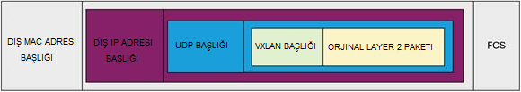

- __Overlay Network - P2P Network:__

Underlay network (Fiziksel network) üzerinden sanal network (Overlay network) geçirmektir. 

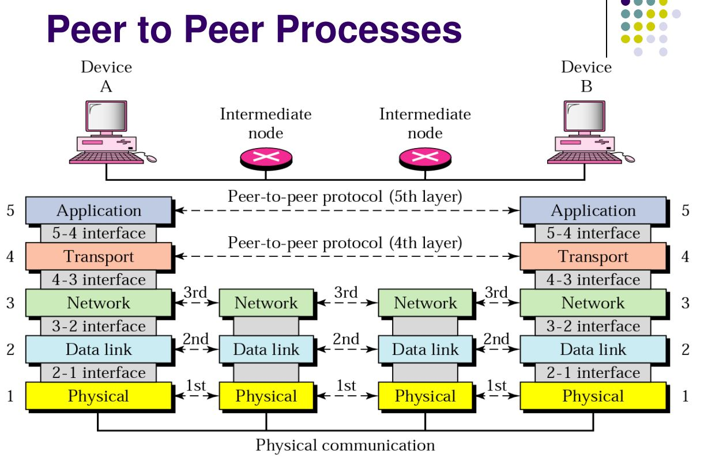
[kaynak](https://www.slideshare.net/Taimoor_Gondal/layers-and-peer-to-peer-process-dccn)


Örneğin alttaki örnekte internet üzerinden kurulmuş bir overlay network görebiliriz. Sanal Network'ün bilgileri, application layer üzerinden taşınmakatadır.

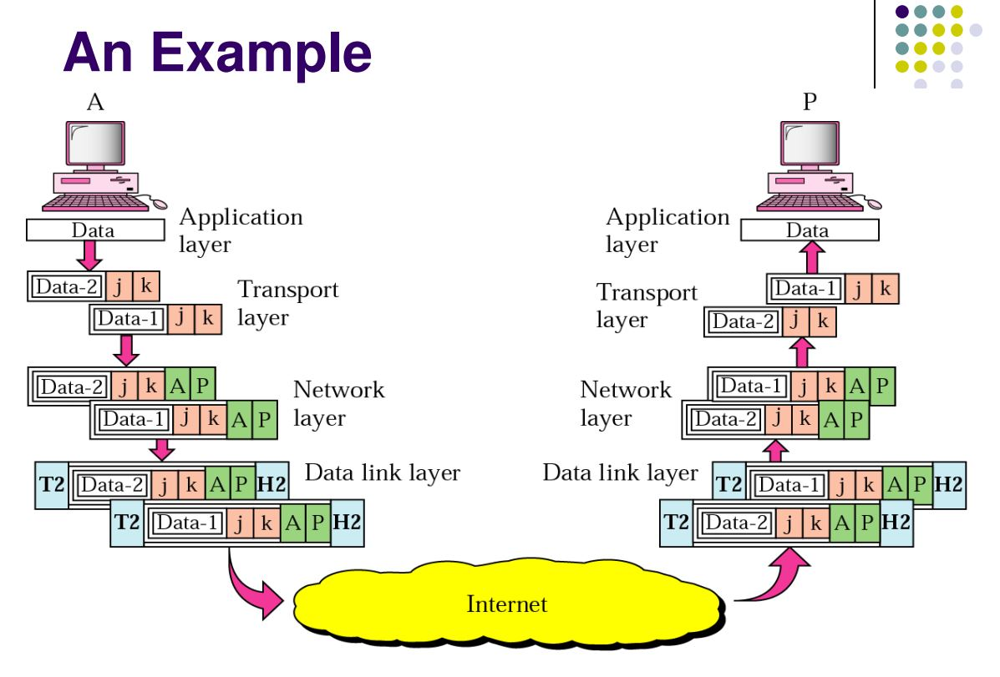
[kaynak](https://www.slideshare.net/Taimoor_Gondal/layers-and-peer-to-peer-process-dccn)


- __VXLAN tabanlı overlay vs BGP tabanlı overlay network__

Ağ tüneli oluşturma, bir protokolü (VXLAN) başka bir protokol (alt tabakanın TCP / IP) içinde sakladığımız anlamına gelir. VXLAN, L4 UDP datagramlarının içindeki katman 2 framelerini tüneller. Bu, aynı VXLAN üzerindeki container'ların aynı L2 ağında olduğu yanılsamasını yaratır. 


BGP (Border Gateway Protochol) İnternet'in yönlendirme protokolüdür. Otonom Sistemler arasında yönlendirme için kullanılır. Otonom Sistem ISP, Internet Exchange Point, veya  Transit Provider olabilir. BGP (Sınır Geçidi Protokolü) nenilmesinin sebebi de budur, bu sistemlerin arasında çalışarak yönlendirmlerri yapar.

BGP tabanlı overlay network aslında kapsülleme yapmaz. Rota bilgilerini node larla paylaşır. Böylece ikinokta birbiriyle hangi path ile haberleşeceğini bildiği için  kapsüllemeye gerk duymaksının haberleşebilir. Bu ndenle de VXLAN' e göre daha hızlı olması beklenir.

Ancak tabiiki BGP'de tünelleme yapılmasığı için node'laırın biribirine yakın olması gereklidir. Ayrıca herzaman Underlay (fiziksel) network üzerine yetkilerimiz olmayabilir. Bu gibi durumlarda da (aşağıda göreceğimiz CNI çözümü olan calico) ip-in-ip ya da VXLAN kullanmak durumunda kalacaktır.

- __Encapsulation (Kapsülleme):__

Kapsülleme hem yazılım hem de ağ teknolojilerinde sıkça kullşanılan bir kavram. Networking dünyaından bakacak olursak basitçe katmanlar arasında paketlerin sarmalanarak (kapsüllenerek) bir sonraki katmana iletilmesidir. Örneğin yukarıda belirttiğimiz sanal ağ için gerekli bilgiler bir alt katmana sarmalanarak iletilir. Yukarı doğru çıkıldıkça da bu kapsüller açılarak okunur diyebiliriz.

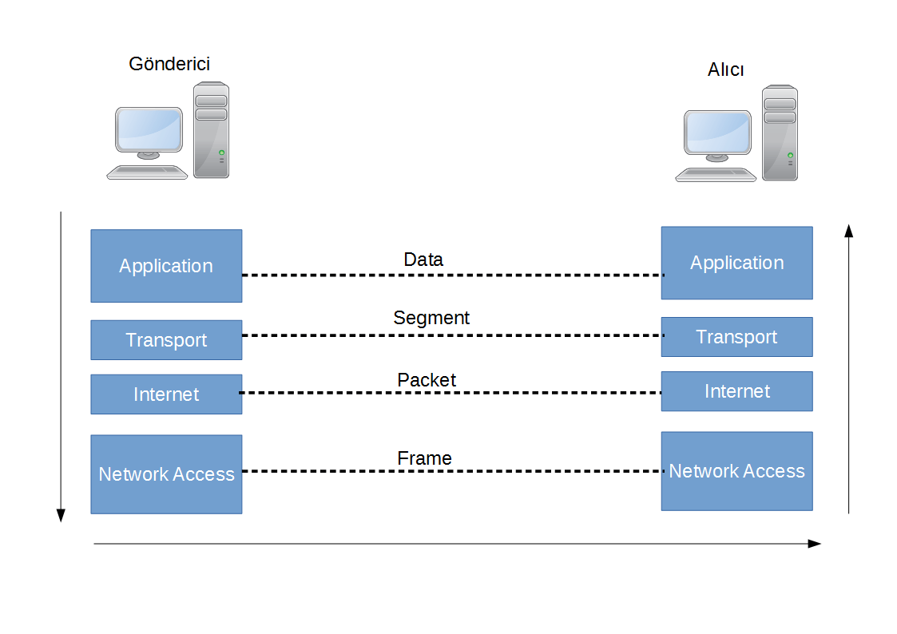
[kaynak](https://www.cemaltaner.com.tr/2018/09/23/veri-kapsullemesi-data-encapsulation/)


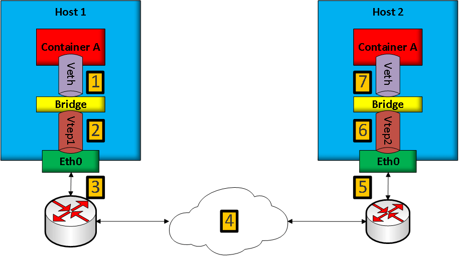
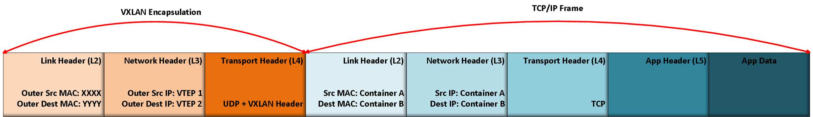

[kaynak](https://community.arm.com/developer/tools-software/tools/b/tools-software-ides-blog/posts/understanding-and-deploying-overlay-networks)


aşağıdaki örneğe bakacak olursak. bir web sitesinin client'a ulaşırken yapılan kapsüllemler görülebilir.

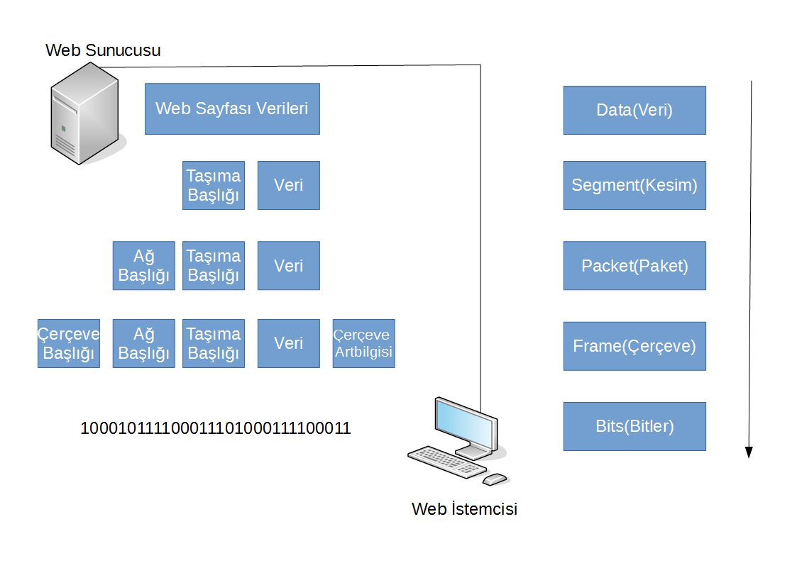
[kaynak](https://www.cemaltaner.com.tr/2018/09/23/veri-kapsullemesi-data-encapsulation/)

 
__Docker Default Network Model__

Docker Network Modeli hakkında detaylı bilgi için [resmi döküman sayfası](https://docs.docker.com/network/).

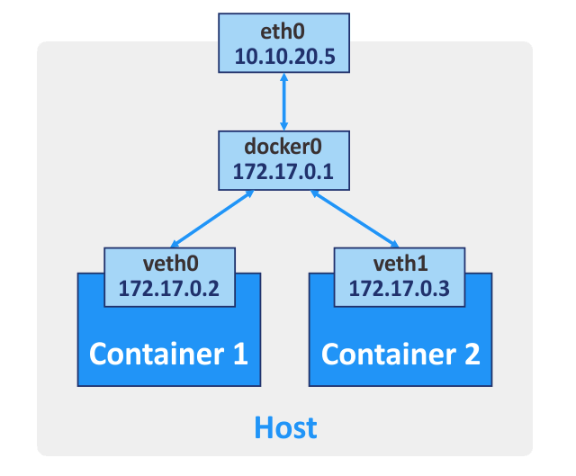
[kaynak](https://www.nakivo.com/blog/docker-vs-kubernetes/)

__Kubernetes Network Model - CNI Yokken__

Burada dikkaet dilirse aslında Docker'ın bize verdiğinden fazlası yok.

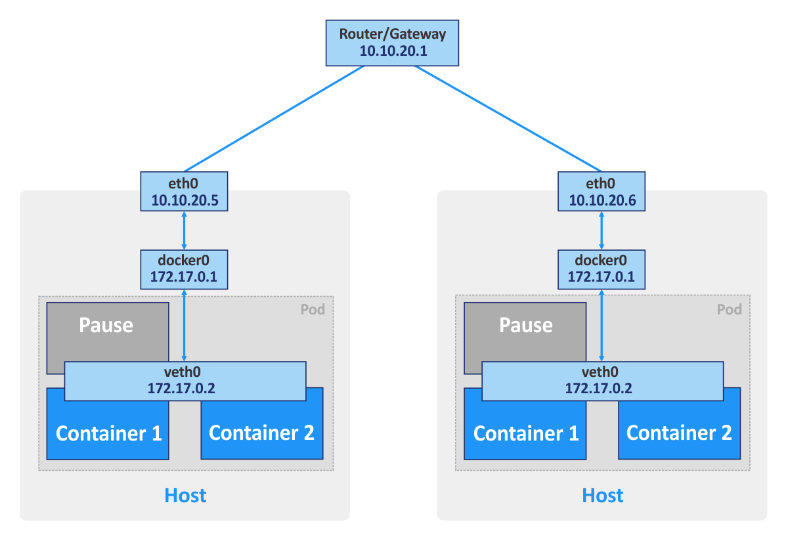


__Kubernetes Network Model (CNI)- Flannel Örneği__

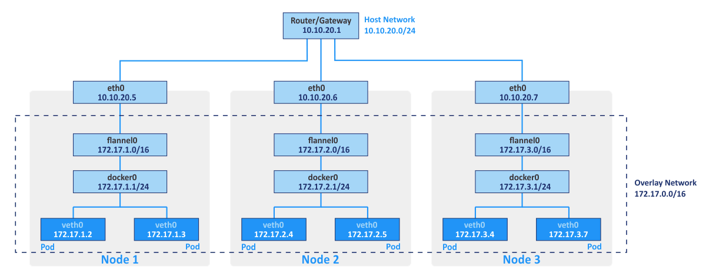
[kaynak](https://www.nakivo.com/blog/docker-vs-kubernetes/)


__Ingress Network Model__

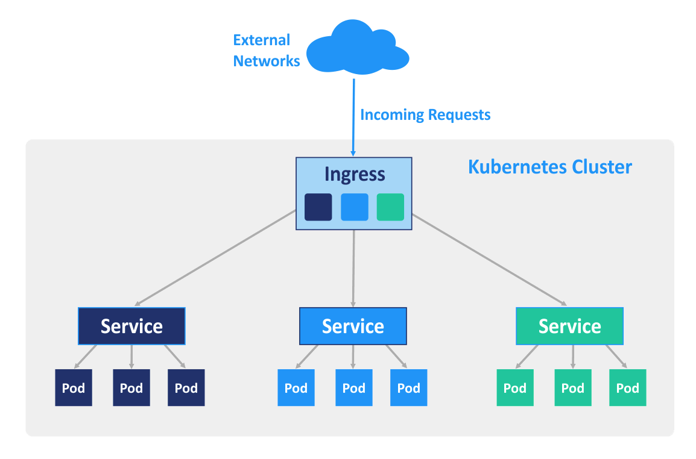


CNI, cluster içindeki podların iletişiminde sorumludur. Farklı özelliklerde pluginler mevcuttur.En çok kullanılanıları gözlemlediğim kadarıyla,

- __Flannel__ (ücretsiz, hız odaklı, firewall yok, Layer 2 de çalışır, overlay network kullanır, VXLAN tabanlı overlay kullanır)
- __Calico__ (Enterprise kısmı ücretli, hız ve güvenlik (firewall) odaklı, layer 3 de çalışır, ayrıca Layer-7 kuralları Istio ile entegre policy'lerle kulladırabiliyor. BGP tabanlı overlay kullanıyor)
- __Wave__ (Enterprise kısmı ücretli, güvenlik (firewall) odaklı ama yavaş)
 
Güvenlik artıkça hız düşüyor. Test sonuçlarını için [CNI Benchmark Test Sonuçları](https://itnext.io/benchmark-results-of-kubernetes-network-plugins-cni-over-10gbit-s-network-updated-april-2019-4a9886efe9c4) sayfasını ziyaret ediniz.

Ingress Controller ise cluster dışından cluster içine gelen networkü yönetmek için kullanılır. Bunun içinde farklı seçenekler mevcut yeri geldiğinde detaylı inceleyeceğiz.

Tekrar Konumuza dönecek olursak :)

Diğer bir terim de Container Runtime Interface (CRI): kubernetes sadece Docker'ı desteklememektedir. Diğer container teknolojilerini de destekler. Bunu yapabilmesi için de CRI'a ihtiyaç vardır. CRI sayesinde farklı implemetasyonlar yapılabilir. Bazı CRI implementasyonları,

- dockershim
- cri-o
- cri-containerd
- frakti
- rktlet 

Cri-O örneği

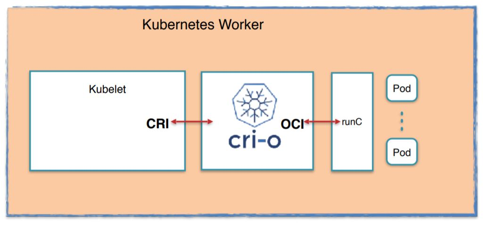

Containerd Örneği

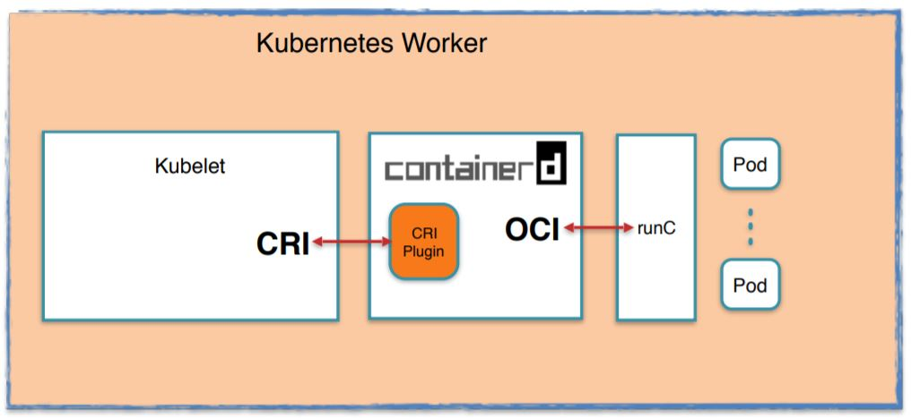

Mesela Kelsey kendi kurulumunda dockerization aracı olarak containerd'yi kurmuş. Üstteki örnek containerd sistemini göstermektedir.

[Detaylı Container Runtime Anlatımı İçin Tıklayınız](https://events19.linuxfoundation.org/wp-content/uploads/2017/11/How-Container-Runtime-Matters-in-Kubernetes_-OSS-Kunal-Kushwaha.pdf)

Biz kendi örneğimizde calico'yu tercih ediyor olacağız. Flannel kadar hızlı olmasa da (çünki Flannel Layer-2 kullanıyor), Wave kadar yavaş da değil ve firewall yeteneği de var. Bu arada isterseniz Flannel kurup üzerine Calico ile güvenlik kısmı içinde kullanabilirsiniz.

Flannel ve Calico'yu beraber kullanma konusunda [bu sayfadan](https://docs.projectcalico.org/getting-started/kubernetes/flannel/) faydalanabilirsiniz.


Docker 1.11 den itibaren CRI olarak cri-containerd ye geçmiştir. Aşağıda kurumlarda containerd'yi de görebilirsiniz. Ayrıca low level container runtime olarakta "runc" yi kullanmaktadır. 

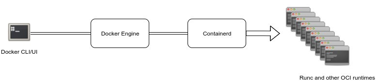

containerd'nin resmi sayfasından bir cümle;

"containerd is available as a daemon for Linux and Windows. It manages the complete container lifecycle of its host system, from image transfer and storage to container execution and supervision to low-level storage to network attachments and beyond."


diagramda görünen __shim__ ise container manager ile runtime arasında çalışarak entegrasyn problemlerinin yaşanmasını engeller.

containerd ile dockerd (d=daemon) arasındaki ileişim gPRC ile gerçekleşir.

__Runc__ ise OCI (Open Container Initiative) tarafıdna belirlenen specification'lara uygun şekilde container yönetimi yapan bir CLI'dır. 


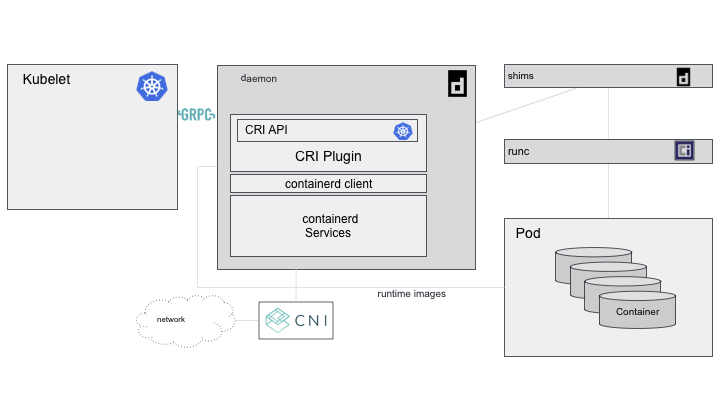


Şimdi  worker node kurulumlarına geçebiliriz.

Sırasıyla aşağıdaki bileşen ve pluginleri kuruyor olacağız.

1. Docker 19.03
2. Kubelet
3. Kube Proxy
4. Kybectl
5. Calico (dolayısıyla CNI ve CRI kurulmuş olacak)


__Docker Kurulumu__

Kurulum için [resmi Docker sayfasını](https://docs.docker.com/engine/install/ubuntu/) kullanıyor olacağım. Tek fark olarak docker versiyonunu 19.03 olarak belirtiyor olacağım.

Bütün worker node'larda bu kodları çalıştırıyoruz.

apt'ye https den paketleri yükleyebilmeleri için yetki veriyoruz.

```
$ sudo apt-get install \
    apt-transport-https \
    ca-certificates \
    curl \
    gnupg-agent \
    software-properties-common
```
GPG key'i ekliyoruz

```
$ curl -fsSL https://download.docker.com/linux/ubuntu/gpg | sudo apt-key add -
```

Fingerprintin son 8 karakterini arayarak bu karakterlerle (9DC8 5822 9FC7 DD38 854A  E2D8 8D81 803C 0EBF CD88) aynı olduğunu teyid ediyoruz.

```
$ sudo apt-key fingerprint 0EBFCD88

pub   rsa4096 2017-02-22 [SCEA]
      9DC8 5822 9FC7 DD38 854A  E2D8 8D81 803C 0EBF CD88
uid           [ unknown] Docker Release (CE deb) <docker@docker.com>
sub   rsa4096 2017-02-22 [S]
```

stable repository'yi ekliyoruz. Test amaçlı stable yerine örneğin nightly de kullanılabilir. Alttaki komutta önemli kısımlardann biri "lsb_release -cs" kısmı. Alttaki komutu çalıştırmadan önce kullanığınız sürümün doğru olduğunda eminolun. Örneğin ben Ubuntu 10.04 kullanıyorum bu durumda "bionic" dönmesini belkiyorum. 

```
$ sudo add-apt-repository \
   "deb [arch=amd64] https://download.docker.com/linux/ubuntu \
   $(lsb_release -cs) \
   stable"
```


Eğer alttaki komutu çalıştırıska en son stable sürün kurulur. Ancak biz bunu tercih etmiyoruz

```
 $ sudo apt-get update
 $ sudo apt-get install docker-ce docker-ce-cli containerd.io
```

Bu nedenle alttaki komutla available olan sürümleri listeleyerek Docker 19.03 kuruyor olacağız. Altta örnek listeyi verdim bizimkinde 19.03 oluyor olacak.

```
$ sudo apt-get update
$ apt-cache madison docker-ce

  docker-ce | 5:18.09.1~3-0~ubuntu-xenial | https://download.docker.com/linux/ubuntu  xenial/stable amd64 Packages
  docker-ce | 5:18.09.0~3-0~ubuntu-xenial | https://download.docker.com/linux/ubuntu  xenial/stable amd64 Packages
  docker-ce | 18.06.1~ce~3-0~ubuntu       | https://download.docker.com/linux/ubuntu  xenial/stable amd64 Packages
  docker-ce | 18.06.0~ce~3-0~ubuntu       | https://download.docker.com/linux/ubuntu  xenial/stable amd64 Packages
  ...
```

daha sonra specific versiyonu kuruyoruz. [VERSION_STRING] yerine 19.03 yazıyoruz. Alttaki komuta dikkat edecek olursanız containerd'nin de kurulduğunu görebilirsiniz.

```
# $ sudo apt-get install docker-ce=[VERSION_STRING] docker-ce-cli=[VERSION_STRING] containerd.io
$ sudo apt-get install docker-ce=5:19.03.11~3-0~ubuntu-bionic docker-ce-cli=5:19.03.11~3-0~ubuntu-bionic containerd.io
```
daha sonra test etmek için bütün workerlarda alttaki komutu çalıştırıyoruz.

```
$ sudo docker run hello-world
```
şu mesajı 3 worker node'da da görmüş olmalıyız.

```
Hello from Docker!
This message shows that your installation appears to be working correctly.
```
Birde containerd'nin çalışıp çalışmadığını kontrol edelim. bunun için systemctl ile bütün worket node'larda servisin çalıştığında  emin oluyoruz. Aşağıdaki komutla test edebiliriz.

```
$ sudo systemctl status containerd
```
Bu  arada Kelsey normalde bunu manuel kurduğu için sayfasında [containerd için bazı ayarlar yapıyor](https://github.com/kelseyhightower/kubernetes-the-hard-way/blob/master/docs/09-bootstrapping-kubernetes-workers.md#configure-containerd) şuan bizim bunları yapmamıza gerek yok ancak ayarların Kelsey ile uyumluluğunu test etmek isteseniz.

Containerd servis dosyası şu adreste " /lib/systemd/system/containerd.service" bulabilirsiniz. Config.toml dosyasını da şu adresten kontrol edebilirsiniz " /etc/containerd/config.toml". Service dosyasıdan gözle görülür bir fark yok ancak toml dosyasına baktığımızda ciddi farklılar olduğunu görebiliriz. En önemli fark cri plugin disabled olarak görülüyor bizdeki toml dosyasında, bunun sebebi ise aslında Docker zaten bir CRI implemetasyonuna sahip (yani kendisi zaten burada CRI uygulayıcısı). Containerd' yi de kendi ihtiyaçlarına göre zaten konfigüre ettiği için toml dosyasında bizim farklı birşey yapmamıza gerek kamamış oluyor. Ancak şunu unutmamak gerekiyor Docker yerine başka bir tool kullanıyor olsaydık bütün bu konfigürasyonu manuel yapmamız gerekebilirdi. 

runc' nin de kurulduğu nu şu şekilde kontrol edebiliriz. Runc'nin ne olduğundan yukarıda bahsetmiştik.

```
runc --version
```


__Kubernetes Binary'lerinin kurulumlarına devam edebiliriz.__

Geriye neler kaldı

- kubelet
- kube-proxy
- kubectl
- ve son olarak CNI (dahas sonra üzerine istenirse calico, flannel veya weave)

Kurumları yapmak için gerekli olan klasörleri bütün worker node'larda oluşturuyoruz.

```
$ sudo mkdir -p \
  /etc/cni/net.d \
  /opt/cni/bin \
  /var/lib/kubelet \
  /var/lib/kube-proxy \
  /var/lib/kubernetes \
  /var/run/kubernetes
```

Binary'leri download ediyoruz. 

```
wget -q --show-progress --https-only --timestamping \
https://storage.googleapis.com/kubernetes-release/release/v1.18.0/bin/linux/amd64/kubectl \
https://storage.googleapis.com/kubernetes-release/release/v1.18.0/bin/linux/amd64/kube-proxy \
https://storage.googleapis.com/kubernetes-release/release/v1.18.0/bin/linux/amd64/kubelet

```

execute izni veriyoruz

```
$ sudo chmod +x kubectl kube-proxy kubelet
```
daha sonra bu binary'leri olması gereken path'lere taşıyoruz.

```
$ sudo cp kubectl kube-proxy kubelet /usr/local/bin/
```
__Kubelet Konfigürasyonu__

sertifika ve kubectl dosyalarını kopyalıyoruz.


__worker 1__
```
$ sudo cp /home/kubernetes/certificate_files/worker1-key.pem /home/kubernetes/certificate_files/worker1.pem /var/lib/kubelet/
$ sudo cp /home/kubernetes/kubeconfigs/worker1.kubeconfig /var/lib/kubelet/kubeconfig
$ sudo cp /home/kubernetes/certificate_files/ca.pem /var/lib/kubernetes/

```

__worker 2__
```
$ sudo cp /home/kubernetes/certificate_files/worker2-key.pem /home/kubernetes/certificate_files/worker2.pem /var/lib/kubelet/
$ sudo cp /home/kubernetes/kubeconfigs/worker2.kubeconfig /var/lib/kubelet/kubeconfig
$ sudo cp /home/kubernetes/certificate_files/ca.pem /var/lib/kubernetes/

```

__worker 3__
```
$ sudo cp /home/kubernetes/certificate_files/worker3-key.pem /home/kubernetes/certificate_files/worker3.pem /var/lib/kubelet/
$ sudo cp /home/kubernetes/kubeconfigs/worker3.kubeconfig /var/lib/kubelet/kubeconfig
$ sudo cp /home/kubernetes/certificate_files/ca.pem /var/lib/kubernetes/

```

kubelet-config.yaml dosyasını oluşturuyoruz ve files altındaki yaml klasörümüzde her bir worker node için klasör oluşturarak ayrı ayrı kopyalıyoruz. aşağıda worker1 olan için örnek doyayı görebilirsiniz.

Hatırlarsanız cluster ip bloğu için 10.32.0.0/24, ve pod için 10.200.0.0/16 belirlemiştik. Burada cluster DNS adresini 10.32.0.10 olarak belirliyoruz. resolveConf parametresi ile de makinalarımızın DNS adreslerini göstermş oluyoruz. CoreDNS i sisteme tanıttığımız zaman loop problemi yaşamamak için burada resolv.conf patyh ini belirtiyoruz.

kubelet'in henuz yeni bir [versiyonu](https://github.com/kubernetes/kubernetes/tree/master/staging/src/k8s.io/kubelet/config) yok görünüyor

```
kind: KubeletConfiguration
apiVersion: kubelet.config.k8s.io/v1beta1
authentication:
  anonymous:
    enabled: false
  webhook:
    enabled: true
  x509:
    clientCAFile: "/var/lib/kubernetes/ca.pem"
authorization:
  mode: Webhook
clusterDomain: "cluster.local"
clusterDNS:
  - "10.32.0.10"
podCIDR: "10.200.0.0/16"
resolvConf: "/run/systemd/resolve/resolv.conf"
runtimeRequestTimeout: "15m"
tlsCertFile: "/var/lib/kubelet/worker1.pem"
tlsPrivateKeyFile: "/var/lib/kubelet/worker1-key.pem"
```

daha sonra worker node'larda yml doyasını ilgili yere taşıyoruz. worker1 için örnek komut.

```
$ sudo cp /home/kubernetes/yaml/worker1/kubelet-config.yaml /var/lib/kubelet/kubelet-config.yaml
```
Şimdi kubelet.service dosyasımızı hazırlayabiliriz. Kelsey'nin hazırladığından farklı olarak biz docker kullandığımız için docker a özel flag'lar ekledik. Ancak [şu resmi sayfada](https://kubernetes.io/docs/reference/command-line-tools-reference/kubelet/) bu docker kelimesi ie başlayan bütün flag'ların kaldırılacağı uyarısı ver ileride buralar değişebilir.

dosyayı bütün woker node'lara kopyalıyoruz.

dosyaları eğer windows makinada hazırladıysanız dos2unix komutunu çalıştımayı unutmayın.

```
[Unit]
Description=Kubernetes Kubelet
Documentation=https://github.com/kubernetes/kubernetes
After=containerd.service
Requires=containerd.service

[Service]
ExecStart=/usr/local/bin/kubelet \
  --config=/var/lib/kubelet/kubelet-config.yaml \
  --docker=unix:///var/run/docker.sock \
  --docker-endpoint=unix:///var/run/docker.sock \
  --image-pull-progress-deadline=2m \
  --kubeconfig=/var/lib/kubelet/kubeconfig \
  --network-plugin=cni \
  --register-node=true \
  --v=2
Restart=on-failure
RestartSec=5

[Install]
WantedBy=multi-user.target
```

daha sonra servisi olması gereken adrese taşıyoruz. 

```
$ sudo cp /home/kubernetes/service_files/kubelet.service   /etc/systemd/system/kubelet.service
```


Şuan servisi başlatmıyoruz. kube-proxy servisini de tamamladğımızda beraber başlatacağız.

__Kubernetes Proxy Konfigürasyonu__

Öncelikle kubeconfig dosyamızı bütün worker node'larda ilgili adrese taşıyoruz.

```
$ sudo cp /home/kubernetes/kubeconfigs/kube-proxy.kubeconfig /var/lib/kube-proxy/kubeconfig
```

Tüm worker node'lar için kube-proxy-config.yaml adında  bir konfigürasyon dosyası oluşturuyoruz. kube-proxy'ninde daha yeni bir versiyonun olmadığını [bu adresten](https://github.com/kubernetes/kubernetes/tree/master/staging/src/k8s.io/kube-proxy/config) görebilirsiniz.


```
kind: KubeProxyConfiguration
apiVersion: kubeproxy.config.k8s.io/v1alpha1
clientConnection:
  kubeconfig: "/var/lib/kube-proxy/kubeconfig"
mode: "iptables"
clusterCIDR: "10.200.0.0/16"
```

Dosyayı bütün worker sunucularına kopyaladıktan sonra ilgili klssöre kopyalıyoruz.

```
$ sudo cp /home/kubernetes/yaml/kube-proxy-config.yaml /var/lib/kube-proxy/kube-proxy-config.yaml
```

Daha sonra kube-proxy.service adındaki servis dosyamızı hazırlıyoruz. Ben kendi bilgisayarımda files klasörü altındaki service_files klasörüne oluşturdum.

```
[Unit]
Description=Kubernetes Kube Proxy
Documentation=https://github.com/kubernetes/kubernetes

[Service]
ExecStart=/usr/local/bin/kube-proxy \
  --config=/var/lib/kube-proxy/kube-proxy-config.yaml
Restart=on-failure
RestartSec=5

[Install]
WantedBy=multi-user.target
```
daha sonra bu dosyamızı da worker node'larda ilgili klasörlere kopyalıyoruz.

dosyaları eğer windows makinada hazırladıysanız dos2unix komutunu çalıştımayı unutmayın.

```
$ sudo cp /home/kubernetes/service_files/kube-proxy.service /etc/systemd/system/kube-proxy.service
```

worker node larınızda alttaki komutla routing NAT kurallarınızı kontrol edebilirsiniz
```
iptables -t nat -L -n
```

worker1 node'unun şuanki hali

```
Chain PREROUTING (policy ACCEPT)
target     prot opt source               destination         
DOCKER     all  --  0.0.0.0/0            0.0.0.0/0            ADDRTYPE match dst-type LOCAL

Chain INPUT (policy ACCEPT)
target     prot opt source               destination         

Chain OUTPUT (policy ACCEPT)
target     prot opt source               destination         
DOCKER     all  --  0.0.0.0/0           !127.0.0.0/8          ADDRTYPE match dst-type LOCAL

Chain POSTROUTING (policy ACCEPT)
target     prot opt source               destination         
MASQUERADE  all  --  172.17.0.0/16        0.0.0.0/0           

Chain DOCKER (2 references)
target     prot opt source               destination         
RETURN     all  --  0.0.0.0/0            0.0.0.0/0           
```


- [detaylı anlatım için bakılabilir](http://arthurchiao.art/blog/cracking-k8s-node-proxy/)
- [proxy ve servisleri debug etmek için](https://kubernetes.io/docs/tasks/debug-application-cluster/debug-service/)


__CNI (Container Network Interface) Kurulumu__


bunun için worker node'ların hepsinde alttakşi komutla gerekli kalsöü  oluşturuyoruz

```
$ sudo mkdir -p \
        /etc/cni/net.d \
        /opt/cni/bin
```
daha sonra bütün worker node'larda binary'yi indiriyoruz

```
$ wget -q --show-progress --https-only --timestamping \
https://github.com/containernetworking/plugins/releases/download/v0.8.6/cni-plugins-linux-amd64-v0.8.6.tgz
```
daha sonra extract ederek ilgili klasöre kopyalıyoruz.

```
$sudo tar -xvf cni-plugins-linux-amd64-v0.8.6.tgz -C /opt/cni/bin/
```

__CRI Kurulumu__

```
$ wget -q --show-progress --https-only --timestamping \ 
https://github.com/kubernetes-sigs/cri-tools/releases/download/v1.18.0/crictl-v1.18.0-linux-amd64.tar.gz

$ tar -xvf crictl-v1.18.0-linux-amd64.tar.gz

$ sudo mv crictl /usr/local/bin/

```

__Worker Servislerin Çalıştırılması__

servisleri çalıştırmak için alttaki komutlar tüm worker sunucularda çalıştırıyoruz.

```
$ sudo systemctl daemon-reload
$ sudo systemctl enable containerd kubelet kube-proxy
$ sudo systemctl start containerd kubelet kube-proxy
```
çalılşır durum agelemeleri biraz vakit alabilir. hata alırsanız service dosyasındaki exec komutunu worker node'laın birinde terminalde çalıştırarak hatayı görebilirsiniz.

test etmek için

```
$ kubectl get nodes --kubeconfig /home/kubernetes/kubeconfigs/admin.kubeconfig

# SONUÇ

NAME       STATUS   ROLES    AGE   VERSION
worker-0   Ready    <none>   15s   v1.18.0
worker-1   Ready    <none>   15s   v1.18.0
worker-2   Ready    <none>   15s   v1.18.0
```

iptables ı tekrar kontro ledecek olursak artık CNI etksini de görebiliriz.


```
$ iptables -t nat -L -n
```


__Konuyla alakalı okunması gereken makaleler__
- [Resmi Kubernets Dökümanı - Kubernetes Network Model](https://kubernetes.io/docs/concepts/cluster-administration/networking/#the-kubernetes-network-model)
- [Kubernetes Community - Networking](https://github.com/kubernetes/community/blob/master/contributors/design-proposals/network/networking.md)
- [Rancher CNI karşılaştırması](https://rancher.com/blog/2019/2019-03-21-comparing-kubernetes-cni-providers-flannel-calico-canal-and-weave/)
- [CNI Benchmark Test Sonuçları](https://itnext.io/benchmark-results-of-kubernetes-network-plugins-cni-over-10gbit-s-network-updated-april-2019-4a9886efe9c4)
- https://www.nakivo.com/blog/docker-vs-kubernetes/
- [İTÜ - Network Layer](https://bidb.itu.edu.tr/seyir-defteri/blog/2013/09/07/a%C4%9F-katman%C4%B1-(network-layer))
- [mshowto - Network Layer](https://www.mshowto.org/network-yapisinda-hostlar-arasi-iletisim.html)
- [Network Kastnaları](https://medium.com/bili%C5%9Fim-hareketi/osi-modeli-ve-7-katman-7c3bb467798c)
- [Kubernetes Networking - resimli anlatım](https://www.stackrox.com/post/2020/01/kubernetes-networking-demystified/)
- [Docker vs. containerd vs. Nabla vs. Kata vs. Firecracker and more](https://www.inovex.de/blog/containers-docker-containerd-nabla-kata-firecracker/)
- [containerd standalone kurulum ve diğer detaylar](https://medium.com/faun/docker-containerd-standalone-runtimes-heres-what-you-should-know-b834ef155426)
- [IBM CRI sayfası](https://developer.ibm.com/blogs/kube-cri-overview/?es_p=9823005)
- [overlay vs bgp]https://community.arm.com/developer/tools-software/tools/b/tools-software-ides-blog/posts/understanding-and-deploying-overlay-networks
- [kube proxy detatlı anlatım ve testler](http://arthurchiao.art/blog/cracking-k8s-node-proxy/)
- [google kubernetes networkinng](https://cloud.google.com/kubernetes-engine/docs/concepts/network-overview)
- [kubernetes networking  deep dive](https://itnext.io/kubernetes-networking-behind-the-scenes-39a1ab1792bb)
- [network troubleshooting](https://discover.curve.app/a/mind-of-a-problem-solver)
- [coredns resolve kubernetes cluster](https://blog.heptio.com/configuring-your-linux-host-to-resolve-a-local-kubernetes-clusters-service-urls-a8c7bdb212a7)