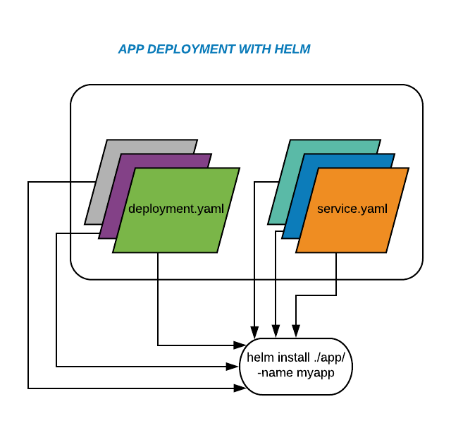
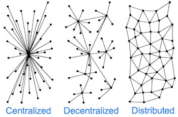

HELM' de iki adet komponent bulunmaktadır.


- **Helm Client**: Chart’ları yönetmenizi sağlayan ve Tiller ile haberleşen araç

- **Tiller**: Kubernetes API si ile konuşarak Helm Client’tan aldığı direktifleri Kubernetes ortamınıza uygulayan araç diyebiliriz.Tiller aynı zamanda sürümleri yöneten kısımdır.

Helm’ in basitlik kazandırdığı bir diğer konu da aslında yukarıda bahsettiğimiz “Lifecycle” mevzusu , yani Helm bize ilgili uygulamanın oluşturulmasından , güncellenmesine, herhangi bir problem durumunda ilgili versiyona rollback edilmesine kadar ki tüm süreçte destek olur.

### Helm vs Kustomize


__Helm__

Kısaca Helm template-driven bir sistem ve decentralization (merkezden yönetilmeme, sorumluluğn dağıtılması) üzerine kurulu bir yapısı var. Yani seperation of concern prensibini uygulamktadır.


güzel bir örnek : https://banzaicloud.com/blog/creating-helm-charts/ (basitten ileri seviye kesinlikle bakılmalı)




aslında chart dosyası ilgili app için gerekli olan herşeyi içerir ancak burad ayağa kaldıraılacak veya değiştirilcek bütün component veya job lar ayrıştırılarak templates altındaki dosylarala yönetilir.Böylece sorumluluklar ayrıştırılmış olur.


https://helm.sh/docs/topics/charts/



__Kustomize__

Kustomize ise merge etmek üzeirne kurlu. Farklı resource ları aynı zamanda transformasyone uğratarak birleştirerek tek bir manifesto dosyası çıkartır. 


Asıl yaml dosyalarını bozmadan aynı anda birden fazla maaç için bu dosyları transformasyonunu sağlar. örneğin test ve prod için base yaml dosylarını alır ve iki farklı ortam için transformasyon yaptıktan sonra tek bir dosya olarka bize deployment.yml çıkartabilir.

şu linkte çok temiz bir örnek var.

https://levelup.gitconnected.com/kubernetes-change-base-yaml-config-for-different-environments-prod-test-6224bfb6cdd6


Kustomize reference sayfası : https://kubectl.docs.kubernetes.io/pages/reference/kustomize.html

Kustomize Örneklerinin bulundu resmi web sayfası : https://github.com/kubernetes-sigs/kustomize/tree/master/examples

detaylı kustomize örneği : https://kubectl.docs.kubernetes.io/pages/examples/kustomize.html

ikisinin de (Helm ve Kustomize) temel amacı aslında karmaşklığı yönetmektir. Ancak birbirlerine rakip değiller.


### HELM Nasıl Çalışır


1. Kubernetes için kaynak tanımları ve uygulama yapılandırma dosyalarının yazılması.

2. Helm ile bu yapılandırma dosyalarının paketlenmesi yani Helm Chart’ın oluşturulması.

3. Oluşturulan Helm Chart’ı depolayabilirsiniz. Nasıl ki Docker Hub üzerinde Docker Image depolanıyor ve oradan tag ile pull edilebiliyor ise aynı şekilde Helm Chart’larıda depolayabilir ve buradan indirebilirsiniz. Örneğin HelmHub, Chart Museum, S3, Azure Container Registry bunlara örnek olarak gösterilebilir.

4. Helm Client, deployment yapmak istediğini ve hangi chart olduğunu gRPC üzerinden Tiller’a bildirir.

5. Tiller Chart paketini açar ve Kubernetes API kullanarak gereken yapılandırma dosyalarını Kubernetes’a bildirir. Uygulamanın Kubernetes kümesi üzerine deploy edilmesini sağlar. Bu adımı kubectl apply komutu gibi düşünebilirsiniz.


### Private Chart Repository

Resmi web sayfası : https://helm.sh/docs/topics/chart_repository/


Chartların Repo ile senkronizayonu : https://helm.sh/docs/howto/chart_repository_sync_example/ 


- Nexus 3 Private Registery yapabilmektedir.
- [Github ve Gitlab Üzeriden Helm Chart Repo Kurmak Private-Public](https://www.goodwith.tech/blog/hosting-helm-chart-private-repository-in-github-and-gitlab)
- [Chart Museum Helm in Resmi Registery Çözümü](https://github.com/helm/chartmuseum)


### Kurulum

https://helm.sh/docs/intro/install/


1. From Binary

doenload version: https://github.com/helm/helm/releases/tag/v3.3.4

```
tar -zxvf helm-v3.3.4-linux-amd64.tar.gz

mv linux-amd64/helm /usr/local/bin/helm
```

2. From Script

script içeriğine dikkat edilşirse DESIRED_VERSION adında bir değişken tanımlanırsa oradan versiyonu alıyor eğer tanımlı değilse son versiyonu indirip kuruyor.


```
DESIRED_VERSION=3.3.4


$ curl -fsSL -o get_helm.sh https://raw.githubusercontent.com/helm/helm/master/scripts/get-helm-3
$ chmod 700 get_helm.sh
$ ./get_helm.sh
```

3. From Snap

https://snapcraft.io/helm

```
$ sudo snap install helm --channel=3.3/stable --classic
```


### Kullanım


- [Hızlı Bakış](1_Quickstart.md)
- [Helmi Kullanmaya Başlamak ve Terimler](2_UsingHelm.md)
- [Chart Developement](3_ChartDevelopment.md)
- [Helm Komutları](4_HelmCommands.md)
- [Chart Template Guide](5_ChartTemplateGuide.md)


örnek detaylı resimli

https://www.mshowto.org/helm-ile-kubernetes-paket-yonetimi.html#close


https://helm.sh/docs/ sayfası çok iyi hazırlanmış. 
- [Bestpractice sayfası mevcut](https://helm.sh/docs/chart_best_practices/conventions/)
- [Başlıklara göre konular ayrıştırılmış](https://helm.sh/docs/topics/charts/)  
- [Helm CLI tek sayfada anlatılmış](https://helm.sh/docs/intro/using_helm/)
- [Bütün Helm Komutlarıu tek sayfada](https://helm.sh/docs/helm/helm/)
- [Chart Template Guide](https://helm.sh/docs/chart_template_guide/getting_started/)


### Resources

- https://medium.com/devopsturkiye/helm-nedir-uygulamalar%C4%B1n%C4%B1z%C4%B1-kubernetes-%C3%BCzerine-kolayca-deploy-ve-upgrade-edin-1ba4bd2f647d
- https://medium.com/@mesutpiskin/helm-nedir-helm-chart-ile-kubernetes-kumesine-nasil-deployment-yapilir-8835d0f5d976

