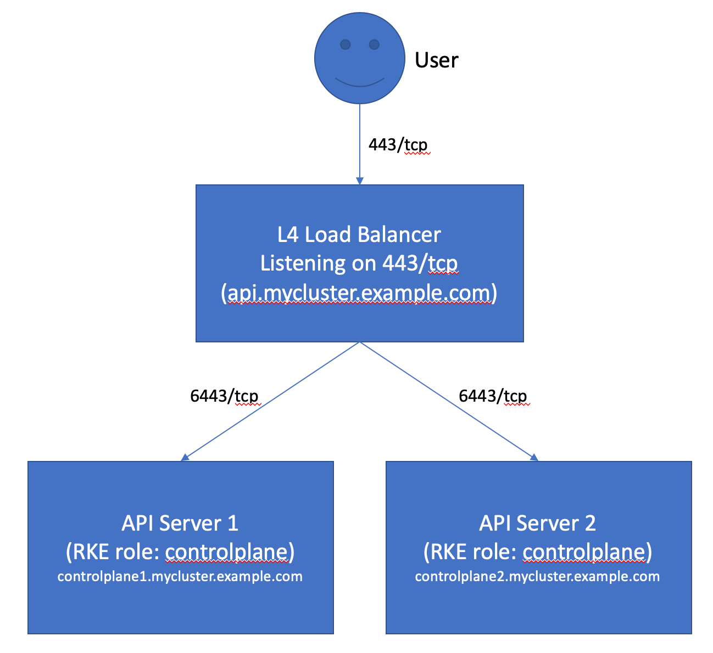

Resmi [kubernetes](https://kubernetes.io/docs/concepts/configuration/organize-cluster-access-kubeconfig/) sayfasında geçen kubeconfig dosyalarını oluşturacağız.

[kubectl cheatsheet](https://kubernetes.io/docs/reference/kubectl/cheatsheet/)

Config doyalarımızı oluşturduktan sonra içeriklerine baktğımızda 3 an bölüm göreceğiz.

1. Cluster: APi serverların IP'leri, sertifikları
2. Users: kullanıcı ile ilgili bilgiler. 
3. Context: kullanıcı ile cluster bilgisinin referansları yer alır. özellikle birde fazla cluster yönetildiğinide burası daha anlamlı olcaktır.

bu arada kubeconfig dosya adı değildir. Genel bir isimlendirmedir. bu dosyalar aslında üstte bahsetiğimiz gibi cluster'lar, kullanıcılar, namespace'lar ve kimlik doğrulama (autehntication) mekanizması hakkında bilgileri barındırır. Bu sayede cubectl aracı bu dosyaları kullanarak bağlanacağı cluster hakknda bilgileri alır ve yine doysdaki bilgilerle ilgili cluster'a bağlanır.  

- [Birden fazla cluster a bağlannmak için](https://kubernetes.io/docs/tasks/access-application-cluster/configure-access-multiple-clusters/)

Toplamda 5 adet kube config doyası oluşturuyor olacağız.

1. kubelet kubeconfig : proxy/nginxlb gerekli
2. kube proxy kubeconfig : proxy/nginxlb gerekli
3. contoller manager kubeconfig
4. kube scheduler kubeconfig
5. admin user kubeconfig

Bu konfigürasyon dosyalarını oluştururken bazı dosylarda proxy/nginxlb ip sini configürasyon dosyasına yazıyor olcağız. Son tahlilde admin olarka hiçbir component'e aslında direk bağlanmıyor olacağız. Aslında her zaman proxy bağlanıyor olacak. Ancak burada şuna da dikkat etmek lazım, örneklerde cloud kullanıldığı için ve oralarda controller için ip bağlandığı için aslında api server ın örneğin bir dış ip si direk oluyor. //TODO Api Server'da o da kubelet lere bağlandığı için kubelet için de kubeconfig dosyasına bu ip adresi de ekleniyor. belki bizde gerek yok gibi ama biz de standart a uyacağız.

Bazı component lere zaten admin hiç bağlanmıyor olacak belki sadece birbirlerine bağlanıyor olacak.




__1. Kubelet Kubernetes Configuration File__


sertifikalarıızmolduğu klasörde iken  alttaki satırları 3 worker node için de çalıştırıyoruz. 


burada oluşturacağımız bütün dosyaları files klasörü altındaki kubeconfigs klasörüne koyalıyor olacağım.

--server=165.227.247.99  (proxy/nginxlb) publis static ip  adresi de varilebilirdi. Ancak proxy sunucusunun sertifikasına ilk domain olarak nginxlb.muratcabuk.com yazmıştık bu nedenle ben de bu ismi kullanıyor olacağım. tabiiki eğer bu yolu tercih ediyorsanız hosts doyanıza ilgili domaini eklemelisiniz.

certificate-authority için ca.pem dosyasını kullandığımıza dikkat edin. çünki bütün sertifikalarımızın onaylayıcısı aynı authority idi.


__worker1 için__

```
kubectl config set-cluster kubernetes-the-hard-way --certificate-authority=ca.pem  --embed-certs=true --server=https://nginxlb.muratcabuk.com:6443 --kubeconfig=worker1.kubeconfig

  kubectl config set-credentials system:node:worker1 --client-certificate=worker1.pem --client-key=worker1-key.pem --embed-certs=true --kubeconfig=worker1.kubeconfig

  kubectl config set-context default --cluster=kubernetes-the-hard-way --user=system:node:worker1 --kubeconfig=worker1.kubeconfig

  kubectl config use-context default --kubeconfig=worker1.kubeconfig

```

__worker2 için__

```
kubectl config set-cluster kubernetes-the-hard-way --certificate-authority=ca.pem  --embed-certs=true --server=https://nginxlb.muratcabuk.com:6443 --kubeconfig=worker2.kubeconfig

  kubectl config set-credentials system:node:worker2 --client-certificate=worker2.pem --client-key=worker2-key.pem --embed-certs=true --kubeconfig=worker2.kubeconfig

  kubectl config set-context default --cluster=kubernetes-the-hard-way --user=system:node:worker2 --kubeconfig=worker2.kubeconfig

  kubectl config use-context default --kubeconfig=worker2.kubeconfig

```


__worker3 için__

```
kubectl config set-cluster kubernetes-the-hard-way --certificate-authority=ca.pem  --embed-certs=true --server=https://nginxlb.muratcabuk.com:6443 --kubeconfig=worker3.kubeconfig

kubectl config set-credentials system:node:worker3 --client-certificate=worker3.pem --client-key=worker3-key.pem --embed-certs=true --kubeconfig=worker3.kubeconfig

kubectl config set-context default --cluster=kubernetes-the-hard-way --user=system:node:worker3 --kubeconfig=worker3.kubeconfig

kubectl config use-context default --kubeconfig=worker3.kubeconfig

```

kodları çalıştırdığımız certificate_files klasörümüzde 3 adet dosya oluşmuş olacak. dosyları kubeconfigs klasörüne taşıyoruz.

1. worker1.kubeconfig
2. worker2.kubeconfig
3. worker3.kubeconfig


oluşan dosyalardan birini inceleyecek olursak yukarıda bahsetiğimiz 3 bölümün oluştuğunu görebiliriz.

- cluster
- context
- user

```

apiVersion: v1
clusters:
- cluster:
    certificate-authority-data: [sertifika otorite bilgisi gelmiş olacak]
    server: https://nginxlb.muratcabuk.com:6443
  name: kubernetes-the-hard-way
contexts:
- context:
    cluster: kubernetes-the-hard-way
    user: system:node:worker1
  name: default
current-context: default
kind: Config
preferences: {}
users:
- name: system:node:worker1
  user:
    client-certificate-data: [sertifika datası gelmiş olacak]
    client-key-data: [key data sı gelmiş olacak]
```

__2. kube-proxy Kubernetes Configuration File__


```
kubectl config set-cluster kubernetes-the-hard-way --certificate-authority=ca.pem  --embed-certs=true --server=https://nginxlb.muratcabuk.com:6443 --kubeconfig=kube-proxy.kubeconfig

kubectl config set-credentials system:kube-proxy --client-certificate=kube-proxy.pem --client-key=kube-proxy-key.pem --embed-certs=true --kubeconfig=kube-proxy.kubeconfig

kubectl config set-context default --cluster=kubernetes-the-hard-way  --user=system:kube-proxy --kubeconfig=kube-proxy.kubeconfig

kubectl config use-context default --kubeconfig=kube-proxy.kubeconfig
```

sonuçta bir dosya oluşmuş olacak : kube-proxy.kubeconfig dosyasını da kubeconfigs klasörüne taşıyoruz.

__3. kube-controller-manager Kubernetes Configuration File__


```

kubectl config set-cluster kubernetes-the-hard-way --certificate-authority=ca.pem  --embed-certs=true --server=https://127.0.0.1:6443 --kubeconfig=kube-controller-manager.kubeconfig

kubectl config set-credentials system:kube-controller-manager  --client-certificate=kube-controller-manager.pem  --client-key=kube-controller-manager-key.pem --embed-certs=true  --kubeconfig=kube-controller-manager.kubeconfig

kubectl config set-context default --cluster=kubernetes-the-hard-way  --user=system:kube-controller-manager --kubeconfig=kube-controller-manager.kubeconfig

kubectl config use-context default --kubeconfig=kube-controller-manager.kubeconfig

```

sonuçta bir dosya oluşmuş olacak : kube-controller-manager.kubeconfig dosyasını da kubeconfigs klasörüne taşıyoruz.


__4. kube-scheduler Kubernetes Configuration File__

```
kubectl config set-cluster kubernetes-the-hard-way --certificate-authority=ca.pem --embed-certs=true --server=https://127.0.0.1:6443 --kubeconfig=kube-scheduler.kubeconfig

kubectl config set-credentials system:kube-scheduler --client-certificate=kube-scheduler.pem --client-key=kube-scheduler-key.pem --embed-certs=true --kubeconfig=kube-scheduler.kubeconfig

kubectl config set-context default --cluster=kubernetes-the-hard-way --user=system:kube-scheduler --kubeconfig=kube-scheduler.kubeconfig

kubectl config use-context default --kubeconfig=kube-scheduler.kubeconfig

```


sonuçta bir dosya oluşmuş olacak : kube-scheduler.kubeconfig dosyasını da kubeconfigs klasörüne taşıyoruz.

__5. admin Kubernetes Configuration File__

```
kubectl config set-cluster kubernetes-the-hard-way --certificate-authority=ca.pem --embed-certs=true --server=https://127.0.0.1:6443 --kubeconfig=admin.kubeconfig

kubectl config set-credentials admin --client-certificate=admin.pem --client-key=admin-key.pem --embed-certs=true --kubeconfig=admin.kubeconfig

kubectl config set-context default --cluster=kubernetes-the-hard-way --user=admin --kubeconfig=admin.kubeconfig

kubectl config use-context default --kubeconfig=admin.kubeconfig

```

Sonuçta bir dosya oluşmuş olacak : admin.kubeconfig dosyasını da kubeconfigs klasörüne taşıyoruz.

Son olarak oluşturduğumuz bütün bu kubeconfig doaylarını barındıran kubeconfigs klasörünü sunucularda oluşturduğumuz home altındaki kubernetes klasörüne kopyalıyoruz.

