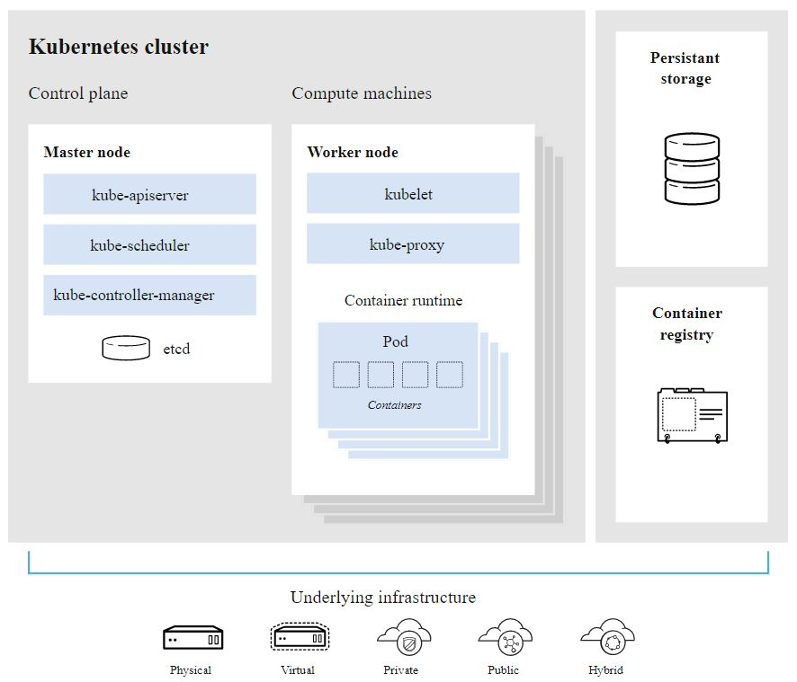

Bu adımdan itibaren artık Kubernetes kurumuna da başlıyor olacağız. Amacımız sadece kurulum yapmak tabii ki ancak, kurulumunu yaptığımız Kubernetes bileşeni hakkında ufak tefek bilgiler vermenin konunun daha kalıcı olacağı kanısındayım. Ayrıca neyi ne için yaptığımızın anlaşılmasına da yardımıcı olacağını düşünüyorum.

Konuya ufak bir giriş yaptıktan sonra Control Plane kurulumununa aşağıda devam ediyor olacağız. Plane kavramı tam olarak panel anlamına gelirmi tartışılır ancak geniş geniş anlatmaya ve akılda tutmaya çalışmkatasa penel demek mantıklı geldi.

Resmi dökümanlardaki kitabi tanımına bakacak olursak. Kontrol Panel (Control Plane), sistemdeki tüm [Kubernetes nesnelerinin](https://kubernetes.io/docs/concepts/overview/components/) kaydını tutar ve bu nesnelerin durumunu yönetmek için sürekli kontrol döngüleri çalıştırır. Herhangi bir zamanda, Kontrol Paneli'nin kontrol döngüleri kümedeki değişikliklere yanıt verir ve sistemdeki tüm nesnelerin gerçek durumunu verdiğiniz istenen durumla eşleştirmek için çalışır.


- [Control Plane](https://kubernetes.io/docs/concepts/#kubernetes-control-plane)
- [Control Plane Communication](https://kubernetes.io/docs/concepts/architecture/control-plane-node-communication/)


 [kaynak](https://kubernetes.io/docs/concepts/overview/components/)


__Kubernetes Nesneleri (Objects)__
- Pods
- Namespaces
- ReplicationController (Manages Pods)
- DeploymentController (Manages Pods)
- StatefulSets
- DaemonSets
- Services
- ConfigMaps
- Volumes

Konumuz olmadığı için nesnelerin yönetimi ile ilgili başlıklara değinmiyoruz ancak merak edenler için aşağıda resmi Kubernetes sayfasından bazı linkleri paylaşıyorum. 

- [Declarative Konfigürasyon dosyaları ile yönetmek](https://kubernetes.io/docs/tasks/manage-kubernetes-objects/declarative-config/)
- [Kustomize ile Yönetmek](https://kubernetes.io/docs/tasks/manage-kubernetes-objects/kustomization/)
- [Imperative Komutlarla Yönetmek](https://kubernetes.io/docs/tasks/manage-kubernetes-objects/imperative-command/)
- [Imprerative Konfigürasyon Dosyaları ile Yöntemek](https://kubernetes.io/docs/tasks/manage-kubernetes-objects/imperative-config/)


__Kubernetes Resources__

Resource kelimesinin genelde bilinen anlamı kaynaktır. Ancak diğer anlamlarına bakacak olursak uğraş, beceri, vasıta vb anlamlara da gelmektedir. Zannediyorum burada Kubernetes yazılımcıları bu ikincil anlmaları da kapsayacak şekilde kullanmak istemişler resource kelimesini. Resource, objects ifadesini de kapsaycak şekilde tanımlanmıştır ancak daha fazlasını da içerir. Bunu iyi bilmek lazım çünki Kubernetes API referanslarını ve versiyonlarını daha iyi kavramanıza yardımcı olacaktır. 

Şu komutla resource'ların listesini alabiliriz.

```
kubectl api-resources -o wide 
```

Bazı Resource tiplerine bakacak olursak.

- DaemonSet
- Deployment
- ReplicaSet
- StatefulSet
- Job
- CronJob
- Pod
- Node
- ReplicationController
- Secret
- Event
- Ingress
- Role
- Ingress
- RoleBinding
- SelfSubjectAccessReview
- PersistentVolume
- vb

Peki object ile resource arasındaki fark nedir? aslında resource'ların da olmasının temel amacı temelde object oluşturmaktır. Temelde üzerinde değişiklik yaptığımız, nasıl çalışacağına, ne kadar olacağına vb karar verdiğimiz aktif olarak ortaya içerik koyanlar object'ler yani nesnelerdir. Bir dğer ayrımı da şu şeki,lde yapabiliriz , örneğin pod'un zaten kendisi tek başına bir üründür ve pod (extreme örnekleri varsaymazsak) bir başka ürün ortaya çıkartmak için oluşturulmazlar.

Daha önce okumuş olduğum kaynaklardan aklımda kalan bir örnekle açıklamaya çalışacağım. Örneğin bir restoranda tek başına et bir ürün olabiir. Yani et istiyorum derseniz belki garson et yemeği de getirebilir. Ancak menüye baktığınızda sadece et yazan bir yemek göremezsiniz. Sizin önünüze eninde sonunda bir et yemeği gelir fakat menude ana konusu et olan farklı yapılış şekilleriyle, bahratlarıyla ve farklı isimlerle bir çok et yemeği vardır. 

Bu örnekte et kavramını pod, örneğin et kavurma, et şiş, et haşlama gibi etin farklı yapılışlarını da resource' a benzetebiliriz.

StatefulSet veya ReplicaSet de bize eninde sonunda pod(lar) oluşturur ancak ortaya çıkan pod'ların oluştulma süreci ve davranışları farklı farklı olacaktır. Ve buradanda anlaşılağı üzere biz ReplicaSet olşuştururuz (create) ancak asıl amacımız aslında pod oluşturmaktır.

Konumuz kurulum olduğu için konuyu burada noktalıyoruz. Ancak şunu da belirtmek gerekiyor ki Kuberntes'i kullanmayı da öğrenmenin yolu bu kavramların altını pratikte de doldurmakdan geçiyor.

__Kontrol Panel Bileşenleri (Control Plane Components)__
- kube-api server
- etcd
- kube-scheduler
- kube-controller-manager
- cloud-controller-manager

__Worker Node Components__
- kubelet
- kube-proxy
- Container Runtime

__Birde sistemde olması gereken temel bazı Addon'lar var__ 
- DNS
- Web UI (Dashboard)
- Cluster-level Logging



[kaynak](https://www.redhat.com/en/topics/containers/kubernetes-architecture)

#### Kubernetes Control Plane

İlk makalede belirttiğimiz üzere Kubernetes Komponentlerinin 1.18 veriyonunu yüklüyor olacağız.

Aksi belirtilmedikçe aşağıdaki komutlar ve dolayısıyle kurulumlar bütün Master (controller) node'larda yapılcaktır. Bu nedenle Linux için tmux, Windows için Cmder kullanmanızı tavsiye ederim.

öncelikle Kubernetes konfigürasyon klasörünü oluşturuyoruz.

```
$ sudo mkdir -p /etc/kubernetes/config
```

Daha sonra gerekli binary'leri download ediyoruz.

```
wget -q --show-progress --https-only --timestamping \
  "https://storage.googleapis.com/kubernetes-release/release/v1.18.0/bin/linux/amd64/kube-apiserver" \
  "https://storage.googleapis.com/kubernetes-release/release/v1.18.0/bin/linux/amd64/kube-controller-manager" \
  "https://storage.googleapis.com/kubernetes-release/release/v1.18.0/bin/linux/amd64/kube-scheduler" \
  "https://storage.googleapis.com/kubernetes-release/release/v1.18.0/bin/linux/amd64/kubectl"
```
[Kaynak](https://kubernetes.io/docs/setup/release/#server-binaries)

daha sonra kurulumu yapıyoruz

```
$ chmod +x kube-apiserver kube-controller-manager kube-scheduler kubectl
$ sudo cp kube-apiserver kube-controller-manager kube-scheduler kubectl /usr/local/bin/
```

 [kaynak](https://kubernetes.io/docs/concepts/overview/components/)

 Daha sonra aşağıdaki komponenetlerin kongigrasyonunu yapıyoruz

 - Kubernetes API Server
 - Controller Manager
 - Kubernetes Scheduler


__Kubernetes API Server Konfigürasyonu__

```
$ sudo mkdir -p /var/lib/kubernetes/

$ sudo cp /home/kubernetes/certificate_files/ca.pem /home/kubernetes/certificate_files/ca-key.pem /home/kubernetes/certificate_files/kubernetes-key.pem \
    /home/kubernetes/certificate_files/kubernetes.pem \
    /home/kubernetes/certificate_files/service-account-key.pem /home/kubernetes/certificate_files/service-account.pem \
    /home/kubernetes/yaml/encryption-config.yaml /var/lib/kubernetes/
 ```


öncelikle alttaki doyayayı ilgili yere kopyalıyoruz


```shell
$ sudo cp /home/kubernetes/yml/encryption-config.yaml  /var/lib/kubernetes/encryption-config.yaml
```


Daha sonra bilgisayarımızda herbir master için bir kube-apiserver.service dosyası oluşturarak alttaki metni içine kopyalıyoruz. Alttaki örnek master1 node'u içindir diğerleri içinde gerekli olan değişikliklşeri yapıp sunucudaki service_files klasörüne kopyalayabilirsiniz.

- 10.240.0.2 master1
- 10.240.0.3 master2
- 10.240.0.4 master3


service içeriği

```yml
[Unit]
Description=Kubernetes API Server
Documentation=https://github.com/kubernetes/kubernetes

[Service]
ExecStart=/usr/local/bin/kube-apiserver \
  --advertise-address=10.240.0.2 \
  --allow-privileged=true \
  --apiserver-count=3 \
  --audit-log-maxage=30 \
  --audit-log-maxbackup=3 \
  --audit-log-maxsize=100 \
  --audit-log-path=/var/log/audit.log \
  --authorization-mode=Node,RBAC \
  --bind-address=0.0.0.0 \
  --client-ca-file=/var/lib/kubernetes/ca.pem \
  --enable-admission-plugins=NamespaceLifecycle,NodeRestriction,LimitRanger,ServiceAccount,DefaultStorageClass,ResourceQuota \
  --etcd-cafile=/var/lib/kubernetes/ca.pem \
  --etcd-certfile=/var/lib/kubernetes/kubernetes.pem \
  --etcd-keyfile=/var/lib/kubernetes/kubernetes-key.pem \
  --etcd-servers=https://10.240.0.2:2379,https://10.240.0.3:2379,https://10.240.0.4:2379 \
  --event-ttl=1h \
  --encryption-provider-config=/var/lib/kubernetes/encryption-config.yaml \
  --kubelet-certificate-authority=/var/lib/kubernetes/ca.pem \
  --kubelet-client-certificate=/var/lib/kubernetes/kubernetes.pem \
  --kubelet-client-key=/var/lib/kubernetes/kubernetes-key.pem \
  --kubelet-https=true \
  --runtime-config=api/all \
  --service-account-key-file=/var/lib/kubernetes/service-account.pem \
  --service-cluster-ip-range=10.32.0.0/24 \
  --service-node-port-range=30000-32767 \
  --tls-cert-file=/var/lib/kubernetes/kubernetes.pem \
  --tls-private-key-file=/var/lib/kubernetes/kubernetes-key.pem \
  --v=2
Restart=on-failure
RestartSec=5

[Install]
WantedBy=multi-user.target
```

Servis konfigürasyon dosyasında 4 yere dikkanizi çekmek istiyorum.

1. konfigürasyon dosyasında ki --enable-admission-plugins kısmında açılış için gerekli olan plugin'ler aktif ediliyor ancak dah bir çok plugin var. konuyla ilgili daha detaylı bilgi almak için [resmi Kubernetes dökümanlarını](https://kubernetes.io/docs/reference/access-authn-authz/admission-controllers/) okumanızı tavsiye ederim.

Ayrıca api referansını okumak isteseniz [buraya](https://kubernetes.io/docs/reference/command-line-tools-reference/kube-apiserver/#options
) bakabilirsiniz.


2. Diğer parametre de service-cluster-ip-range=10.32.0.0/24 bölümü olmalıdır. Hatırlarsanız Bu bloğun servislerin kullanımı için gerekli olduğundan bahsetmiştik.

3. daha önce oluşturmuş oluğumuz encryption-config.yaml dosyasının burada kulanılıyor olması. Zannediyoru daha önce bu dosyayı şu adrese (/var/lib/kubernetes/encryption-config.yaml) kopyalamamıştık. Öncelikle onu kopyaladıkrtan sonra her master (controller) için aşağıdaki dosyayı hazırlayalım. 

4. Son olarak --authorization-mode=Node,RBAC parametresi de Kubernetes'in authorizaiton seçeneklerinden birinin (RBAC, Role Based Access Control) kullanılcağını belirtiyor.

- [Resmi Kubernetes sayfası için tıklayınız](https://kubernetes.io/docs/reference/access-authn-authz/authorization/)
- [RBAC için tıklayınız](https://kubernetes.io/docs/reference/access-authn-authz/rbac/)


Bu servisi şuan başlatmıyoruz. Diğer konfigürasyonlar bittikten sonra başlatacağız.

Eğer dosyayı Windows'da oluşturduysanız, dosyayı Linux'e taşıdıktan sonra dos2unix komutu ile  "end of line sequence" hatasını engellemeyi unutmayın.


daha sonra service dosyamızı ilgili yere kopyalıyoruz.

```
$ sudo cp /home/kubernetes/service_files/kube-apiserver.service   /etc/systemd/system/kube-apiserver.service
```


__Controller Manager Konfigürasyonu__

Öncelikle kubeconfig dosyamızı kopyalıyoruz.

```
sudo cp /home/kubernetes/kubeconfigs/kube-controller-manager.kubeconfig /var/lib/kubernetes/
```
daha sonra local bilgisayarımızda kube-controller-manager.service dosyasını oluşturuyoruz. Bu dosya bütün master (controller) node'larda aynı olacak. Ben yine files klasörü altındaki service_files klasörüne bu doyayı oluşturuyorum.


[Kube Controller Manager Referansları için tıklayınız.](https://kubernetes.io/docs/reference/command-line-tools-reference/kube-controller-manager/)


dosyada en altta yer alan --v parametresi log levelını göstermektedir. 

```
[Unit]
Description=Kubernetes Controller Manager
Documentation=https://github.com/kubernetes/kubernetes

[Service]
ExecStart=/usr/local/bin/kube-controller-manager \
  --address=0.0.0.0 \
  --cluster-cidr=10.200.0.0/16 \
  --cluster-name=kubernetes \
  --cluster-signing-cert-file=/var/lib/kubernetes/ca.pem \
  --cluster-signing-key-file=/var/lib/kubernetes/ca-key.pem \
  --kubeconfig=/var/lib/kubernetes/kube-controller-manager.kubeconfig \
  --leader-elect=true \
  --root-ca-file=/var/lib/kubernetes/ca.pem \\
  --service-account-private-key-file=/var/lib/kubernetes/service-account-key.pem \
  --service-cluster-ip-range=10.32.0.0/24 \
  --use-service-account-credentials=true \
  --v=2
Restart=on-failure
RestartSec=5

[Install]
WantedBy=multi-user.target
```

Daha sonra service_files klasörümü tekrar sunuya kopyalıyorum. Kopyalama işimi bütün servisleri tamamladıktan sonra da yapabilrsiniz.

Bu dosya için de Linux'de dos2unix komutu çalıştırmayı unutmayınız.

daha sonra service dosyamızı ilgili yere kopyalıyoruz.

```
$ sudo cp /home/kubernetes/service_files/kube-controller-manager.service   /etc/systemd/system/kube-controller-manager.service
```


__Kubernetes Scheduler Konfigürasyonu__


Öncelikle kubeconfig dosyamızı kopyalıyoruz.

Bütün master (controller) sunucularda  alttaki komutu çalıştırıyoruz.

```
$ sudo cp  /home/kubernetes/kubeconfigs/kube-scheduler.kubeconfig /var/lib/kubernetes/
```
Daha sonra kube schedular servisinin konfigürasyon doyasını (kube-scheduler.yaml) oluşturuyoruz. Dosyayı Files altındaki yml klasörüne oluştuyor olacağım.
bütün master (controller) node'larda aynı dosyaı kullanacağız.

Normalde internetteki kaynaklarda (Kelsey Hightower' da dahil), apiVersion parametesini "apiVersion: kubescheduler.config.k8s.io/v1alpha1" olarak kullanıyor. Ancak Kelsey Kubernetes 1.15  versiyonunu kaullanıyor biz ize 1.18 versiyonunu kullanıyoruz. Kubernetes 1.18 versiyon release notlarını okuduğmuzda v1alpha2 versiyonunun kullanılabileceğini görebiliriz. Bu nedenle biz de alpha2 olarak kullanıyoruz.


- [alpha2 nin kullanılabilceğine dair github pull request](https://github.com/kubernetes/kubernetes/pull/87628)
- [1.18 release notlarında alpha2](https://kubernetes.io/docs/setup/release/notes/#kube-scheduler-1)

Alpha3 de 2020 yılı içinde yayınlandı. yeni özellikler için [buraya](https://kubernetes.io/blog/2020/04/21/cluster-api-v1alpha3-delivers-new-features-and-an-improved-user-experience/) bakabilirsiniz.


```
apiVersion: kubescheduler.config.k8s.io/v1alpha2
kind: KubeSchedulerConfiguration
clientConnection:
  kubeconfig: "/var/lib/kubernetes/kube-scheduler.kubeconfig"
leaderElection:
  leaderElect: true
```
daha sonra sunucuya taşıdımız dosyayı /etc/kubernetes/config/kube-scheduler.yaml adersine kopyalıyoruz.


```
$ sudo cp /home/kubernetes/yml/kube-scheduler.yaml /etc/kubernetes/config/kube-scheduler.yaml
```


Daha sonra kendi bilgisayarımızda service dosyamızı oluşturuyoruz. kube-scheduler.service dosyasını files altındaki service_files klasörü altına oluşturup bütün master (controller) node'lara taşıyorum.

```
[Unit]
Description=Kubernetes Scheduler
Documentation=https://github.com/kubernetes/kubernetes

[Service]
ExecStart=/usr/local/bin/kube-scheduler \
  --config=/etc/kubernetes/config/kube-scheduler.yaml \
  --v=2
Restart=on-failure
RestartSec=5

[Install]
WantedBy=multi-user.target

```
servis doaysını daha sonra sunucularda /etc/systemd/system/kube-scheduler.service path'ine kopyalıyoruz. Hatırlatma yapmakta fayda görüyorum dos2Unix komutu Linux'de çalıştırmayı unutmayın.

```
$ sudo cp /home/kubernetes/service_files/kube-scheduler.service   /etc/systemd/system/kube-scheduler.service
```

ve son olarak servislerimi çalıştırıp test lerimizi yapıyoruz.

```
$ sudo systemctl daemon-reload
$ sudo systemctl enable kube-apiserver kube-controller-manager kube-scheduler
$ sudo systemctl start kube-apiserver kube-controller-manager kube-scheduler
```


normalde Kelsey ve diğer birçok örnek Google Load Balancer kullandığı için o örneklerdeki testi yapamıyor olacağız ancak tek tek bütün master (contoller) node'ları test etme şansımız var. 
İleride nginxlb sunucumu ayağa kaldırdığımızda bu testi de yapıyor olacağız.

alttaki komutu çalıştırdığımızda şu ana kadar çalışan servislerimiz durumlarını öğrenebiliriz. admin.kubeconfig dosyanız master (controller) sunucularda neredeyse oradan çağırmalısın. 

```
$ kubectl get componentstatuses --kubeconfig admin.kubeconfig

# yada sadece kubectl get componentstatuses

# SONUÇ : etcd yerine master da yazabilir

NAME                 STATUS    MESSAGE              ERROR
controller-manager   Healthy   ok
scheduler            Healthy   ok
etcd-2               Healthy   {"health": "true"}
etcd-0               Healthy   {"health": "true"}
etcd-1               Healthy   {"health": "true"}

```

__TROUBLESHOOTING__

Eğer test komutunu çalıştırdığınızda hata alırsanız.

1. Bütün servislerin tüm master sunucularda çalıştığından emin olun. Buraya kadar geldiyseniz zaten etcd nin çalıştığını varsayıyorum

```
$ sudo systemctl status kube-apiserver
$ sudo systemctl status kube-controller-manager
$ sudo systemctl status kube-scheduler
```

2. çalışmayan yada durmuş servis varsa tekrar çalıştırmayı deneyin.
3. yine çlışmazsa service dosyanızdan servisi çalıştırma scriptini alıp manuel olarka terminalden çalıştırmayı deneyin. hatayı ekranınızda görmüş olacaksınız.

Büyük ihtimalle, ya service dosyanıdaki parametrelerde hata vardır, ya sertifikaları unutmusşunuzdur, yada yml dosyalarından birini ilgili lokasyona kopyalamamışsınız.

Ayrıca şu sayfaları ziyaret ediniz
- https://kubernetes.io/docs/tasks/debug-application-cluster/debug-cluster/
- https://talkcloudlytome.com/troubleshooting-kubernetes-master-nodes/
