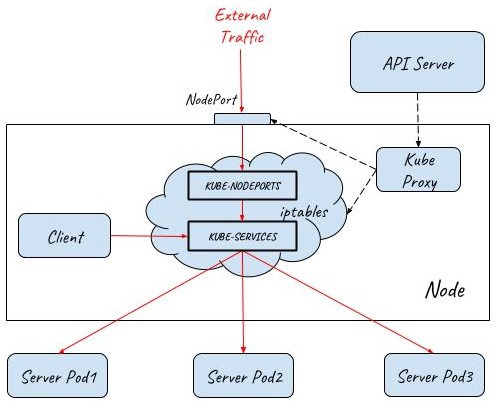
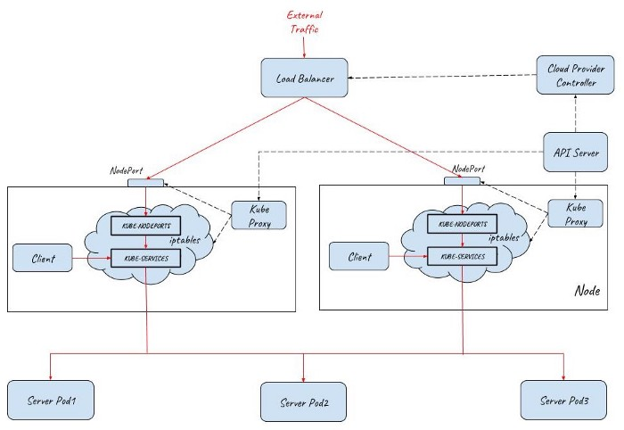
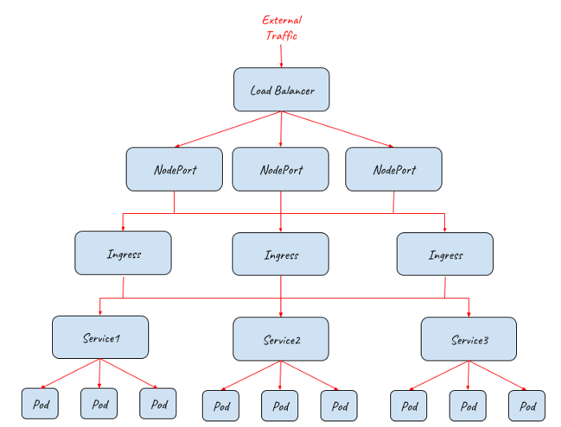
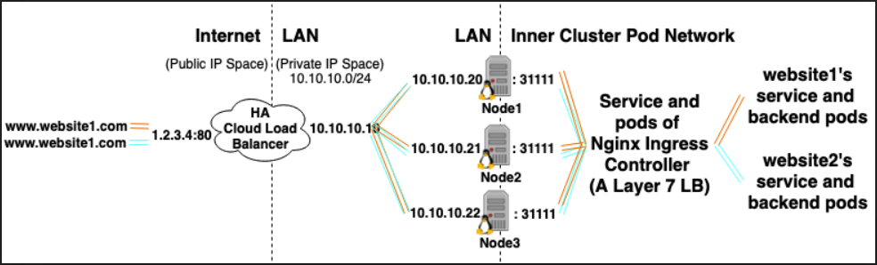
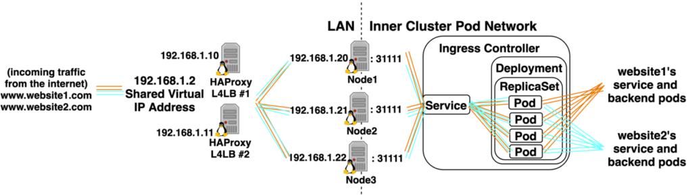
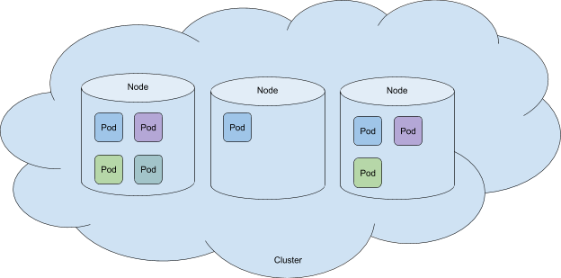
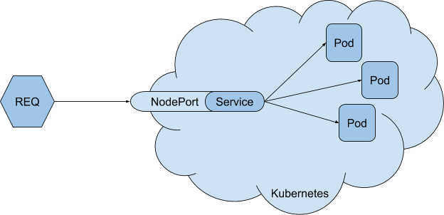
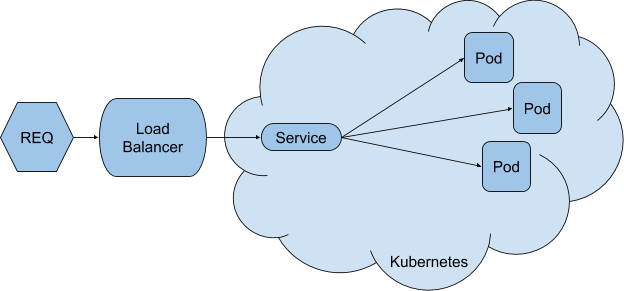

Bu konuta metallb (load balancer) vs nginx ingress (ingress) olarak da bakabiliriz

basitçe metallb gelen isteğin hangi node a olduğunu söyler, niginx ingress (service mesh istio da) ise o node da hangi servisse gidileceğini bilir. Ancak biz dış bir load balancer ile herhngi bir node agetirebilirsek istteği nginx ingress yada istio içeride doğru servise de gidebilir. 

Mevzu aslında çok basit eğer service yayınlam şeklini loadbalancer olarak yayınlayacak olursak metallb gibi servise ip verebilcek bir mekanizmaya ihtyacımız var. Bu cloud load balancerlarda yapabiliyor hazliyle pluginleri var. Eğer bu yoksa clusterip tanımlaryıp bunu external load balncer ile kunnabiliriz. her node a bu servissin iç ipsini ve domain nameini yazıp external lb den node lara yönlendirme yapabiliriz. yada NodePor kulnmarak expernal ip den node lara yönlendirme yapar aynı clusterip de yaptığımız gibi hosts doyalarına yazarak çağırabiliriz.

yada ingress kurarız ve node lara isteği göndeririz ingress de içeride podlara yönlşendirme yapabilir. ancak şunu bilmemiz gerekiyorki ingress de tek başına dışarı açılamaz çünki aslında o da bir pod dur bu durumda noıdeport ile dışarı açılması gerkir.

bu durumda en iyi çözüm metallb ile birlikte ingress kullanmaktır.

[Bu limnke kesin bakılmalı](https://medium.com/@zhaohuabing/which-one-is-the-right-choice-for-the-ingress-gateway-of-your-service-mesh-21a280d4a29c#:~:text=The%20operations%20of%20the%20service,policy%20checking%20and%20metrics%20collections.)

Metallb divides the traffic between the physical nodes, Ingress finds the appropriate service, and NodePort find the pod in the cluster. They are all necessary for best practices. If you are on cloud providers go for a LB launched there.

You will need both, as they solve separate problems:

- __MetalLB__ receives requests from the outside of the cluster, and balances them across the load balancer(s) in the cluster

- __Nginx__ receives requests from outside the cluster and balances them across the nodes.

See https://kubernetes.github.io/ingress-nginx/deploy/baremetal/#a-pure-software-solution-metallb for details.

__Without MetalLB, nginx ingress service in bare metal stays in pending state because it has no IP assigned to it. MetalLB does the job of assigning nginx an external IP.__

__Without Nginx, you will have to perform TLS termination on every client, something that is generally not advisable.__

Another way of looking at it:

- nginx ingress handles the type Ingress
- metallb handles the type LoadBalancer

The confusion likely stems from the fact while the operations above are fundamentally different, they are often done by a "load balancer".

Note that the same applies in the cloud: you need to deploy an ingress to handle TLS termination and others, and the provider automatically creates a load balancer on their infrastructure.

resimde cloud daki load balancer gösterilmiş. düşünüki cload da değiliz ve dışarıdan bir domain gelsiğinde onu içeriye alacak bir LB a ihtiyacımız olsun işte bunu sağlayan Martallb load balancer.

dışarıda kurmuş olduğumuz laoad balancer herhangi bir node a trafiği ulaştırdığı an ingress doğru servis ibulacaktır.

### Service Mesh Nedir

https://www.digitalocean.com/community/tutorials/an-introduction-to-service-meshes

- __float ip vs virtual ip__

Virtual IP (or VIP) normally is used as a term to express the fact, that an IP does not belong to one specific physical interface. In that sense the VIP is independent of a physical interface (in Physics particles which lack a physical representation are called virtual. Looks like IPs without a physical interface are terefor called virtual, too). Hence, a non-virtual IP is meant to go up and down with it's interface and belong only one single interface, while a VIP can break out of this in several ways (it even is possible to exist on more than one interface at the same time, very like virtual particles can exist inside and outside of a black hole at the same time - see https://en.wikipedia.org/wiki/Hawking_radiation).

Floating IP (or FIP) seems to be the term coined by some failover/virtual hosting solutions to name the public reachable outside IP address (some even reserve the term FIP to IPs from the public IP area).

So following is true:

- a FIP normally is a VIP, too, but there are exceptions
- a VIP can be a FIP when used in certain setups
- a FIP usually means much more than just a special form of VIP

[kaynak 1](https://serverfault.com/questions/536360/what-are-the-differences-between-floating-ips-and-virtual-ips/747922#:~:text=A%20floating%20IP%20address%20is,address%20at%20any%20given%20time.&text=A%20virtual%20IP%20address%20refers,is%20a%20more%20nebulous%20term.) - [kaynak 2](https://www.fourkitchens.com/development/benefits-floating-virtual-ip/) - [kaynak 3](https://support.huaweicloud.com/intl/en-us/eip_faq/faq_eip_0013.html)

### Resorces

- https://www.haproxy.com/blog/dissecting-the-haproxy-kubernetes-ingress-controller/
- https://kubernetes.github.io/ingress-nginx/deploy/baremetal/#a-pure-software-solution-metallb
- https://oteemo.com/2019/09/19/kubernetes-networking-and-services-101/
- https://oteemo.com/2020/01/16/ingress-102-kubernetes-ingress-implementation-options/
- https://oteemo.com/2019/10/28/ingress-101-what-is-kubernetes-ingress-why-does-it-exist/
- https://particule.io/en/blog/k8s-no-cloud/
