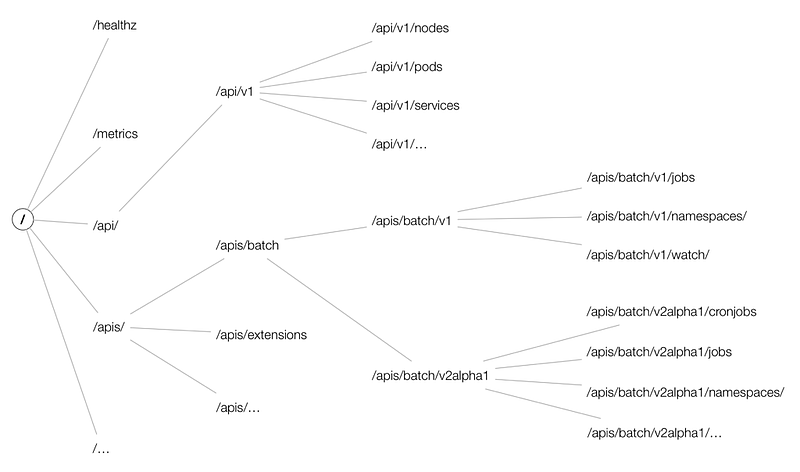

### API Versiyonlama

Kubernetes ileriye dönük güncelleme ve API extend edilme yeteneklerini geliştirebilmek için biraz karmaşık bir API versiyonla sistemi kullanır.  

API sistemi api leri versiyomlama iki sistem kullanır




1. /ap/v1
2. /apis/api-group/v1/resource (örneğin "/apis/batch/v1beta1/jobs" v1beta1 kısmı ileride anlatılacak)


__Api Group:__ mantıksal olarak gruplanabilen bir grup türü (kind) ifade eder pod ve namespace de bir türdür ancak bunlar api group da değelendirilmez o yüzden api de /api/v1/pods gibi çağrılabilirler. çünki bu tip kind lar(türler) kubernetes için elle tutulur (persistant) nesnelerdir ve birden fala kaynağı barındırabilirler.
Ancak bazı türler nesnel olarak yer tutmazlar belirli bir işi yapmk için bulunan objelerdir, mesela batch api grubu içinde yer alan jobs, SheduledJobs gibi. yada RespicaSet, Deployment, StatfulSet resource ları da apps grubu içinde yar alılar.

__Version:__ APi grupları birden fazlza version asahip olabilir.

- Alpha: ne olacağı belli değil ileride kaldırabilir
- Beta: testlerden geçmiş release de önceki sürüm

şu [linkten](https://kubernetes.io/docs/reference/using-api/deprecation-policy/) api versiyonlarımın tüm bilgisine ulaşılabilir. zaman içinde versiyonlamanın bir çok kısmı deprecated olmuş.

ayrıca "Kubernetes version and version skew support policy" için şu [linke](https://kubernetes.io/docs/setup/release/version-skew-policy/) bakabilirsiniz. Kubernets in temel komponentleri için deteklenecek api versiyonları görüntülecebilir.
_version skew_ aynı anda aynı kodun iki yerdede olması gibibir anlam ifade eder.

şu an son haliyle API şu durumlardan geçer

|Example|Track|
|---|---|
|v1|GA (generally available, stable)|
|v1beta1|Beta (pre-release)|
|v1alpha1|Alpha (experimental)|

- Eğer V1 de yazılmış bir api V2 yeniden yazılmışsa geriye döük V1 detekleniz ağer V2 ye yeni alanlar eklendiyse V1 e de aynı alanlar eklenir. hem geriye uyumluluk hem de karmaşaya sebebiyet vermemek için.

Eğer bir api için deprication açıklaması yapıldıysa;
- GA (Generally Available) durumundaysa 12 ay yada 3 release yayında kaldırılmaz
- Beta ise 9 ay veya 3 release yayından kaldırılmaz
- Alpha ise her an kadırılabilir

__Deprecating a flag or CLI__

CLI elements of user-facing components (e.g. kubectl) must function after their announced deprecation for no less than:

- GA: 12 months or 2 releases (whichever is longer)
- Beta: 3 months or 1 release (whichever is longer)
- Alpha: 0 releases

CLI elements of admin-facing components (e.g. kubelet) must function after their announced deprecation for no less than:

- GA: 6 months or 1 release (whichever is longer)
- Beta: 3 months or 1 release (whichever is longer)
- Alpha: 0 releases


örneğin 

kube-apiserver

- newest kube-apiserver is at 1.18
- other kube-apiserver instances are supported at 1.18 and 1.17

kubelet kube-apiserverdan daha yeni bir versiyon olamaz. hatta 2 minor versyon gerideolması gerekir.

- kube-apiserver is at 1.18
- kubelet is supported at 1.18, 1.17, and 1.16

### kubectl ile API versiyonlarının görüntülenmesi

bütün api kaynakarlarını (resources) görmek için aşağıdaki komut kullanılabilir.

görüleceği bazı türlerin (kind) ların yanında group adları da yaıyor.


```
$ kubectl api-resources -o wide

NAME                              SHORTNAMES   APIGROUP                       NAMESPACED   KIND                             VERBS
bindings                                                                      true         Binding                          [create]
componentstatuses                 cs                                          false        ComponentStatus                  [get list]
configmaps                        cm                                          true         ConfigMap                        [create delete deletecollection get list patch update watch]
endpoints                         ep                                          true         Endpoints                        [create delete deletecollection get list patch update watch]
events                            ev                                          true         Event                            [create delete deletecollection get list patch update watch]
limitranges                       limits                                      true         LimitRange                       [create delete deletecollection get list patch update watch]
namespaces                        ns                                          false        Namespace                        [create delete get list patch update watch]
nodes                             no                                          false        Node                             [create delete deletecollection get list patch proxy update watch]
persistentvolumeclaims            pvc                                         true         PersistentVolumeClaim            [create delete deletecollection get list patch update watch]
persistentvolumes                 pv                                          false        PersistentVolume                 [create delete deletecollection get list patch update watch]
pods                              po                                          true         Pod                              [create delete deletecollection get list patch proxy update watch]
podtemplates                                                                  true         PodTemplate                      [create delete deletecollection get list patch update watch]
replicationcontrollers            rc                                          true         ReplicationController            [create delete deletecollection get list patch update watch]
resourcequotas                    quota                                       true         ResourceQuota                    [create delete deletecollection get list patch update watch]
secrets                                                                       true         Secret                           [create delete deletecollection get list patch update watch]
serviceaccounts                   sa                                          true         ServiceAccount                   [create delete deletecollection get list patch update watch]
services                          svc                                         true         Service                          [create delete get list patch proxy update watch]
mutatingwebhookconfigurations                  admissionregistration.k8s.io   false        MutatingWebhookConfiguration     [create delete deletecollection get list patch update watch]
validatingwebhookconfigurations                admissionregistration.k8s.io   false        ValidatingWebhookConfiguration   [create delete deletecollection get list patch update watch]
customresourcedefinitions         crd          apiextensions.k8s.io           false        CustomResourceDefinition         [create delete deletecollection get list patch update watch]
apiservices                                    apiregistration.k8s.io         false        APIService                       [create delete deletecollection get list patch update watch]
controllerrevisions                            apps                           true         ControllerRevision               [create delete deletecollection get list patch update watch]
daemonsets                        ds           apps                           true         DaemonSet                        [create delete deletecollection get list patch update watch]
deployments                       deploy       apps                           true         Deployment                       [create delete deletecollection get list patch update watch]
replicasets                       rs           apps                           true         ReplicaSet                       [create delete deletecollection get list patch update watch]
statefulsets                      sts          apps               

```
versiyon numaralrından önce yazanlar group isimleridir.

```
$ kubectl api-versions

admissionregistration.k8s.io/v1beta1
apiextensions.k8s.io/v1beta1
apiregistration.k8s.io/v1beta1
apps/v1
apps/v1beta1
apps/v1beta2
authentication.k8s.io/v1
authentication.k8s.io/v1beta1
authorization.k8s.io/v1
authorization.k8s.io/v1beta1
autoscaling/v1
autoscaling/v2beta1
batch/v1
batch/v1beta1
certificates.k8s.io/v1beta1
certmanager.k8s.io/v1alpha1
enterprises.upmc.com/v1
events.k8s.io/v1beta1
extensions/v1beta1
metrics.k8s.io/v1beta1
monitoring.coreos.com/v1
networking.k8s.io/v1
policy/v1beta1
rbac.authorization.k8s.io/v1
rbac.authorization.k8s.io/v1beta1
storage.k8s.io/v1
storage.k8s.io/v1beta1
v1
```

### API çağırarak API nin dicove edilmesi


curl yardımızyla API yi çağıracak olursak. Resource Listesi görülebilir. Ayrıca VERB kısmın adikkat edilirse API nin hangi http vernlerini desteklediği de görülebilir. 

```
$curl localhost:8001/api/v1


{
  "kind": "APIResourceList",
  "groupVersion": "v1",
  "resources": [
    {
….
    {
      "name": "namespaces",
      "singularName": "",
      "namespaced": false,
      "kind": "Namespace",
      "verbs": [
        "create",
        "delete",
        "get",
        "list",
        "patch",
        "update",
        "watch"
      ],
      "shortNames": [
        "ns"
      ]
    },
    …
    {
      "name": "pods",
      "singularName": "",
      "namespaced": true,
      "kind": "Pod",
      "verbs": [
        "create",
        "delete",
        "deletecollection",
        "get",
        "list",
        "patch",
        "proxy",
        "update",
        "watch"
      ],
      "shortNames": [
        "po"
      ],
      "categories": [
        "all"
      ]
    },
    {
      "name": "pods/attach",
      "singularName": "",
      "namespaced": true,
      "kind": "Pod",
      "verbs": []
    },
    {
      "name": "pods/binding",
      "singularName": "",
      "namespaced": true,
      "kind": "Binding",
      "verbs": [
        "create"
      ]
    },
   ….
  ]
}

```


örneğin batch api grubunu çağıracak olursak

```
$ curl http://127.0.0.1:8080/apis/batch/v1

{

  "kind": "APIResourceList",

  "apiVersion": "v1",

  "groupVersion": "batch/v1",

  "resources": [

    {

      "name": "jobs",

      "namespaced": true,

      "kind": "Job"

    },

    {

      "name": "jobs/status",

      "namespaced": true,

      "kind": "Job"

    }

  ]

}

```


### API den daha çok faydalanmak

__Cluster odağındaki kaynakalr için__

- GET /apis/GROUP/VERSION/RESOURCETYPE - return the collection of resources of the resource type
- GET /apis/GROUP/VERSION/RESOURCETYPE/NAME - return the resource with NAME under the resource type

__Namespace odağındaki kaynakalr için__

- GET /apis/GROUP/VERSION/RESOURCETYPE - return the collection of all instances of the resource type across all namespaces
- GET /apis/GROUP/VERSION/namespaces/NAMESPACE/RESOURCETYPE - return collection of all instances of the resource type in NAMESPACE
- GET /apis/GROUP/VERSION/namespaces/NAMESPACE/RESOURCETYPE/NAME - return the instance of the resource type with NAME in NAMESPACE


__Api dedeğişiklikleri izlemek için__

örneğin bir pod un değişimini takip etmek için öncelikle pod un id sinie ulaşalım

```
GET /api/v1/namespaces/test/pods
 ---
 200 OK
 Content-Type: application/json
 {
   "kind": "PodList",
   "apiVersion": "v1",
   "metadata": {"resourceVersion":"10245"},
   "items": [...]
 }
```

resourceid = 10245

daha sonra bu id nin değişi,mlerini takip edelim.

dikkat edilirse api çağrılırken watch diye bir parametre geşmekte, bu parameter aslın daapi den read yaparken kulanlan tekniklerden biri diğer ikisi ise get ve list. 

watch stream verisi için kullanılşan parametredir. buradaki stream video yada herhangi bir dosyasnın yada çok hızlı akan bir veririn stream oması gibi değil. belli değişiklikler uğranış bir objenin geçmişinin stream edilmesidir aslıda.

bütün resource ların bu şekilde eventlerı vardır.

[eventleri görmek için tıklayınız](https://kubernetes.io/docs/reference/generated/kubernetes-api/v1.18/#cronjob-v1beta1-batch)

```
GET /api/v1/namespaces/test/pods?watch=1&resourceVersion=10245


 ---
 200 OK
 Transfer-Encoding: chunked
 Content-Type: application/json
 {
   "type": "ADDED",
   "object": {"kind": "Pod", "apiVersion": "v1", "metadata": {"resourceVersion": "10596", ...}, ...}
 }
 {
   "type": "MODIFIED",
   "object": {"kind": "Pod", "apiVersion": "v1", "metadata": {"resourceVersion": "11020", ...}, ...}
 }
 ...
 ```

### API den dönen json verisinin işlenmesi

normalde kubectl ile api den veri çektiğimizde gelen veri okunabilr olsun diye bazı detaylardan arındıılmış gelir.

daha detayl ıver almak için 

```
kubectl get nodes -o wide
```

komutu kullanılır.

çıktıdan istediğimiz parçaları almak için json ı formatlıyoruz


örneğin çıkıtıda items lardan sıfrıncısının cantainers ları içinde image verini okumak istiyorsak

```
kubectl get pods -o=jsonpath='{.items[0].spec.containers[0].image}'
```
daha farklı bir örnek 

```
kubectl get nodes -ojsonpath='{.items[*].status.nodeinfo.architecture}'

diğer bir örnek

kubectl get nodes -ojsonpath='{.items[*].metadata.name}'

```

iki json formatı bir arada a yazılabilir

```
kubectl get nodes -ojsonpath='{.items[*].metadata.name} {"\n"} {.items[*].status.capacity.cpu}'

örnek çıktı (\n alt satır \t tab demektir)

master node1 
4 4 

```

ayrıca loop da yapılabilir


örneğin
```

akılda kalması için şöyle düşünebiliriz
FOR EACH NODE
    PRINT NODE NAMÖE \T PRINT CPU COUNT \N
END FOR

{range {.items[*]}
      {.metadata.name} {"\t"} {status.capacity.cpu} {"\n"} 
{end}

doğru yazımı

kubectl get nodes -ojsonpath='{range {.items[*].metadata.name} {"\t"} {.items[*].status.capacity.cpu} {"\n"} {end}'


```

ayrıca tablo şekilde custom clumn la da sunmak mümkün

```
kubectl get nodes -custom-columns=<COLUMN NAME>:<JSON PATH>

kubectl get nodes -o=cusotm-colums=NODE:.meta.name, CPU:.status.capacity.cpu

sonuç

NODE    CPU
master  4
node01  4

```

ayrıca sort da yapılabilir

```
kubectl get nodes --sort-by=.metadata.name

sonuç

NAME    STATUS  ROLES   AGE VERSION
master  Ready   master  5m  v1.11.3
node01  Ready   <none>  5m  v1.11.3


```


### Kaynaklar
- https://akomljen.com/kubernetes-api-resources-which-group-and-version-to-use/
- https://medium.com/@bjammal/understanding-the-kubernetes-api-d8a9a97af15a
- https://www.openshift.com/blog/kubernetes-deep-dive-api-server-part-1
- https://kubernetes.io/docs/reference/using-api/deprecation-policy/
- 


