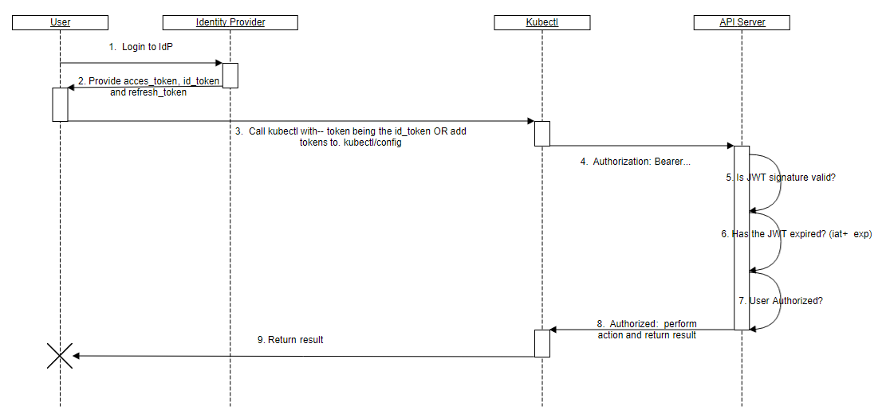

## Authentication

Kubernetes de iki tip kllanıcı var; bunlar servis hesapları ve normal kullanıcı hesapları. bu ikisinin authentication işlemleri birbirindne farklı işlemektedir.

Kubernetes' de normal kulanıcıların yönetimi için bir obje bulunmamaktadır. Kullanıcı yönetiminin dışarıda yapıldığı varsayılı. Bir dosyaya kullanıcıadı şifre listesi yapıp kubernetes'e verilebilir yada bir cloud oratamından servis bağlanabilir. 

Buna karşılık Kubernets servis hesapları Kubernetes tarafında yönetilmektedir. Otomatik yada manule oluşturulabilir, credential'lar secrets olarka saklanırlar ve gerektiğinde pod lara mount edilebilirler.


__Authenticaiton Stratejileri__

Kubernetes authentication plugini üzeriendeisiteme girişleri yaptırmaktadır. Cliendan gelecek bilgileri, client certificate, beare tokens veya HTTP basic auth ile kabül eder. gelen kulanıcı biligilerinde aşağıdaki atrrbiute ların olamsını bekler.


- Username: a string which identifies the end user. Common values might be kube-admin or jane@example.com.
- UID: a string which identifies the end user and attempts to be more consistent and unique than username.
- Groups: a set of strings which associate users with a set of commonly grouped users.
- Extra fields: a map of strings to list of strings which holds additional information authorizers may find useful.

diğer bir seçenek de authenticaiton proxy kulanmaktır. Bunun için LDAP, SAML, Kerberos, alternate x509 schemes, vb prokoller authenticating proxy veya authentication webhook yardımıyla kullanılanılarak kullanıcılar giriş yaptırılabiir.

#### Authenticating with Bootstrap Tokens

Bootstrap tokens are a simple bearer token that is meant to be used when creating new clusters or joining new nodes to an existing cluster. It was built to support kubeadm, but can be used in other contexts for users that wish to start clusters without kubeadm. It is also built to work, via RBAC policy, with the Kubelet TLS Bootstrapping system.

https://kubernetes.io/docs/reference/access-authn-authz/bootstrap-tokens/


####  __X509 Client Certs__


örnek sertifika oluşturmak.


aşağıdaki kod murat.cabyuk kullanıcısını app1 ve app2 gruplarına atamak için CSR (certificate signing request)oluşturmaktadır.  

```
openssl req -new -key jbeda.pem -out jbeda-csr.pem -subj "/CN=jbeda/O=app1/O=app2"
```
daha fazla dtay için [Kubernetes Sayfası](https://kubernetes.io/docs/concepts/cluster-administration/certificates/). 

bizzat sertifikalar hakkında daha detaylı bilgi almak için [muratcabuk github sayfası](https://github.com/muratcabuk/Notes/tree/master/Security)


__Openssl ile client sertifikası oluşturma yayınlama__

openssl can manually generate certificates for your cluster.

Generate a ca.key with 2048bit:

```
openssl genrsa -out ca.key 2048
```

According to the ca.key generate a ca.crt (use -days to set the certificate effective time):
```
openssl req -x509 -new -nodes -key ca.key -subj "/CN=${MASTER_IP}" -days 10000 -out ca.crt
```

Generate a server.key with 2048bit:

```
openssl genrsa -out server.key 2048
```


Create a config file for generating a Certificate Signing Request (CSR). Be sure to substitute the values marked with angle brackets (e.g. [MASTER_IP]) with real values before saving this to a file (e.g. csr.conf). Note that the value for MASTER_CLUSTER_IP is the service cluster IP for the API server as described in previous subsection. The sample below also assumes that you are using cluster.local as the default DNS domain name.

```
[ req ]
default_bits = 2048
prompt = no
default_md = sha256
req_extensions = req_ext
distinguished_name = dn

[ dn ]
C = <country>
ST = <state>
L = <city>
O = <organization>
OU = <organization unit>
CN = <MASTER_IP>

[ req_ext ]
subjectAltName = @alt_names

[ alt_names ]
DNS.1 = kubernetes
DNS.2 = kubernetes.default
DNS.3 = kubernetes.default.svc
DNS.4 = kubernetes.default.svc.cluster
DNS.5 = kubernetes.default.svc.cluster.local
IP.1 = <MASTER_IP>
IP.2 = <MASTER_CLUSTER_IP>

[ v3_ext ]
authorityKeyIdentifier=keyid,issuer:always
basicConstraints=CA:FALSE
keyUsage=keyEncipherment,dataEncipherment
extendedKeyUsage=serverAuth,clientAuth
subjectAltName=@alt_names
```

Generate the certificate signing request based on the config file:
```
openssl req -new -key server.key -out server.csr -config csr.conf
```

Generate the server certificate using the ca.key, ca.crt and server.csr:
```
openssl x509 -req -in server.csr -CA ca.crt -CAkey ca.key \
-CAcreateserial -out server.crt -days 10000 \
-extensions v3_ext -extfile csr.conf
```


View the certificate:

```
openssl x509  -noout -text -in ./server.crt
```

Finally, add the same parameters into the API server start parameters.


son olarak yayınlama

```
On each client, perform the following operations:

sudo cp ca.crt /usr/local/share/ca-certificates/kubernetes.crt
sudo update-ca-certificates
Updating certificates in /etc/ssl/certs...
1 added, 0 removed; done.
Running hooks in /etc/ca-certificates/update.d....
done.
```

### Static Token File


statik bir csv doyasına 3 dütundan oluşan bilgiler girilerek API üzerinde kaydettirilir. opsiyonel olrak group bilgisi süütunuda olabilir.

örnek : conf token,user,uid,"group1,group2,group3"

işlem yaparken API çağrımında --token-auth-file=SOMEFILE parametersi kullanılır.

### Statik Password File

api çağrılırken --basic-auth-file=SOMEFILE şekilden dosya request e eklenir.

örnek : password,user,uid,"group1,group2,group3"

When using basic authentication from an http client, the API server expects an Authorization header with a value of Basic BASE64ENCODED(USER:PASSWORD).


### Service Account Tokens

Service accounts are usually created automatically by the API server and associated with pods running in the cluster through the ServiceAccount Admission Controller. Bearer tokens are mounted into pods at well-known locations, and allow in-cluster processes to talk to the API server. Accounts may be explicitly associated with pods using the serviceAccountName field of a PodSpec.

Note: serviceAccountName is usually omitted because this is done automatically.
apiVersion: apps/v1 # this apiVersion is relevant as of Kubernetes 1.9

```yml
kind: Deployment
metadata:
  name: nginx-deployment
  namespace: default
spec:
  replicas: 3
  template:
    metadata:
    # ...
    spec:
      serviceAccountName: bob-the-bot
      containers:
      - name: nginx
        image: nginx:1.14.2
```

Service account bearer tokens are perfectly valid to use outside the cluster and can be used to create identities for long standing jobs that wish to talk to the Kubernetes API. To manually create a service account, simply use the kubectl create serviceaccount (NAME) command. This creates a service account in the current namespace and an associated secret.

```shell
kubectl create serviceaccount jenkins

serviceaccount "jenkins" created
```

Check an associated secret:

```yml
kubectl get serviceaccounts jenkins -o yaml

apiVersion: v1
kind: ServiceAccount
metadata:
  # ...
secrets:
- name: jenkins-token-1yvwg
```


The created secret holds the public CA of the API server and a signed JSON Web Token (JWT).
```
kubectl get secret jenkins-token-1yvwg -o yaml

apiVersion: v1
data:
  ca.crt: (APISERVER'S CA BASE64 ENCODED)
  namespace: ZGVmYXVsdA==
  token: (BEARER TOKEN BASE64 ENCODED)
kind: Secret
metadata:
  # ...
type: kubernetes.io/service-account-token
```


Note: Values are base64 encoded because secrets are always base64 encoded.
The signed JWT can be used as a bearer token to authenticate as the given service account. See above for how the token is included in a request. Normally these secrets are mounted into pods for in-cluster access to the API server, but can be used from outside the cluster as well.

Service accounts authenticate with the username system:serviceaccount:(NAMESPACE):(SERVICEACCOUNT), and are assigned to the groups system:serviceaccounts and system:serviceaccounts:(NAMESPACE).

WARNING: Because service account tokens are stored in secrets, any user with read access to those secrets can authenticate as the service account. Be cautious when granting permissions to service accounts and read capabilities for secrets.

#### OpenID Connect Tokens



aşağıdaki linkte detaylı uygulama görülebilir

https://kubernetes.io/docs/reference/access-authn-authz/authentication/#openid-connect-tokens


### Webhook Token Authentication

Webhook authentication is a hook for verifying bearer tokens.

- authentication-token-webhook-config-file a configuration file describing how to access the remote webhook service.
- authentication-token-webhook-cache-ttl how long to cache authentication decisions. Defaults to two minutes.
The configuration file uses the kubeconfig file format. Within the file, clusters refers to the remote service and users refers to the API server webhook. An example would be:

```
# Kubernetes API version
apiVersion: v1
# kind of the API object
kind: Config
# clusters refers to the remote service.
clusters:
  - name: name-of-remote-authn-service
    cluster:
      certificate-authority: /path/to/ca.pem         # CA for verifying the remote service.
      server: https://authn.example.com/authenticate # URL of remote service to query. Must use 'https'.

# users refers to the API server's webhook configuration.
users:
  - name: name-of-api-server
    user:
      client-certificate: /path/to/cert.pem # cert for the webhook plugin to use
      client-key: /path/to/key.pem          # key matching the cert

# kubeconfig files require a context. Provide one for the API server.
current-context: webhook
contexts:
- context:
    cluster: name-of-remote-authn-service
    user: name-of-api-sever
  name: webhook
```


When a client attempts to authenticate with the API server using a bearer token as discussed above, the authentication webhook POSTs a JSON-serialized authentication.k8s.io/v1beta1 TokenReview object containing the token to the remote service. Kubernetes will not challenge a request that lacks such a header.

Note that webhook API objects are subject to the same versioning compatibility rules as other Kubernetes API objects. Implementers should be aware of looser compatibility promises for beta objects and check the “apiVersion” field of the request to ensure correct deserialization. Additionally, the API server must enable the authentication.k8s.io/v1beta1 API extensions group (--runtime-config=authentication.k8s.io/v1beta1=true).

The POST body will be of the following format:

```json
{
  "apiVersion": "authentication.k8s.io/v1beta1",
  "kind": "TokenReview",
  "spec": {
    "token": "(BEARERTOKEN)"
  }
}
```
The remote service is expected to fill the status field of the request to indicate the success of the login. The response body’s spec field is ignored and may be omitted. A successful validation of the bearer token would return:

```json
{
  "apiVersion": "authentication.k8s.io/v1beta1",
  "kind": "TokenReview",
  "status": {
    "authenticated": true,
    "user": {
      "username": "janedoe@example.com",
      "uid": "42",
      "groups": [
        "developers",
        "qa"
      ],
      "extra": {
        "extrafield1": [
          "extravalue1",
          "extravalue2"
        ]
      }
    }
  }
}
```

An unsuccessful request would return:
```json
{
  "apiVersion": "authentication.k8s.io/v1beta1",
  "kind": "TokenReview",
  "status": {
    "authenticated": false
  }
}
```

HTTP status codes can be used to supply additional error context.

