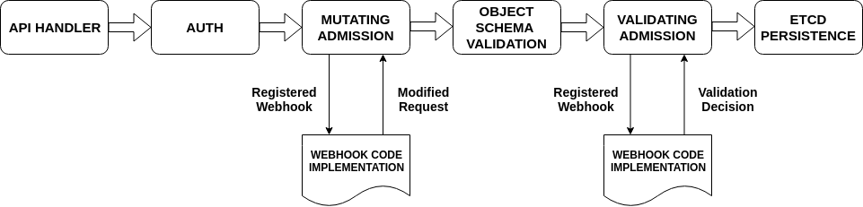

### Admission Controller

Authorization dan farklı olarak sadece create, update ve delete operayonlarında çalışırlar ve reject olursa bir operasyon bütün request hemen reddedilir. ilgili pluginler sırayla çalşır yani bir certate işleminde örneğin birden fazla admission controller çalışabilir.

istek iki aşamanın birinden veya her ikisinden de geçebilir
- Muteting Admission
- Validating Admission

ilgii admission ları çağrılması webhook yardımıyla olmaktadır. Burada biz güvenlik bakış açısıyla inceliyoruz ancak daha birçok durumda webhook lar kullanılabilir.

Muteting Admission gelen isteği editleyebilir. Validating ise sadece validate işlemi yapabilir.

__Herbir Admission Controller'ın ne yapabilceği ile ilgili liste__

https://kubernetes.io/docs/reference/access-authn-authz/admission-controllers/#what-does-each-admission-controller-do

__Dynamic Admission Control__

https://kubernetes.io/docs/reference/access-authn-authz/extensible-admission-controllers/

#### Kaynaklar

- https://kubernetes.io/blog/2019/03/21/
- https://banzaicloud.com/blog/k8s-admission-webhooks/ (web hook oluşturmayı anlatmış)
- https://docs.giantswarm.io/guides/creating-your-own-admission-controller/ (web hook oluşturmayı anlatmış)
- https://github.com/banzaicloud/admission-webhook-example
- https://github.com/kelseyhightower/denyenv-validating-admission-webhook
- https://dev.to/ineedale/writing-a-very-basic-kubernetes-mutating-admission-webhook-5b1
- https://docs.openshift.com/container-platform/3.11/architecture/additional_concepts/dynamic_admission_controllers.html
- https://kubernetes.io/docs/reference/access-authn-authz/admission-controllers/
- https://kubernetes.io/docs/reference/access-authn-authz/controlling-access/

