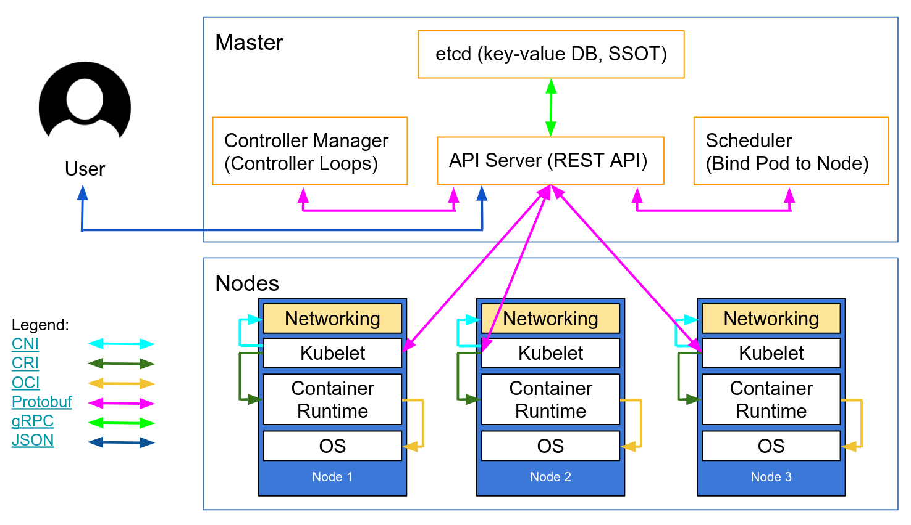
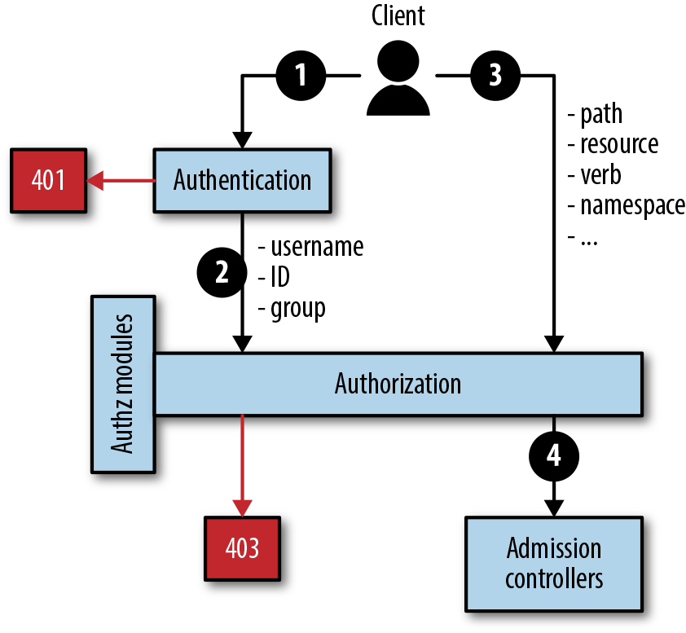
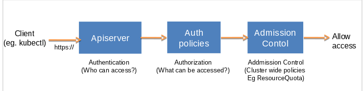
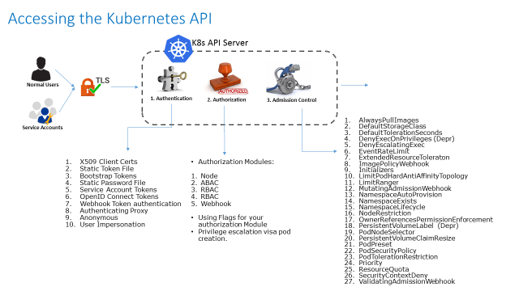

Bu bölümde 

- Kubernetes' e uzaktan erişme güvenliği
- Kubernetes bileşenlerinin birbirleriyle olan iletişim güvenliği
- Role Based Access Control (RBAC) 
- vb

Konu başlıkları ele alınacaktır.

Ancak bu konuda ne yazıkki Kuberneste resmi references sayfası çok kötü anlatmış konuyu. Özellikle TSL/SSL kısmına çok çok az değinilmiş. bu ndenle farklı kaynaklardan yararlanılarak bu konular anlatılmaya çalışılacak. 

Resmi References başlıklarından yola çıkılarak detaylandırma farklı kaynaklardan faydalanılarak yapılacak.

Kubernetes hardway  kurlumlarında TSL/SSL kurulumu ile ilgili bölümler aslında bütün ssl kurumlarını tek tek anlatmakta.

Kubernetes ortamında hagi componentler arasında ve dışarıdan bağlanırklen hangi componentler için güvenliğe ihtyacımızvar onu inceleyelim. Bunu anlama için öcemlikle kubernetes için autehnticaiton ve authoricaiton kavramlarının ne anlama geldiini anlamamız gerekiyor.

şekilde görülen her ok iki component arasındaki iletişim ve dolayısiyle aralarında olması gereke güvenli bağlantı noktalarını göstermektedir.

bütün bunalrın arasında TSL kullanılmalıdır.

şu sayfada oluşturulmas ıgereken ne kadar sertifika türü varsa detaylı şekilde incelenmiş.

https://kubernetes.io/docs/setup/best-practices/certificates/

bu sayfada kubeadm ile sertifika yönetimi hakıında bilgi alınabilir

https://kubernetes.io/docs/tasks/administer-cluster/kubeadm/kubeadm-certs/

ayrıca Mumshad Mannambeth github sayfasında örnek bir sertifika checker hazırlamış.

https://github.com/mmumshad/kubernetes-the-hard-way/tree/master/tools

aynı dosyaya şuradan da erişebilirsiniz
[excel](files/kubernetes-certs-checker.xlsx)

alt sayfalarda 
- [authentication](2.1_Authentication.md)
- [Authorization](2.2_Authorization.md)
- [Admission Controller](2.3_AdmissionController.md)
  
Hakkında detaylı bilgi alabilirsiniz

### Kaynaklar
- https://neonmirrors.net/post/2019-10/authentication-and-authorization-in-k8s/
- https://github.com/oahcran/kubernetes-the-hard-way-bare-metal/blob/master/docs/02-provisioning-certs-config-encryption.md
- https://github.com/Praqma/LearnKubernetes/blob/master/kamran/Kubernetes-The-Hard-Way-on-BareMetal.md#configure--setup-tls-certificates-for-the-cluster
- https://kubernetes.io/docs/tasks/administer-cluster/kubeadm/kubeadm-certs/
- https://github.com/kelseyhightower/kubernetes-the-hard-way/blob/master/docs/04-certificate-authority.md
- https://github.com/kelseyhightower/kubernetes-the-hard-way/blob/master/docs/05-kubernetes-configuration-files.md
- https://kubernetes.io/blog/2018/07/18/11-ways-not-to-get-hacked/
- https://github.com/kelseyhightower/kubernetes-the-hard-way/blob/1.9.0/docs/04-certificate-authority.md
- https://www.level-up.one/kubernetes-networking-3-level-up/
- https://itnext.io/verifying-service-mesh-tls-in-kubernetes-using-ksniff-and-wireshark-2e993b26bf95
- https://vocon-it.com/2019/01/02/kubernetes-7-ingress-controller-on-a-multi-node-cluster-http-https/