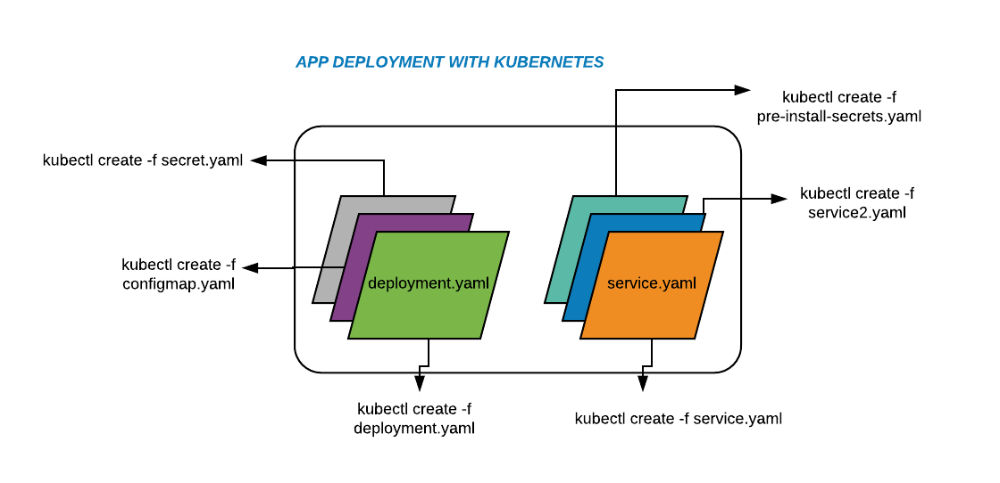
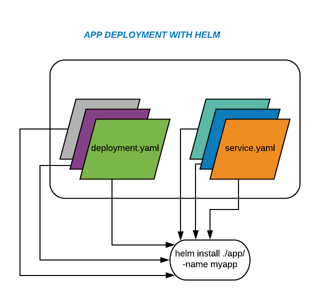
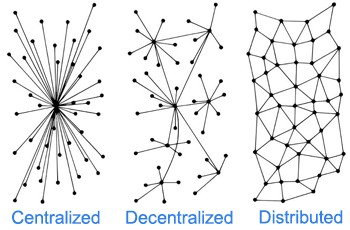
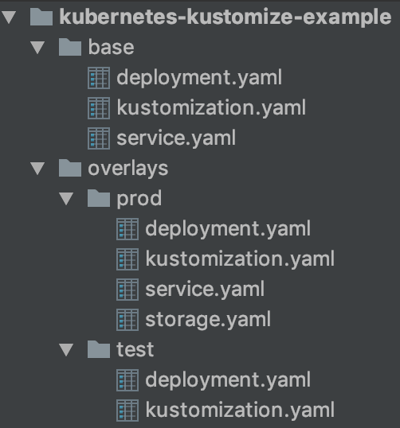

https://hasura.io/blog/draft-vs-gitkube-vs-helm-vs-ksonnet-vs-metaparticle-vs-skaffold-f5aa9561f948/

__Helm__

Kısaca Helm template-driven bir sistem ve decentralization (merkezden yönetilmeme, sorumluluğn dağıtılması) üzerine kurulu bir yapısı var. Yani seperation of concern prensibini uygulamktadır.

gğzel bir örnek : https://banzaicloud.com/blog/creating-helm-charts/ (basitten ileri seviye kesinlikle bakılmalı)

aslında chart dosyası ilgili app için gerekli olan herşeyi içerir ancak burad ayağa kaldıraılacak veya değiştirilcek bütün component veya job lar ayrıştırılarak templates altındaki dosylarala yönetilir.Böylece sorumluluklar ayrıştırılmış olur.

https://helm.sh/docs/topics/charts/

__Kustomize__

Kustomize ise merge etmek üzeirne kurlu. Farklı resource ları aynı zamanda transformasyone uğratarak birleştirerek tek bir manifesto dosyası çıkartır. 

Asıl yaml dosyalarını bozmadan aynı anda birden fazla maaç için bu dosyları transformasyonunu sağlar. örneğin test ve prod için base yaml dosylarını alır ve iki farklı ortam için transformasyon yaptıktan sonra tek bir dosya olarka bize deployment.yml çıkartabilir.

şu linkte çok temiz bir örnek var.

https://levelup.gitconnected.com/kubernetes-change-base-yaml-config-for-different-environments-prod-test-6224bfb6cdd6

Kustomize reference sayfası : https://kubectl.docs.kubernetes.io/pages/reference/kustomize.html

Kustomize Örneklerinin bulundu resmi web sayfası : https://github.com/kubernetes-sigs/kustomize/tree/master/examples

detaylı kustomize örneği : https://kubectl.docs.kubernetes.io/pages/examples/kustomize.html

ikisinin de (Helm ve Kustomize) temel amacı aslında karmaşklığı yönetmektir. Ancak birbirlerine rakip değiller.

### KAYNAKLAR

- https://codeengineered.com/blog/2018/helm-kustomize-complexity/

- https://levelup.gitconnected.com/kubernetes-change-base-yaml-config-for-different-environments-prod-test-6224bfb6cdd6
https://blog.stack-labs.com/code/kustomize-101/

- https://kubernetes.io/docs/tasks/manage-kubernetes-objects/kustomization/

- https://github.com/kubernetes-sigs/kustomize/blob/master/docs/glossary.md#kustomization

- https://blog.jetstack.io/blog/kustomize-cert-manager/

- https://levelup.gitconnected.com/kubernetes-change-base-yaml-config-for-different-environments-prod-test-6224bfb6cdd6

- https://github.com/wuestkamp/kubernetes-local-dev/blob/c0e92950db4e32258e9243bf56032b9412a1cd23/infrastructure/helm/sf/templates/sf-deployment.yaml
- https://testingclouds.wordpress.com/2018/07/20/844/

