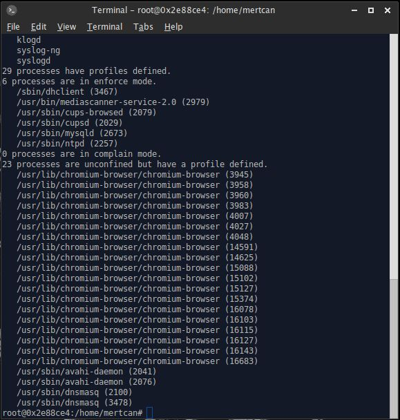
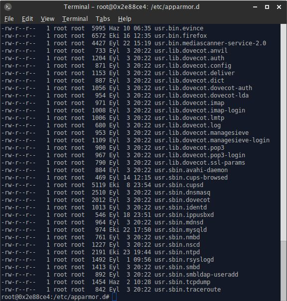
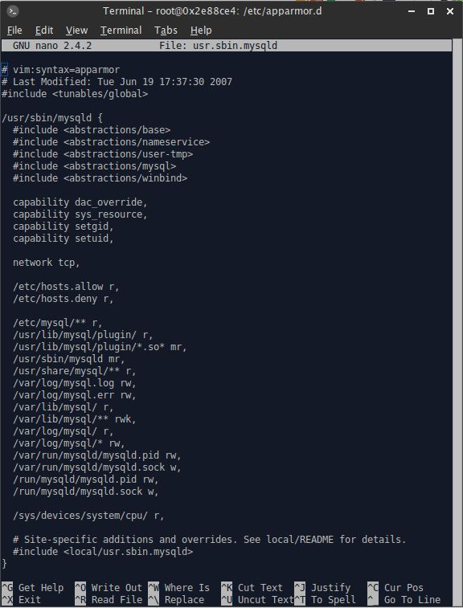

Kaynak  : https://mertcangokgoz.com/ubuntu-sistemlerde-apparmor-nedir/


SeLinux (RedHat) ve AppArmor (Ubuntu) aslında bağımsız iki [Linux Security Module](https://en.wikipedia.org/wiki/Linux_Security_Modules)'dür. Amaçları Kernel güvenliğini sağlamaktır.


Ubuntu için geliştirilmiş olan bir "Security Framework" yapısıdır.Red Hat ve Fedora sistemlerdeki SELİNUX benzer bir yapısı bulunmaktadır.Sistemin arkaplanında her daim çalışmaya devam eder ve siz ne olduğunu genelde fark etmezsiniz terminal den durumuna bakmadıkça veya bildirimlerini görmedikçe ne olduğunu hiç araştırmayacak bile olabilirsiniz.


AppArmor açıklanabilecek en kısa açıklaması ile sisteme verilebilecek zararı sınırlandırır veya yapılan bu işlemi tamamen durdururan bir uygulamadır.Selinux ve AppArmor ikiside MAC(Mandatory Access Control) güvenliğini sağlamaktadır.Yapılacakları veya yapılmayacakları belirler


AppArmor sunucu sistemleri için özellikle kullanılması ve özel kural setlerinin belirlenmesi istenilen bir yapıdır.İnternetde ufak bir araştırma yaparak görebileceğiniz gibi bazı işlemleri kısıtladığı için kapatılması önerilir şeklinde yazılır.Aksine AppArmor ubuntu sistemlerde hayati önem taşıdığı için kesinlikle kapatılmaması gerekmektedir.Çok nadir durumlar dışında lütfen kapatmayınız.Cevap alınamayan bir uygulamanın yeniden başlatılması sürecinde bile etkin bir şekilde rol almaktadır.


### Bare Metal Host üzerinde kullanımı 

AppArmor sistemde öntanımlı olarak çalışır bir halde gelir ve durumunu öğrenmek isterseniz aşağıdaki komutu vermeniz gerekir.Sistemde kullandığınız uygulamalara göre kural setleri ve profiller farklılık gösterir.

```
apparmor_status
```




apparmor-utils yapılandırmak için komut satırı araçları içerir.

profiller /etc/apparmour.d/ içinde saklanırlar


Burada görebileceğiniz gibi farklı profil paketleride gözüküyor çünkü ben sistemi yapılandırırken AppArmor için profil paketini sisteme dahil ettim böylelikle bir çok programı koruma altına almış oldum.profilleri kurmazsanız ubuntu sisteminde ilk kurulumda gelen uygulamalar dışında korumaya almadığını görebilirsiniz.

```
sudo apt-get install apparmor-profiles
```


Yukarıdaki komut ile sisteme profil paketini dahil edebilirsiniz.Bu aşamadan sonra ise profiller otomatik çalışmaya süreçleri kontrol etmeye başlar.

Bunun dışında AppArmor yapısında 2 adet mod vardır bunlardan biri " Enforce" diğeride " Complain" modlarıdur istediğiniz uygulamayı bu modlardan biri ile koruma altına alabilirsiniz.Koruma altına alınacak olan uygulamanın sistem içerisindeki yolunu bilmeniz yeterli

Uygulamayı Enforce moduna taşımak için

```
sudo aa-enforce /uygulamayolu
```

Uygulamayı Complain moduna taşımak için

```
sudo aa-complain /uygulamayolu

```


yaratılan bu uygulama profilleri "/etc/apparmor.d/" klasörü içerisinde bulunmaktadır oluşturduğunuz herhangi bir profili buradan rahatlıkla görebilir manuel olarak müdahalede bulunabilirsiniz.




Aynı zamanda tüm profillerin modlarını tek bir komut ile Enforce yada Complain moduna alabilirsiniz.


```
sudo aa-complain /etc/apparmor.d/*

sudo aa-enforce /etc/apparmor.d/*
```


Bununla birlikte mysqld için otomatik olarak yazılmış olan bir kural setini şu şekilde görüyoruz.




Bu dosya içerisinde ise komutlar şu şekilde açıklanabilir.

-#include <tunables/global> satırı ortak olarak tanımlanan kural seti havuzundaki parametreleri dosya içerisine-çağırmaktadır.Ön tanımlı olarak gelen ayarlar dahil edilir.

-Alt satırda yer alan ve uygulamanın yolunu gösteren kısımda normalde uygulamada uygulanacak olan mod belirtilir-ancak bilgisayarımda kullandığım bir takım geliştirme ortamlarını enforce etmediğim için kural seti normal olarak-çalışıyor yani mysqld süreçlerinde herhangi bir kısıtlama getirmedik.Getirmiş olsayıdık ise /usr/sbin/mysql flags-(enforce) olarak geçecekti

-/etc/hosts.allow ve hemen alındaki satırda ise uygulamaya okuma konusunda ayrıcalıklar tanır ve belirtilen yerdeki-dosyayı okuyarak dosya içine ekleme yapar.

Ayar dosyası içerisinde bulunan r,ux,rw,m gibi parametreler ise şu şekilde tanımlanmıştır.

- r – okuma
- w – yazma
- ux – Kısıtlamasız çalıştırma
- Ux – Temiz kısıtlamasız çalıştırma
- px – Ayrı ayrı profilleri yürüt
- Px – Temiz ve ayrık bir şekilde profilleri yürüt
- ix – Devralarak yürüt
- m – PROT_EXEC işlemi kabul edilir.
- l – link

AppArmor size hiçbir şekilde bilgilendirme yapmaz arka planda sessizce çalıştığı için acaba işe yarıyormu gibi düşüncelere kapılabilirsiniz.Bunun yerine sisteminize apparmor-notify ve apparmor-utils paketlerini kurarsanız ve uygulamaları admin kullanıcısına eklerseniz apparmor tarafından gelen bildirimleri görme imkanınız var ancak her süreçte bunu görmek canınızı sıkacağı için kapalı kalması önerilir.

Kritik bir durumla karşılaşırsanız ve AppArmor uygulamasını durdurmak istiyorsanız aşağıdaki komutu kullanabilirsiniz.

```
/etc/init.d/apparmor stop

```

veya

```

sudo service apparmor stop

```

Aynı şekilde AppArmor uygulamasının çalışmasını ama profillerin eski haline gelmesini ve durmasını istiyorsanız aşağıdaki komutu kullanabilirsiniz.

```
/etc/init.d/apparmor teardown

```


### Docker ile Kullanımı

https://docs.docker.com/engine/security/apparmor/


### Resources

- https://forum.ubuntu-tr.net/index.php?topic=37875.0
- https://docs.docker.com/engine/security/apparmor/


