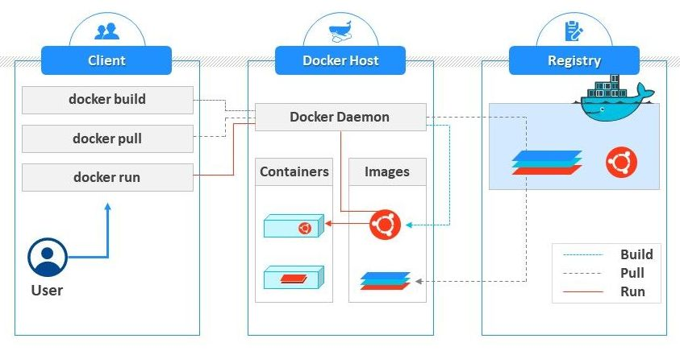

Docker, yazılımları container adı verilen paketler halinde sunmak için işletim sistemi düzeyinde sanallaştırmayı amaçlayan "Platform as a Service" (PaaS)  ürünleri kümesidir. Container teknolojileri kendi yazılımlarını, kitaplıklarını ve yapılandırma dosyalarını bir araya getirir ve birbirlerinden izole bir şekilde çalıştırılar.Tüm container'lar tek bir işletim sistemi çekirdeği tarafından çalıştırılır ve bu nedenle sanal makinelerden daha az kaynak kullanır.


Kubernetes, bilgisayar uygulaması dağıtımını, ölçeklendirmesini ve yönetimini otomatikleştirmek için açık kaynaklı bir konteyner düzenleme sistemidir. 

İşletim sistemi üzerinde çalışan, birbirinden izole ancak gerektiğinde birbirleriyle iletişime geçebilen Docker container işlemlerinin (process) beklenen güvenli ortamı sunabilmesi gerekmektedir.

Güvenlik açıkları üç bölüme ayrılabilir.

- Host işletim sistemindeki güvenlik açıkları containerlar üzerinde güvenlik zaafiyetlerine sebep olabilir.
- Container'daki güvenlik açıkları host işletim sistemi üzerinde güvenlik zaafiyettine sebep olabilir.
- Son olarak container'daki güvenlik açıkları container kendisi üzerinde güvenlik zaafiyetlerine sebep olabilir.

Güvenlik zaafiyetlerinin engellenebilmesi için alınacak önlemler zaten zaafiyet tanımını da verdiğiniden ayrıca bunları açıklamaya gerek duyulammaıştır. Bu konuda OWASP'ın (Open Web Application Security Project) sunmuş olduğu Top 10 Best Practice'ler ve Docker resmi sitesinde yer alan aşağıdaki önlemlerin alınması önem arzetmektedir.

### Docker Güvenlik Önlemleri



- Container'lar yönetici (root) hesabıyla çalıştırılmamalıdır. Bunun yerine Docker group a tanımlı root olmayan bir kullanıcı ile çalıştırılmalıdır.
- Docker image'ları mümkün olduğunca –no-new-privileges parametresiyle çalıştırılmalıdır.  Böylece çalışma zamanında yetki arttırmanın önüne geçilecektir.
- Docker contianerların birbiriyle haberleşmesi gerekmiyorsa --icc=false parametşleri ile inter-container communication engellenmelidir. Gereken yerlerde ise --link=CONTAINER_NAME_or_ID:ALIAS parametresi ile haberleşme açlabilir.
- Docker TCP socket varsayılan olarak unencrypted (güvenliksiz) bir yapıdadır. Bu nedenle Docker daemon uzak bağlantılara kapatılmalıdır. Eğer uzak bağlatıya açılması çok zorunluysa https encripted socker kullanılmalıdır. Detaylar için Docker dökümanları incelenmelidir.
- Linux security modullerinden en azından  biri (Use Linux Security Module (seccomp, AppArmor, or SELinux)) kullanılmalıdır. Böylece Linux Dosker ortamlarında kernel ve app seviyesinde güvenlik ihlalleri kontrol altına alınabilir. Detaylar için Docker resmi sayfaları ziyate edilmelidir.
- Update'ler düzenli kontrol edilmeli ve özellikle güvenlik yamaları yapılmalıdır.
- Container'ların network izolasyonu ve firewall ayarları dikkatli yapılmalıdır.
- Gizli bilgiler konfigürasyon içine clean text olarak yazılmamalıdr. Bunun yerine Docker Secrets ve benzeri araç ve teknikler kullanılmalıdır. 
- Private registery ihtiyacı varsa SSL kullanılmalıdır.
- Public repolardan kullanılan Docker image'lar onaylı resmi image'lardan seçilmelidir.
- Docker container'ın host işletim sistemi üzeride yapabilecekleri sınırlandırılmalıdır.
- Container'ların kaynak tüketimleri limitlenmelidir.
- Container'ların dosya yazma ihtiyacı yoksa storage'lar readly only olarak bağlanmalıdır.

### Kubernetes Güvenlik Önlemleri


Öncelikle şunu hatırlamak gerekiyor ki Kuberneste bir orkestrasyon aracıdır. Ayni aslında tek başına birşey ifade etmemektedir. Amacı bir veya birden fazla containe'ı scheduler yardımıyla istenen durumda (desired state) tutmaya çalışmaktır. Bu nedenle yukarıda container sisteminin güvenliği konusunda bahsi geçen maddelerin tamamı Kubernetes için de geçerlidir. Bu maddelere dikket ederek Kubernetes'i kullanmak gerekemektedir.

Ek olarak aşağıdaki maddeleri sıralamak mümkündür. Kubernetes güvenlik başlığını Güvenliğin 4C'si diye bir başlık altında resmi sayfasında toplamış.

 

Yani

- [Kod (Code) güvenliği](https://kubernetes.io/docs/concepts/security/overview/#code-security): OWASP top 10 security risk listesindeki güvanlik zaafiyetlerinin engellenmesi amaçlanmıştır.Listeye ve güvenlik önlemlerine [şu sayfadan](https://owasp.org/www-project-top-ten/) ulaşabilirsiniz.
- [Container (Docker) güvenliği](https://kubernetes.io/docs/concepts/security/overview/#container): Yukarıda bahsi geçen bölüme de bakılabilir.
- [Cluster'ın güvenliği](https://kubernetes.io/docs/tasks/administer-cluster/securing-a-cluster/)
- [Cloud/Data Center güvenliği](https://kubernetes.io/docs/concepts/security/overview/#cloud)
    - Alibaba Cloud: https://www.alibabacloud.com/trust-center
    - Amazon Web Services:	https://aws.amazon.com/security/
    - Google Cloud Platform: https://cloud.google.com/security/
    - IBM Cloud: https://www.ibm.com/cloud/security
    - Microsoft Azure:	https://docs.microsoft.com/en-us/azure/security/azure-security
    - VMWare VSphere: https://www.vmware.com/security/hardening-guides.html


Başlıklar incelendiğinde Kubernetes özelinde alınabilcek tedbirler Cluster Güvenliği başlığı altında sıralanmıştır. Bunu da iki başlık latında incelyebiliriz.

1. Kubernetes bileşenlerinin güvenliğinin dolayısıyla [cluster'ın güvenliğinin sağlanması]((https://kubernetes.io/docs/tasks/administer-cluster/securing-a-cluster/)) sağlanması.
2. Kubernetes cluster altında  çalışan uygulamaların güvenliği. Buda [Pod güvenliğinin sağlanaması](https://kubernetes.io/docs/concepts/security/pod-security-standards/) anlamına gelmektedir. 
    - RBAC Authorization (Access to the Kubernetes API)	https://kubernetes.io/docs/reference/access-authn-authz/rbac/
    - Authentication	https://kubernetes.io/docs/reference/access-authn-authz/controlling-access/
    - Application secrets management (and encrypting them in etcd at rest)	https://kubernetes.io/docs/concepts/configuration/secret/
https://kubernetes.io/docs/tasks/administer-cluster/encrypt-data/
    - Pod Security Policies	https://kubernetes.io/docs/concepts/policy/pod-security-policy/
    - Quality of Service (and Cluster resource management)	https://kubernetes.io/docs/tasks/configure-pod-container/quality-service-pod/
    - Network Policies	https://kubernetes.io/docs/concepts/services-networking/network-policies/
    - TLS For Kubernetes Ingress	https://kubernetes.io/docs/concepts/services-networking/ingress/#tls


Ayrıca aşağıdaki başlıklara da bakılmalıdır.

- [Nettwork Policies](https://kubernetes.io/docs/concepts/services-networking/network-policies/)
- [Encrypting Data in Rest](https://kubernetes.io/docs/tasks/administer-cluster/encrypt-data/)
- [Secrets](https://kubernetes.io/docs/concepts/configuration/secret/)


### Docker ve Kubernets için kullanılabilecek Araçlar

- Docker container güvenlik zaafiyetleri için statik güvenlik analizi yapan araçlar: Clair, Trivy
- DevSec Hardening Framework: Docker ve Kubernetes için güvenlik benchmark testi yapan ve sonuca göre tavsiyelerde bulunan uygulama. Çalıştırabilmek için Chef InSpec kurulu olmalıdır. Ayrıca yanlış yapılandırmaları da raporlayabiliyor.
- Kubernetes için güvenlik analizi yapan araçlar: kubeaudit, kubesec.io


### AppArmor

AppArmor, Linux dağıtımlarında kullanılan, SeLinux benzeri bir güvenlik modülüdür. Docker'ın kullanabilceği bir AppArmor profili ve kural oluşturulur. Daha detaylı bilgi ve Docker'da  kullanımı için [şu sayfayı](AppArmour.md) ziyaret ediniz.

### SecComp

https://docs.docker.com/engine/security/seccomp/


### Docker Bench 

CIS standartlarını içeren Docker Güvenlik ve audir yaplnadırmalarını otomatik olarak kontrol ederek kullanıcıya rapor sunan Bash ile yazılmış açık kaynak bir scripttir.

- https://dev-sec.io/baselines/docker/
- https://dev-sec.io/

```
$ Docker pull docker/docker-bench-security
# veya
$ git clone https://github.com/docker/docker-bench-security.git
# çalıştırmak için

$ ./docker-bech-security.sh

```


iki bölümlük yazı dizisi bakılabilir. uygulamalaı

- https://www.linkedin.com/pulse/konteyner-g%C3%BCvenli%C4%9Fi-b%C3%B6l%C3%BCm-i-asiye-yigit/

- https://www.linkedin.com/pulse/konteyner-g%C3%BCvenli%C4%9Fi-b%C3%B6l%C3%BCm-2-asiye-yigit/


### Kaynaklar
- https://github.com/OWASP/Docker-Security/blob/master/D00%20-%20Overview.md
- https://cheatsheetseries.owasp.org/cheatsheets/Docker_Security_Cheat_Sheet.html
- https://docs.docker.com/engine/security/
- https://docs.docker.com/engine/security/seccomp/
- https://dev-sec.io/baselines/docker/
- https://docs.docker.com/engine/security/apparmor/
- https://docs.docker.com/engine/reference/commandline/dockerd/#daemon-socket-option
- https://dev-sec.io/baselines/kubernetes/
- https://dev-sec.io/baselines/docker/
- https://kubernetes.io/docs/concepts/security/overview/
- https://kubernetes.io/docs/concepts/security/pod-security-standards/
- https://kubernetes.io/docs/tasks/administer-cluster/securing-a-cluster/
