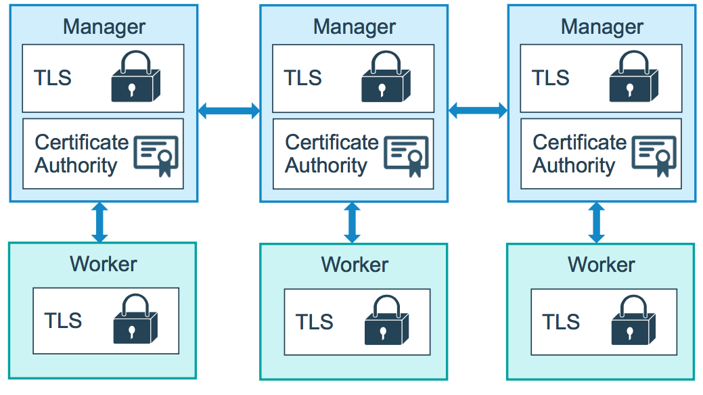

### Docker swarm kmutları

#### docker swarm ca

docker swarm ca [OPTIONS]

Display and rotate the root CA (rotate değiştirmek yenilemek gibi birnalam geliyor burada)

bunun için öcelikle docker swarm secuity hakkında bilgi sahibi olmak gerekebilir 
kaynak : https://docs.docker.com/engine/swarm/how-swarm-mode-works/pki/




__Options__

```
Name, shorthand Default     Description
--ca-cert		            Path to the PEM-formatted root CA certificate to use for the new cluster
--ca-key		            Path to the PEM-formatted root CA key to use for the new cluster
--cert-expiry   2160h0m0s   Validity period for node certificates (ns|us|ms|s|m|h)
--detach , -d		        Exit immediately instead of waiting for the root rotation to converge
--external-ca		        Specifications of one or more certificate signing endpoints
--quiet , -q		        Suppress progress output
--rotate		            Rotate the swarm CA - if no certificate or key are provided, new ones will be generated

```

#### Docker swarm init

docker swarm mı ilklendiir. bu komutu ilk (özellikle manager yapılmak istenen) node üzerinde çlıaştırdığımızda swam cluster tek node olarak kurulmuş daha sonra diğer node lar initialize edilmiş bu node a bağlanır.

docker swarm init [OPTIONS]

- --advertise-addr
This flag specifies the address that will be advertised to other members of the swarm for API access and overlay networking. If unspecified, Docker will check if the system has a single IP address, and use that IP address with the listening port (see --listen-addr).

- --dispatcher-heartbeat
This flag sets the frequency with which nodes are told to use as a period to report their health.

--default-addr-pool
This flag specifies default subnet pools for global scope networks. Format example is 
--default-addr-pool 30.30.0.0/16 --default-addr-pool 40.40.0.0/16

#### docker swarm join

Join a swarm as a node and/or manager

docker swarm join [OPTIONS] HOST:PORT

örnek

```

$ docker swarm join --token SWMTKN-1-3pu6hszjas19xyp7ghgosyx9k8atbfcr8p2is99znpy26u2lkl-7p73s1dx5in4tatdymyhg9hu2 192.168.99.121:2377
This node joined a swarm as a manager.
$ docker node ls
ID                           HOSTNAME  STATUS  AVAILABILITY  MANAGER STATUS
dkp8vy1dq1kxleu9g4u78tlag *  manager2  Ready   Active        Reachable
dvfxp4zseq4s0rih1selh0d20    manager1  Ready   Active        Leader

```

### docker swarm join-token

Join tokens are secrets that allow a node to join the swarm. There are two different join tokens available, one for the worker role and one for the manager role. You pass the token using the --token flag when you run swarm join. Nodes use the join token only when they join the swarm.


As a convenience, you can pass worker or manager as an argument to join-token to print the full docker swarm join command to join a new node to the swarm:

```
$ docker swarm join-token worker
```

To add a worker to this swarm, run the following command:

```
    docker swarm join \
    --token SWMTKN-1-3pu6hszjas19xyp7ghgosyx9k8atbfcr8p2is99znpy26u2lkl-1awxwuwd3z9j1z3puu7rcgdbx \
    172.17.0.2:2377
```
```
$ docker swarm join-token manager
```
To add a manager to this swarm, run the following command:

```
    docker swarm join \
    --token SWMTKN-1-3pu6hszjas19xyp7ghgosyx9k8atbfcr8p2is99znpy26u2lkl-7p73s1dx5in4tatdymyhg9hu2 \
    172.17.0.2:2377
```

Use the --rotate flag to generate a new join token for the specified role:

```
$ docker swarm join-token --rotate worker
```

Successfully rotated worker join token.

To add a worker to this swarm, run the following command:

```
    docker swarm join \
    --token SWMTKN-1-3pu6hszjas19xyp7ghgosyx9k8atbfcr8p2is99znpy26u2lkl-b30ljddcqhef9b9v4rs7mel7t \
    172.17.0.2:2377
```

After using --rotate, only the new token will be valid for joining with the specified role.

The -q (or --quiet) flag only prints the token:

```
$ docker swarm join-token -q worker

SWMTKN-1-3pu6hszjas19xyp7ghgosyx9k8atbfcr8p2is99znpy26u2lkl-b30ljddcqhef9b9v4rs7mel7t
```

#### docker swarm update

çalışan docker swarm üzerinde parametrelerin değiştirilmesi için  kullanılır

docker swarm update [OPTIONS]

örnek

```
$ docker swarm update --cert-expiry 720h

```